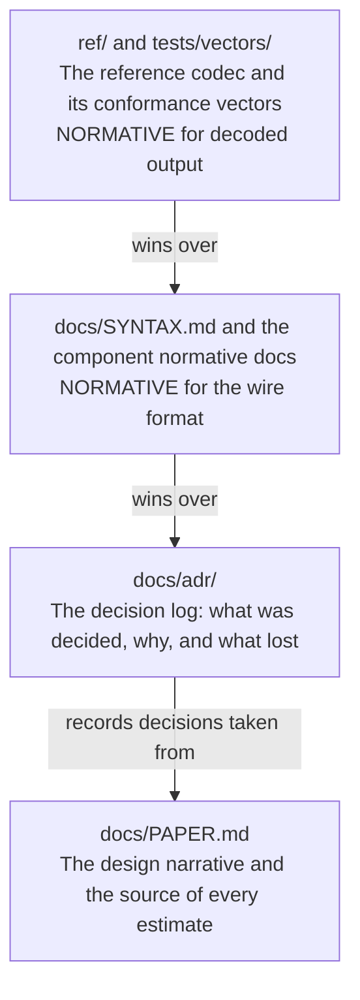

# Governance

How decisions get made in NX Warp, and what has authority over what.

## Who decides

**One maintainer.** [@nerdrx](https://github.com/nerdrx) owns the project, merges every change, and
makes the final call on every technical decision. There is no committee, no vote and no formal
membership tier, and pretending otherwise would be theatre for a project this size.

What that costs, stated openly: a single point of failure and a single point of taste. What it buys is
a coherent design, which for a codec matters more than it does for most software, because a codec is a
contract between two implementations and inconsistency in that contract is fatal.

If the project grows enough that this is a bottleneck, the successor structure will be written here
before it is needed, not after.

## The four sources of authority

They are not equal, and knowing the order matters when they disagree.

1. **The reference codec (`ref/`) and the conformance vectors (`tests/vectors/`) are normative for
   decoded output.** If the reference decoder and any document disagree about what a bitstream means,
   the reference decoder is right and the document is a bug. This is stated in the paper itself
   (3.7): "The CPU reference decoder is the specification; SPIR-V is validated against it, not the
   other way round."
2. **The normative documents** ([SYNTAX.md](docs/SYNTAX.md), [TRANSPORT.md](docs/TRANSPORT.md), and
   the other component specifications) are normative for the wire format and for behaviour the
   reference codec does not exercise, such as transport, rate control and integration. They are
   derived from the reference implementation, not invented alongside it.
3. **The ADRs** ([docs/adr/](docs/adr/)) record what was decided and why, and what the alternatives
   were. They are authoritative about the *reasoning*, not about the current state of the code. An ADR
   that has been overtaken by reality is stale and gets superseded.
4. **The paper** ([docs/PAPER.md](docs/PAPER.md)) is the design source of truth and the source of
   every estimate in the project. It is a design document with a date on it, not a living
   specification. Where a section of the paper contradicts another section, paper section 6 is the
   reconciliation and the ADRs carry it forward.

The paper is not edited to match what the code turned out to be. It is a record of what was designed
and what was believed at the time, which is what makes it possible to see later how wrong the
estimates were. Corrections to the design happen in ADRs.

## How a decision is made

1. **Something forces a choice**: a measurement, a conflict between two components, a review finding,
   or a contributor proposal.
2. **Discussion happens in the open**, in a GitHub issue or a pull request.
3. **If the decision changes the bitstream, the architecture, or a project-wide policy, it gets an
   ADR.** Use [docs/adr/template.md](docs/adr/template.md). An ADR is a pull request like any other and
   is reviewed as one.
4. **The maintainer accepts or rejects.** A rejected ADR may still be merged with status
   `Superseded` or `Rejected` if the reasoning is worth keeping; a decision that was seriously
   considered and refused is more useful on the record than absent from it.
5. **Accepted ADRs are immutable.** A changed decision gets a new ADR that supersedes the old one, and
   the only edit permitted to the old one is updating its status line to point at the successor.

### What needs an ADR

- Anything that changes the bitstream syntax or semantics.
- Anything that changes a cross-component contract: transport framing, feedback format, the reference
  model, synchronisation.
- Adopting a new coding tool, which must also record its patent status
  ([ADR-0020](docs/adr/0020-apache-2-0-and-patent-hygiene.md)).
- Adding or removing a dependency, a language, or a build toolchain.
- Licensing and policy changes.

### What does not

- Implementation choices inside one component that no other component can observe.
- Performance work that does not change output.
- Documentation, tests, tooling and CI.
- Fixing a bug so the code matches an existing ADR.

## Component ownership

The tree is divided into components, each with an implementation directory and, where the behaviour is
normative, its own specification document:

| Component | Directory | Normative doc |
|---|---|---|
| Reference codec | `ref/` | [docs/SYNTAX.md](docs/SYNTAX.md) |
| Pose warp | `warp/` | WARP.md (in progress) |
| Transport | `transport/` | [docs/TRANSPORT.md](docs/TRANSPORT.md) |
| Rate control and foveation | `rc/`, `fov/` | RATECONTROL.md (in progress) |
| Vulkan encoder and decoder | `vk/` | derived from SYNTAX.md |
| Phase 0 benchmark | `bench/` | `bench/README.md` |
| Android client | `android/` | [docs/INTEGRATION.md](docs/INTEGRATION.md) |
| Stereo inter-view | `stereo/` | STEREO.md (in progress) |
| Hybrid layering | `hybrid/` | HYBRID.md (in progress) |
| Platform support | `platform/` | [docs/INTEGRATION.md](docs/INTEGRATION.md) |
| Engine extension | | XR_EXT_NXWARP.md (in progress) |
| Quality and conformance tooling | `tools/`, `tests/` | `tools/quality/README.md` |
| Project documentation | `docs/`, root files | this document |

Ownership here means "who is expected to keep it coherent", not exclusive write access. A change
touching two components needs both to still make sense afterwards, which in practice means the
maintainer reviews the seam.

## The relationship between the paper and the reference decoder

This is the question the project gets asked most, so it gets its own section.

The paper designs a codec. The reference decoder implements it. **They are expected to diverge**, and
the divergence is not a defect in either one:

- The paper states estimates. The implementation produces facts. When a fact contradicts an estimate,
  the fact wins, an ADR records it, and the paper stays as written so the size of the error remains
  visible. [PERFORMANCE.md](docs/PERFORMANCE.md) is built around this rule: its measured column sits
  next to the estimate column, and an estimate that turned out wrong is never deleted.
- The paper leaves things open on purpose (section 6.10's compute budget verdict, the FTO review, the
  degradation ladder's subjective validation). Those are resolved by work, and the resolution lands in
  an ADR.
- Where the paper is internally inconsistent, and it is in several places because its sections were
  written in parallel, paper section 6 reconciles the ones its author noticed. Others are noted in the
  documents that depend on them rather than fixed silently in the paper.

The chain of authority is therefore: the paper proposes, the ADRs decide, the normative documents
specify, and the reference codec is the final word on what a bitstream means.

## Releases

There have been none. When they begin:

- Semantic versioning on the library (`nxvc`), with the bitstream version tracked separately in the
  stream header, because a library release and a format change are different events.
- A format-breaking change requires an ADR and a bump of the stream header `version` field. Format
  changes are expected to be rare after Phase 2 and should be additive (a tool bit, a TLV) wherever
  possible, since capability negotiation is an intersection rather than a version comparison
  (paper 1.2).
- Every release states which conformance vectors it passes, on which devices.
- No release ships before the freedom-to-operate review scoped in
  [ADR-0017](docs/adr/0017-fto-review-scope.md); it is a Phase 3 exit criterion, not a formality.

## Contributing

See [CONTRIBUTING.md](CONTRIBUTING.md) for the practical mechanics: build, style, tests, commit
conventions. Conduct expectations are in [CODE_OF_CONDUCT.md](CODE_OF_CONDUCT.md), and security
reports go through the private channel in [SECURITY.md](SECURITY.md).

One expectation specific to this project: **if you add an algorithm, you must be able to state its
origin and its patent status.** The tool policy is public-domain, expired or explicitly royalty-free
only, and the written record of where each tool came from is kept from day one
([ADR-0020](docs/adr/0020-apache-2-0-and-patent-hygiene.md)).

## Licence

Apache-2.0, chosen for its explicit patent grant and defensive termination. See [LICENSE](LICENSE).
Contributions are accepted under the same licence; there is no separate CLA.
