<div align="center">


### VR-specific compression. GPU-native reconstruction. Latency first.

[](https://github.com/nerdrx/nx-warp/actions/workflows/ci.yml)
[](https://github.com/nerdrx/nx-warp/actions/workflows/format.yml)
[](LICENSE)


[Design paper](docs/PAPER.md) · [Measured results](#measured-results) · [Build](#building) · [WiVRn NX integration](https://github.com/nerdrx/wivrn-nx/tree/atlas-live)

</div>

## Abstract

**NX Warp is an experimental video codec for rendered VR, developed with the custom WiVRn NX streaming stack.** It explores a simple premise: head pose, reusable tiles and renderer information should let a headset reconstruct useful pixels with less work than a conventional whole-frame pipeline.

The current work combines a Vulkan encoder, a Vulkan decoder and an atlas renderer tested on Pico 4. The priority is **low latency, full-resolution output and inexpensive reconstruction**, especially at low bitrate. Visual approximations are valid experiments when they preserve useful structure and measurably reduce cost. Quality, bitrate and power remain measured tradeoffs.

The immediate target follows the Pico display: **90 Hz / 11.11 ms per update**, with centre-first correction scheduling under investigation. The stretch target remains **240 Hz / 4.17 ms per update**. Individual stages and repeated-render throughput have crossed parts of that budget; **consistent 240 Hz delivery has not been demonstrated**. This is a research prototype, with visible artifacts and incomplete quality gates, rather than a production-ready streaming release.

> **Removing work beats optimizing work.**

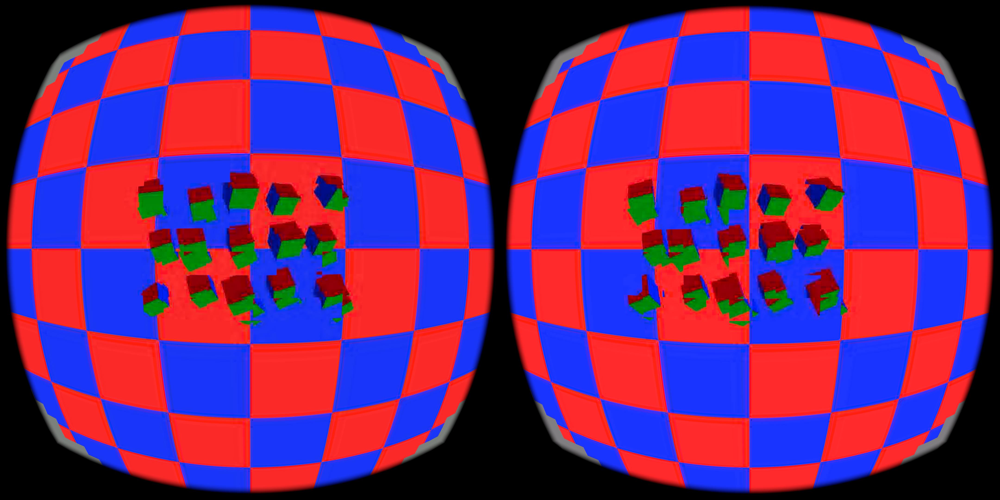

*Figure 1. Actual Pico capture from the native atlas renderer, configured for 2160 × 2160 output per eye. Tile seams and cube trails remain visible. A screenshot establishes the captured appearance, not moving-head quality or display FPS. [Capture settings, control image and binary identity](bench/results/240fps-2026-09-08/atlas-vertex-warp/v3-final/README.md).*

## At a glance

| | Current scope |
|---|---|
| Application | Rendered stereo VR through **custom WiVRn NX** |
| Implementation | C++20 and Vulkan compute/graphics; library identifier `nxvc` |
| Primary measured hardware | Radeon RX 7900 XTX host; Pico 4 / Adreno 650 headset |
| Native output in recent captures | **2160 × 2160 per eye**; sequence fixture uses a padded 4352 × 2176 stereo atlas |
| Live integration | WiVRn NX [`atlas-live`](https://github.com/nerdrx/wivrn-nx/tree/atlas-live); experimental renderer switches remain opt-in |
| Presentation target | **90 → 120 → 144 → 180 → 240 Hz**; recent live Pico captures use 90 Hz |
| Evidence | Controlled comparisons, raw timings, fixture/build identities and actual captures |
| Open problems | Completion-time tails, correction scheduling, motion artifacts, compression quality and sustained thermal behavior |

**Read next:** [Architecture](#architecture) · [Results](#measured-results) · [Visual results](#visual-results) · [Measurement rules](#measurement-rules) · [Status](#status) · [Roadmap](#roadmap) · [Documentation](#documentation)

## Architecture

The design divides images into **64 × 64 tiles** and makes reusable content cheap. The reference codec defines reconstruction behavior; Vulkan implementations and live rendering experiments are checked against their relevant reference or control paths.

The current atlas work separates stored tile content from the mapping used to render it. Reusing content can avoid full-picture reconstruction, while a tile-aware mesh moves warp calculations out of repeated fragment work. Changes to codec references still need explicit synchronization and correct feedback handling.

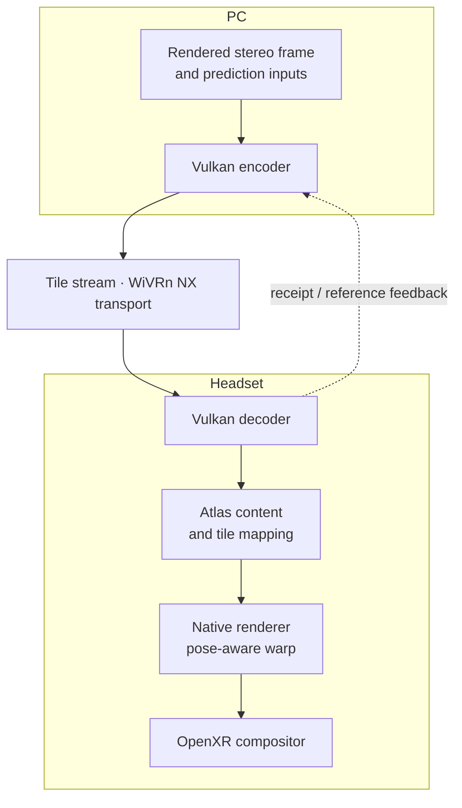

*Figure 2. Simplified experimental integration. Encoding, transport, decoding, rendering and compositor scheduling have distinct costs; a gain in one box is not automatically an end-to-end gain.*

The next architectural direction is to separate work by what each region needs:

| Region or tile | Intended compute policy | Research question |
|---|---|---|
| Predictable / unchanged | Warp or skip; reuse stored content | Can reconstruction and memory writes disappear? |
| Sparse correction | Update only the residual that matters | Can lightweight work avoid the dense path? |
| Dense / disoccluded | Spend more work on a fallback | Can difficult content stay within a deadline? |
| Fovea | Preserve detail and useful edges | Where does additional compute improve perception most? |
| Periphery / invisible | Cheaper correction, mostly warp, or skip | Can foveation control work as well as quantization? |

These are development priorities, not a claim that every path is integrated. Depth, motion vectors, visibility and object information could improve prediction further. The codec should ultimately describe what the renderer's prediction cannot explain.

### 240 Hz without 240 heavy corrections

A presentation update can reuse a stable correction state and apply a newer pose. This makes **60–120 Hz correction with faster presentation** worth investigating. The sequence probe already tests repeated rendering, but currently repeats a static pose; it does not establish this complete pose-aware scheduling architecture.

```text
Correction state   A ───────────── B ───────────── C
Presentation       warp → warp → warp → warp → warp → …
                   target: one useful update every 4.17 ms
```

Stable references, disocclusion handling and bounded image age are essential. Queueing more work can increase throughput while making the displayed image older.

## Measured results

**Live integration boundary:** the fast PLANAR renderer is now connected to custom WiVRn NX as an explicit opt-in. The earlier Pico benchmark numbers do not describe the installed streaming client. [Interface and supported frames](docs/integration/planar-direct.md). A 22-second live smoke test reported 87 fresh updates/s; visual and physical head-motion checks remain outstanding. [Live evidence and limitations](bench/results/90fps-2026-09-08/planar-direct-integration/live/README.md).

**90 Hz centre-first optimization:** single-pass admission halves the earlier multi-pass median (5.32–5.45 → 2.73–2.76 ms), with zero deadline misses across two 720-frame native Pico motion runs. One run retains outer pixels for one frame; the other refreshes every tile. This remains an offscreen experiment, not live streaming proof. [Paired results and actual capture](bench/results/90fps-2026-09-08/single-pass/README.md).

**Latest decoder improvement:** consecutive full-picture frames now reuse an
already materialized reference. In the native Pico motion stress control,
eligible-frame median decode time falls **121.82 → 66.11 ms** with matching output
hashes; motion-phase median falls **98.56 → 64.71 ms**. This is a real but incomplete
improvement: live motion performance and 240 Hz delivery remain unproven.
[Implementation, validation and timing figure](bench/results/240fps-2026-09-08/materialized-copy/README.md).

The live sender also now treats decoder-worker backlog as an overload signal;
previously only deliberate decode-stride drops triggered immediate pacing backoff.
[WiVRn NX change and limits](https://github.com/nerdrx/wivrn-nx/blob/atlas-live/docs/bench/backlog-pacing-20260908/README.md).
Its live cadence benefit has not yet been measured.

The copy shortcut also covers a complete full-resolution INTRA refresh, with
matching Pico output hashes. A paired-colour-plane shader experiment showed no
speedup and remains disabled. [Follow-up tests and limits](bench/results/240fps-2026-09-08/intra-refresh-copy/README.md).
The client now rebuilds decoders after seamless reconnect even when settings
are unchanged; decoder recreation was observed, but resumed video remains unverified.
[Reconnect evidence](https://github.com/nerdrx/wivrn-nx/blob/atlas-live/docs/bench/reconnect-decoder-reset-20260908/README.md).

**Motion regression baseline:** isolated native-resolution Pico motion stress now
reproduces the reported lag: the original 128-pixel rebuild threshold takes
**94.24 ms median per moving-frame decode**, versus **1.39 ms** during static
recovery. A matched decode-plus-render run completes only **17.18 fresh pairs/s**
after two startup frames. This adversarial synthetic input changes pose while
keeping pixels fixed; it is a regression stress case, not a rendered head-turn
quality test. Earlier sparse/static results do not characterize this workload.
[Motion timings and actual Pico offscreen captures](bench/results/240fps-2026-09-08/native-motion-stress/README.md).
The [native pose-transition staging failure](bench/results/240fps-2026-09-08/native-pose-transition/README.md)
is fixed; large-motion performance and reconnect reliability remain open.

**Evidence snapshot: 2026-09-08.** The rows below use different fixtures and measurement scopes. They must not be added together or interpreted as one unified benchmark.

| Experiment | Observed result | What it establishes |
|---|---|---|
| Remove unused encoder readback | **8.72 → 2.38 ms median**, **3.49 ms p99**; restored control 8.71 ms | An encoder-stage improvement; four fixture comparisons were bit-identical |
| Opt-in native vertex warp | **6.30 → 3.10 ms**, median of GPU window means | Less renderer GPU work at native output; not frame-level p99 |
| Sequential Pico decode + render | **177–178 completed pairs/s**, approximately **7.75 ms p99** | Improved offscreen sparse-motion performance; still over the 240 Hz deadline |
| Four renders per correction, long run | **298 renders/s**, **74.5 fresh corrections/s**; **67.6%** within 4.17 ms | Repeated-render capacity over an 81.5-second capture; not paced 240 Hz delivery |
| Renderer GPU timestamp diagnostic | **3.99 ms GPU interval p99**, **7.05 ms completion p99** | GPU command intervals and completion latency differ materially |
| CPU completion polling | **324 repeated renders/s**, **7.52 ms p99**, about **7× CPU time** | A costly throughput tradeoff; disabled by default |

### Motion proof attempt

A new native **4352 × 2176** proof attempt still fails strict 240 Hz deadlines. The 30-second changing-pixel pan missed **41 / 7,200** deadlines. A separate rendered-camera trajectory (yaw ±60°, pitch ±25°, translation; 720 distinct input frames over three seconds) missed **3 / 720** deadlines, then **17 / 720** on repeat. Worst camera completion was **4.83 ms**, above the 4.17 ms budget. These offscreen PLANAR measurements exclude encoding, network and compositor latency.

[Raw timings, verified input hashes, camera trajectory and actual Pico captures](bench/results/240fps-2026-09-08/motion-proof/README.md). Average throughput remains approximately 240 FPS; consistent delivery and live head-motion performance are not established.

### PLANAR refresh work

An opt-in GPU fit now emits coarse two-region tiles without CPU fitting or an unused warp-prediction pass. Encoder references use a separate padded PLANAR buffer; host-fit and GPU-fit reference checks pass. On the native synthetic fixture, removing unused clears and selecting the exact zero-slope decoder kernel reduced median reconstruction wall time from roughly **31 ms to 10–11 ms**. This remains above the 240 Hz budget.

Host conformance passes **260 streams**, with three skips. Pico conformance remains incomplete: directional and related cases fail, and synthetic failures reproduce with both new decoder optimizations disabled. These results do **not** qualify the build for live use. [Logs, scope and encoder validation](bench/results/240fps-2026-09-08/planar-refresh/README.md).

### PLANAR direct-render evidence

The standalone PLANAR probe now has a paired 7,200-frame Android capture on a
**4352 × 2176** full-resolution synthetic changing-pixel pan fixture at
approximately **157 Mb/s**. The fixture is low complexity and all-PLANAR; the
probe has no PC encoder, network, XR compositor, head-motion pose warp or live
presentation path. With the queue-priority HIGH configuration, the paired runs
average approximately **240 scheduled updates/s**, while about **9.3% of
deadlines are missed**. This is a renderer and queueing diagnostic, not evidence
of sustained 240 Hz delivery.

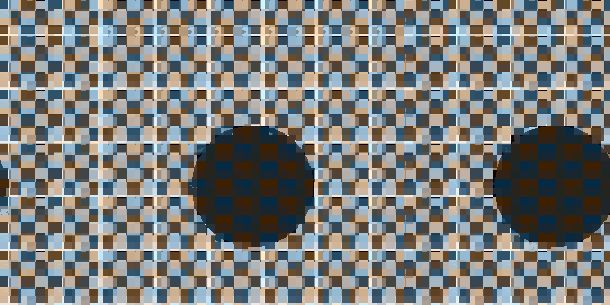

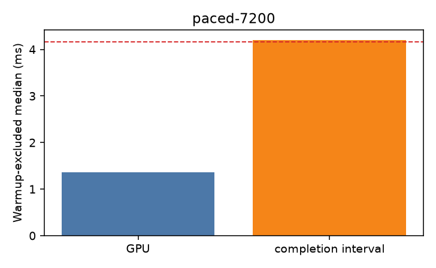

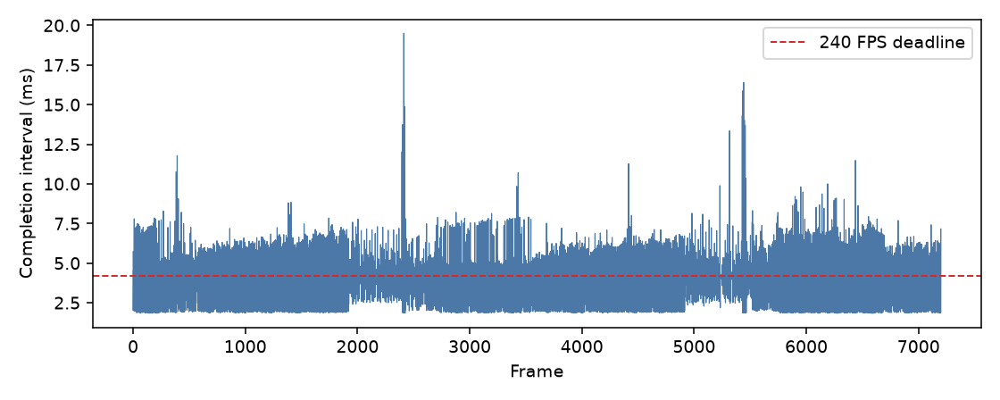

*Figure 3. Actual Pico output and scientific latency diagnostics from the
standalone probe. `total_ms` is scheduled arrival to observed completion and
drives the deadline-miss count; `interval_ms` measures cadence and includes
inter-frame CPU cleanup. The plots exclude cold startup/device and pipeline
creation from the timed window. [Archive, raw captures, summary and exact
reproduction](bench/results/240fps-2026-09-08/planar-direct/README.md).*

The experiment supports an approximate GPU PLANAR reconstruction direction and
motivates reducing redundant decoder memory work. Those are research directions;
no additional numerical decoder claim is made here pending matched validation.

A same-binary pacing follow-up completed four HIGH-priority 7,200-frame runs on
the same synthetic fixture. After excluding 24 warmup frames, the three busy-spin
configurations missed **0.47–0.82%** of 240 Hz deadlines, compared with **6.19%**
for the sleep control. The runs report approximately 240 scheduled updates/s,
but this still does not establish consistent 240 Hz delivery. Busy-wait pacing
trades CPU time and thermal headroom; power was not measured. [Raw captures,
summary script, chart and binary/shader identities](bench/results/240fps-2026-09-08/planar-pacing/README.md).

### Removing an entire copy

The encoder was reading back **55 MiB of unused coefficients per frame**. Removing that transfer cut measured live Lite encoding time without changing the compared bitstreams. The control was restored to check that the gain followed the change.

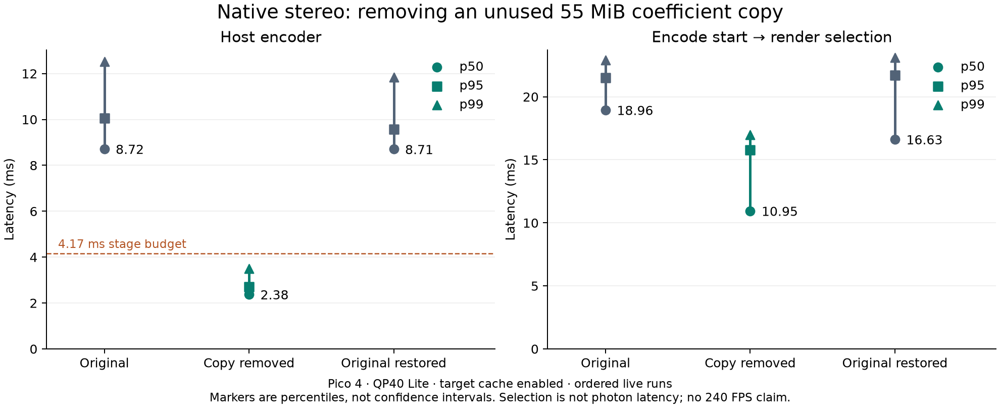

*Figure 4. Controlled removal of unused GPU→CPU work. The encoder result falls inside 4.17 ms; the full pipeline still has other costs. [Methods, profiler data, screenshots and bitstream checks](bench/results/240fps-2026-09-08/unused-coefficient-readback/README.md).*

### Moving warp work into the mesh

The native renderer splits its mesh at tile and foveation boundaries and performs tile homographies in the vertex path. The final same-APK comparison retained full-resolution output and reproduced the reduction from **6.30 to 3.10 ms** in GPU window means. It did not establish a consistent encode-to-selection tail-latency improvement.

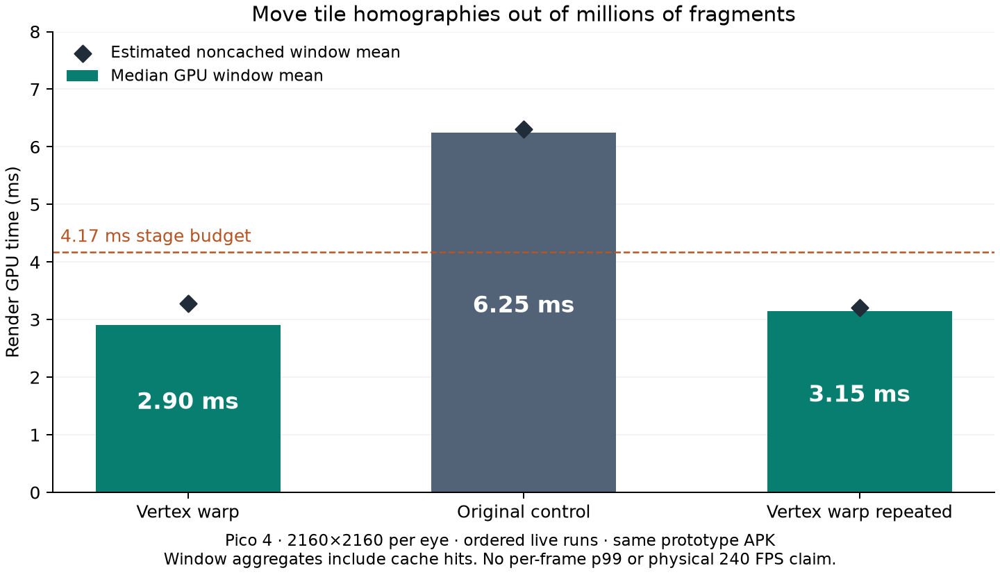

*Figure 5. Prototype renderer comparisons; the [final cleaned pair](bench/results/240fps-2026-09-08/atlas-vertex-warp/v3-final/README.md) is recorded separately. These GPU aggregates are not per-frame percentiles. [Implementation and experiments](bench/results/240fps-2026-09-08/atlas-vertex-warp/README.md).*

A subsequent live experiment removes a cancelling color-conversion pair using mutable UNORM attachment views over SRGB swapchain images. GPU window medians were **2.7 / 3.2 / 2.6 ms** for enabled / disabled / repeat, with no consistent selection-latency win. It remains opt-in. [WiVRn NX source, fallback behavior and captures](https://github.com/nerdrx/wivrn-nx/tree/atlas-live/docs/bench/atlas-unorm-20260908).

### Throughput is only one part of 240 Hz

The long sequence test completed **24,000 offscreen renders in 81.5 seconds**, using four static-pose renders per correction. Its steady render p99 was **7.29 ms**. The renderer has useful capacity, but late iterations still prevent a consistent 4.17 ms cadence.

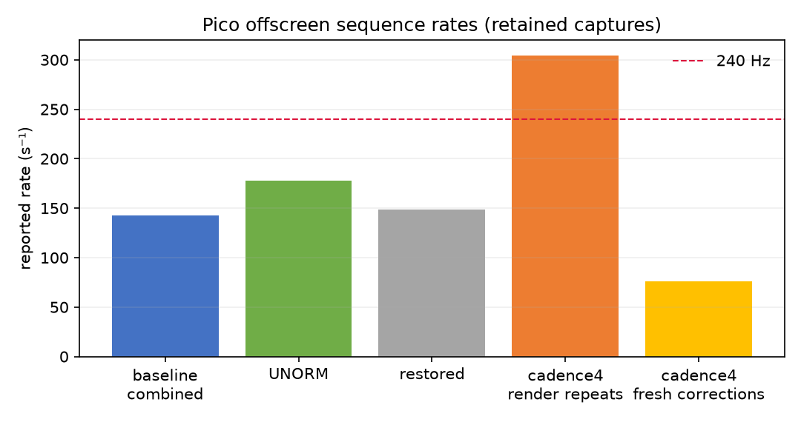

*Figure 6. Fresh corrections and repeated renders count different work. The sparse monochrome fixture is not a broad scene-quality test. [Raw CSVs, reproducible probe, timestamps and negative controls](bench/results/240fps-2026-09-08/sequence-throughput/README.md).*

### Comparison with hardware HEVC

One native-resolution, reversed-order comparison measured encode-start-to-render-selection latency as follows:

| Pipeline | p50 | p95 | p99 |
|---|---:|---:|---:|
| Custom WiVRn NX hardware HEVC | 21.822 ms | 31.159 ms | 33.322 ms |
| NX with experimental target cache | **17.633 ms** | **22.321 ms** | **23.256 ms** |

This is a measured pipeline advantage under those conditions. **Bitrate, quality, stereo organization and rendering paths differed.** HEVC reached decoded pixels sooner; NX spent less time from decode completion to selection. An [earlier native comparison](bench/results/240fps-2026-09-07/live-atlas/native-csv-hevc-nx/README.md) favored HEVC. Neither establishes general codec superiority or photon latency. [Controlled pairs and canonical frame mapping](bench/results/240fps-2026-09-07/live-atlas/borrowed-cache-corrected/v2-live/README.md).

## Visual results

The following figures come from archived measurements and actual Pico GPU readbacks. The 90 Hz charts use native padded stereo **4352 × 2176**, synthetic camera motion and 720 source frames per run. They measure offscreen parsing, upload and rendering; they do not measure live WiVRn NX or motion-to-photon latency. [Full visual gallery and regeneration script](docs/visual-results/README.md).

### Distribution, rather than average FPS

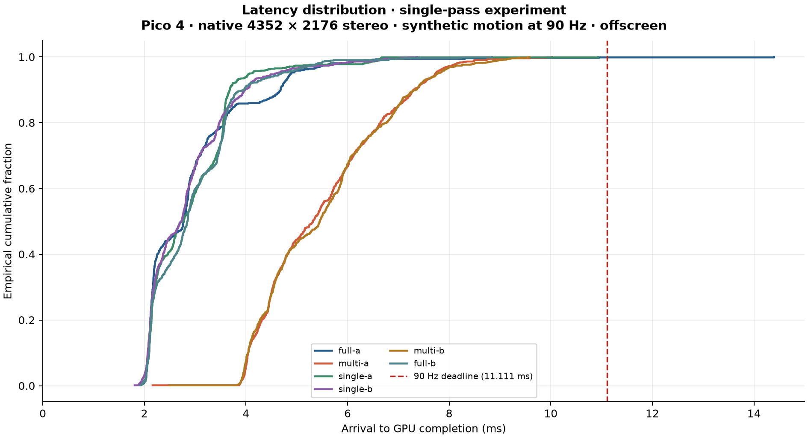

*Single-pass scheduling moves the latency distribution toward the full-draw control. The dashed line is the 11.111 ms display-period budget. Each curve represents a separate run.*

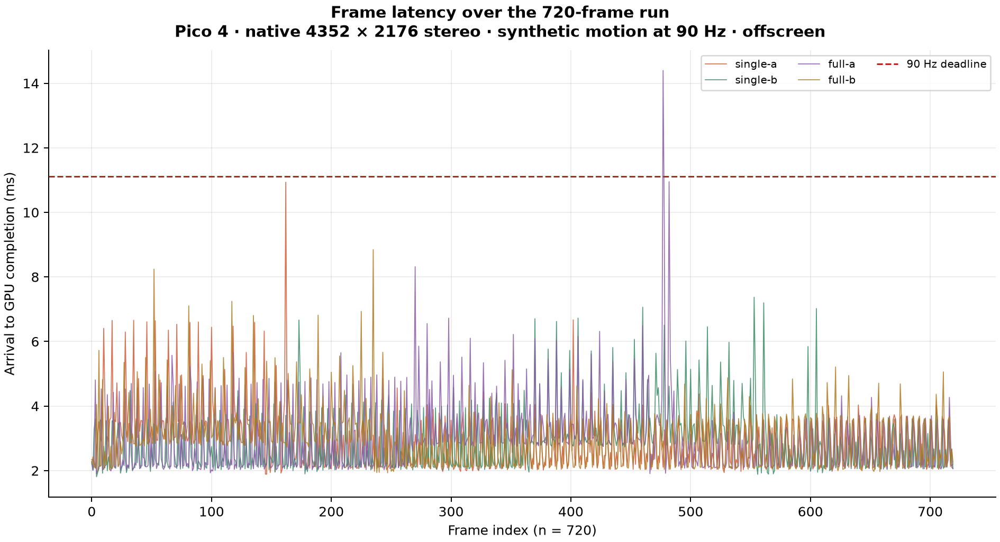

*Individual frames expose stalls that an average FPS number hides. Source frame order is preserved; no warmup samples are removed.*

### Where the time goes

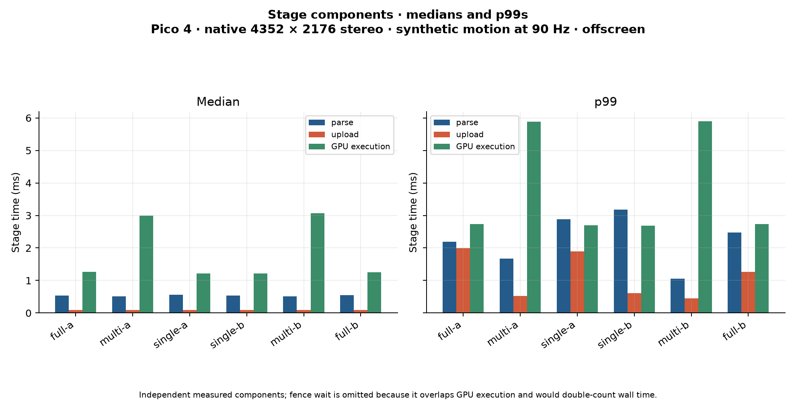

*Independent component medians and p99s. These bars must not be summed into an end-to-end percentile; fence waiting overlaps GPU execution.*

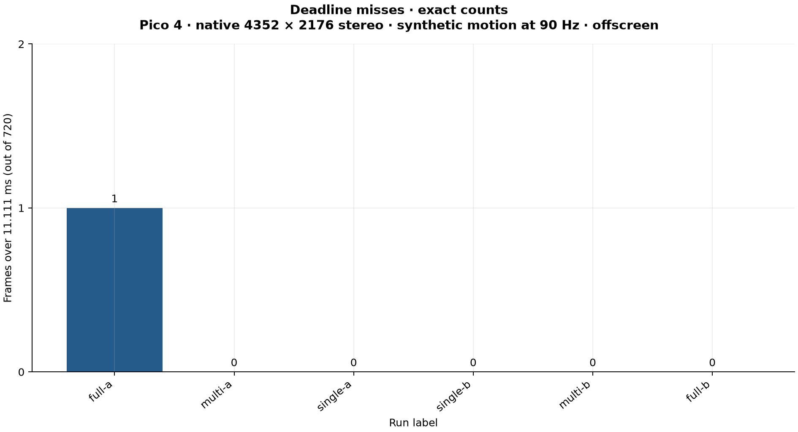

*Both final single-pass runs complete all 720 frames within 11.111 ms. This finite observation does not guarantee future deadlines or sustained thermal behavior.*

### Speed and pixel freshness together

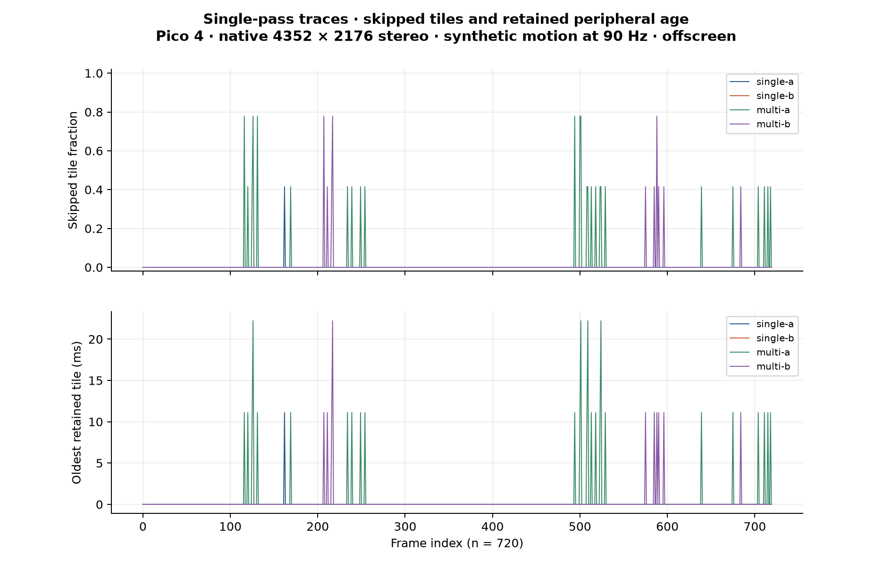

*Skipped work is useful only if retained content remains useful. Single A retains some outer pixels for one frame; Single B updates every tile.*

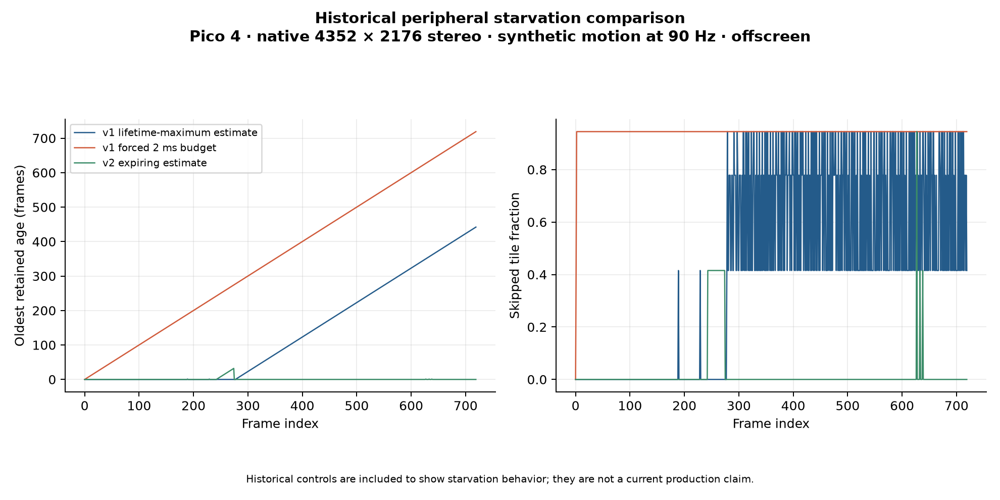

*Historical controls: the first scheduler's lifetime-maximum estimate caused prolonged starvation. Expiring measurements helped, but did not establish a hard pixel-age bound. These are different runs from the final single-pass comparison.*

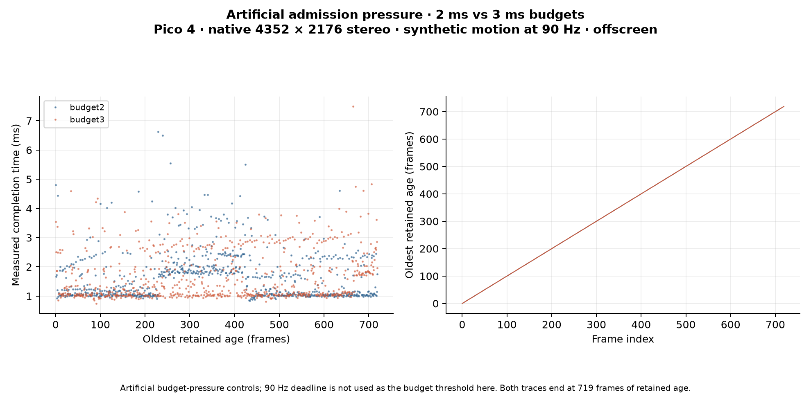

*New failure case: imposing a 2 or 3 ms admission threshold at 90 Hz leaves the outermost pixels stale for almost eight seconds. The artificial threshold is separate from the 11.111 ms cadence. [Raw pressure-test results](bench/results/90fps-2026-09-08/budget-pressure/README.md).*

### Real Pico output: complete versus retained pixels

| Fresh complete frame | Forced centre-only update |
|---|---|
|  | 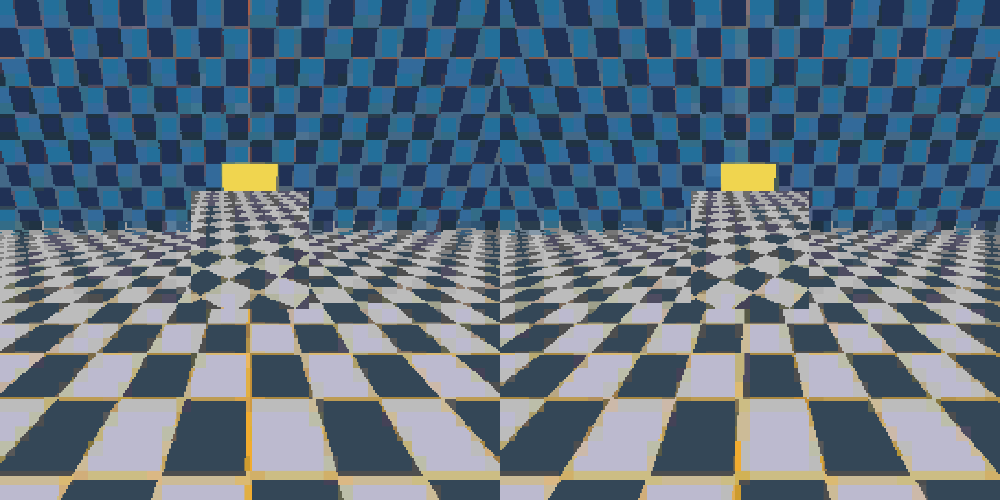 |

*The forced-retention control is intentionally discontinuous: each centre contains frame 19 while its outside retains frame 0. Exact RGBA checks verify both regions. Captures are outside timing, and single-pass output matches the full-draw control.*

### Camera-motion capture sequence

| Forward view | Positive yaw | Negative yaw |
|---|---|---|
| 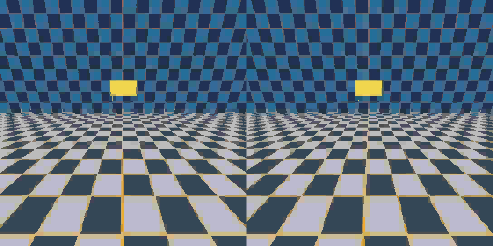 | 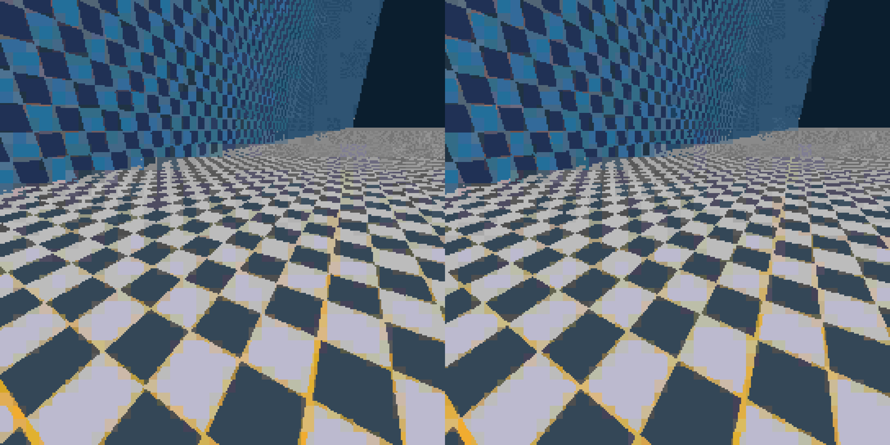 | 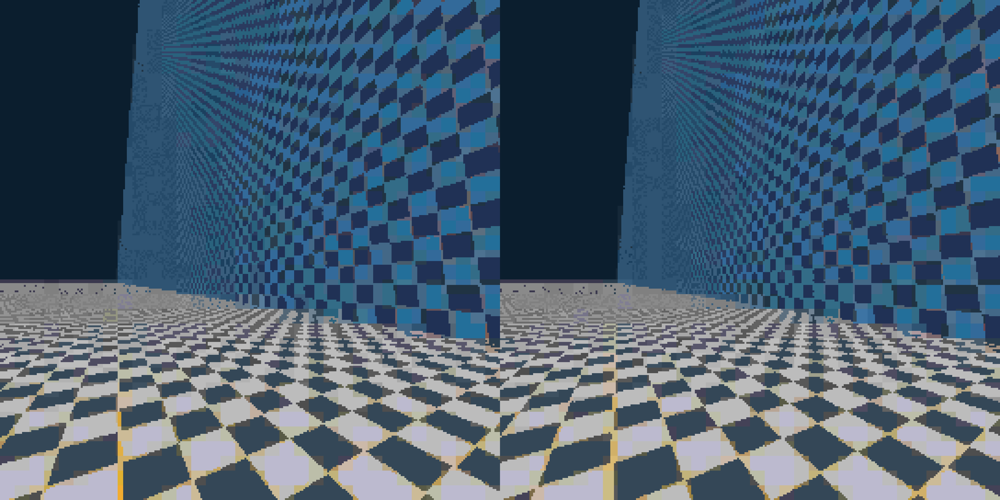 |

*Actual readbacks from the earlier 240-FPS source trajectory, including approximately ±60° yaw. These historical images establish changing rendered views, not physical headset tracking or successful 240 Hz presentation. [Trajectory, identities and failed deadline tests](bench/results/240fps-2026-09-08/motion-proof/README.md).*

## Quality and visual research

Speed is the immediate Pico priority. The desired low-bitrate appearance preserves useful edges and structure even when texture or exact reconstruction is sacrificed. That is an objective to test, not a property every current image achieves.

| Rendered test material | Deliberate approximation |
|---|---|
| 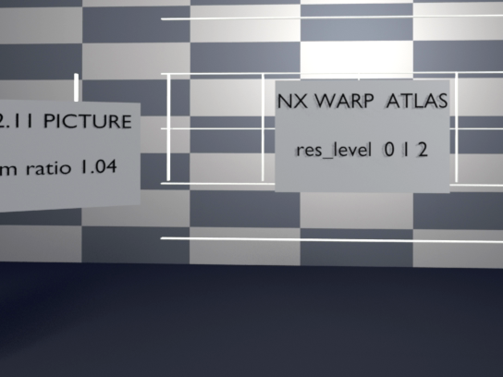 |  |
| The rendered room corpus exercises stereo, head motion and independently moving content. | Planar tiles trade fidelity for hard-edged facets. The recorded experiment costs 2–4 dB; it is a visual choice, not a free quality gain. |

*Figure 7. Existing research figures. [Settings, measurements and regeneration commands](docs/GALLERY.md).*

Historical [reference-codec quality gates](tools/quality/reports/gates-v2-2026-09-04.md) failed on the tested band-limited material. Later timing wins do not close those gates. Live captures still show seams and motion trails, and sustained thermal behavior needs further qualification.

## Measurement rules

A result belongs with its fixture, build and definition of completion.

- **Stage time:** encoder or decoder work alone. Its inverse is not complete-pipeline FPS.
- **GPU interval:** timestamped GPU work, potentially including dependency stalls. Periodic GPU window means cannot supply per-frame p95 or p99.
- **Completed offscreen work:** a GPU fence confirms completion. Repeated rendering does not create new source frames.
- **Render selection:** the client selected a decoded frame for rendering. The logged `blit` event is not a photon measurement.
- **Presentation:** paced updates delivered by the runtime and display. Recent Pico captures use 90 Hz; no physical 240 Hz presentation is demonstrated here.

Compare controls in both orders where practical, preserve warmup and session gaps, and report deadline misses alongside p50/p95/p99. Historical “displayed pose age” labels represented a difference between display timestamps, not measured motion-to-photon latency. [Full protocol and corrections](docs/240FPS.md).

Rejected and inconclusive experiments remain useful evidence: [R16 live handoff](bench/results/240fps-2026-09-07/live-atlas/r16-handoff/README.md), [shared-load pacing](bench/results/240fps-2026-09-07/live-atlas/shared-load-pacing/README.md), [all-skip uploads](bench/results/240fps-2026-09-07/skip-uploads/README.md), and [CPU affinity, color approximation and polling](bench/results/240fps-2026-09-08/sequence-throughput/README.md). Less GPU work alone is insufficient justification for more complexity.

## Status

| Area | Current state | Entry point |
|---|---|---|
| Reference codec and syntax | CPU reference, conformance material and recorded quality results | [Reference](ref/README.md), [syntax](docs/SYNTAX.md) |
| Vulkan encoder | Executable GPU encoder and measured live Lite path | [Encoder](vk/encoder/README.md) |
| Vulkan decoder | Compute decode, reconstruction and atlas experiments | [Decoder](vk/decoder/README.md), [atlas design](docs/ATLAS-DECODER.md) |
| Live streaming | Experimental encoder/decoder/renderer integration in the custom fork | [WiVRn NX `atlas-live`](https://github.com/nerdrx/wivrn-nx/tree/atlas-live) |
| Performance probes | Host and Pico evidence; sequential native-render probe | [Sequence probe](probe/sequence/README.md), [240 Hz work](docs/240FPS.md) |
| Quality evaluation | Synthetic and rendered material, anchors and published gate results | [Quality harness](tools/quality/README.md), [gallery](docs/GALLERY.md) |
| Further design work | Renderer-assisted prediction, compute foveation and hybrid approaches have varying implementation depth | [Architecture](docs/ARCHITECTURE.md), [hybrid](docs/HYBRID.md), [roadmap](ROADMAP.md) |

The design paper records a broader intended system than the measured live path. Consult implementation evidence before treating a design capability as available.

## Building

For CPU development, use **CMake 3.25+**, a **C++20 compiler** and **Ninja** with the checked-in presets:

```sh
cmake --preset dev
cmake --build --preset dev --parallel
ctest --preset dev --output-on-failure
```

For Vulkan development, install the Vulkan headers, loader, a usable Vulkan driver and `glslc` (shaderc). Some supporting components also use `glslangValidator`:

```sh
cmake --preset dev-vk
cmake --build --preset dev-vk --parallel
ctest --preset dev-vk --output-on-failure
```

Use `cmake --list-presets` to inspect other configurations. Vulkan is off in the default CPU preset. Building this repository does not install the custom headset client.

| Task | Instructions |
|---|---|
| Encode/decode from the reference tools | [Reference codec](ref/README.md) |
| Run Vulkan codec tools | [Encoder](vk/encoder/README.md), [decoder](vk/decoder/README.md) |
| Reproduce offscreen native rendering | [Sequence probe](probe/sequence/README.md); Android runs require an NDK and a matching decoder build |
| Reproduce quality comparisons | [Quality harness](tools/quality/README.md); Python dependencies and external anchors are documented there |
| Work on live VR streaming | [Custom WiVRn NX branch](https://github.com/nerdrx/wivrn-nx/tree/atlas-live) and its build instructions |

## Roadmap

Progress is measured against **90 → 120 → 144 → 180 → 240 Hz**, with full-resolution output and low latency carried through every checkpoint.

1. **Close the completion-time gap.** Separate GPU work, CPU scheduling, synchronization and correction cost; reduce late iterations rather than only average time.
2. **Decouple corrections from presentation.** Keep reference state stable while newer poses drive faster updates. Measure image age and disocclusion failures.
3. **Remove work by region.** Strengthen warp/skip and sparse paths; use foveation, visibility and renderer information to decide what needs computing.
4. **Prove the whole path.** Run matched scene and bitrate comparisons, moving-head captures, long thermal tests and actual presentation measurements on suitable hardware.

Stage fusion, specialized queues and decode-cost-aware rate control are candidates when measurements justify them. Every feature must earn its complexity through quality, bitrate, latency, GPU cost and power behavior. [Experiment direction](docs/240FPS.md) · [Broader roadmap and historical gates](ROADMAP.md).

## Documentation

| Document | Purpose |
|---|---|
| [Documentation index](docs/README.md) | Map of the project |
| [Design paper](docs/PAPER.md) | Rationale, alternatives and intended architecture |
| [Bitstream syntax](docs/SYNTAX.md) | Normative syntax; takes precedence over the design paper |
| [Architecture](docs/ARCHITECTURE.md) | Modules and interfaces |
| [Transport](docs/TRANSPORT.md) | Wire format, feedback and packet handling |
| [240 Hz experiments](docs/240FPS.md) | Performance direction, methodology and limitations |
| [Research gallery](docs/GALLERY.md) | Figures with settings and regeneration commands |
| [Architecture decisions](docs/adr/) | Recorded implementation choices and tradeoffs |
| [Integration design](docs/INTEGRATION.md) | Design context; use the live fork for current implementation |

## Contributing

Start with [CONTRIBUTING.md](CONTRIBUTING.md). Useful work includes reproducible performance experiments, difficult motion and disocclusion fixtures, conformance coverage, and independent hardware measurements.

Codec syntax changes need the reference behavior, documentation and vectors to agree. Lossy visual experiments should state the approximation and compare it against a named control; they do not excuse undefined reconstruction, reference corruption or unsafe synchronization. Keep measurements scoped, retain negative results and run the checks relevant to the change.

## License and acknowledgements

[Apache-2.0](LICENSE). Licensing does not constitute patent clearance; the repository's [review brief](docs/FTO-BRIEF.md) records that separate work.

NX Warp builds on the open VR ecosystem: [WiVRn](https://github.com/WiVRn/WiVRn), [WiVRn NX](https://github.com/nerdrx/wivrn-nx), [Monado](https://monado.freedesktop.org/), [ALVR](https://github.com/alvr-org/ALVR), and Mesa. The [design paper](docs/PAPER.md) discusses the compression, reprojection and perceptual research behind the project. Branding belongs to the [NX family](brand/README.md).

<div align="center">

<br>
<sub>Useful pixels. Less work. Measured progress.</sub>
</div>
