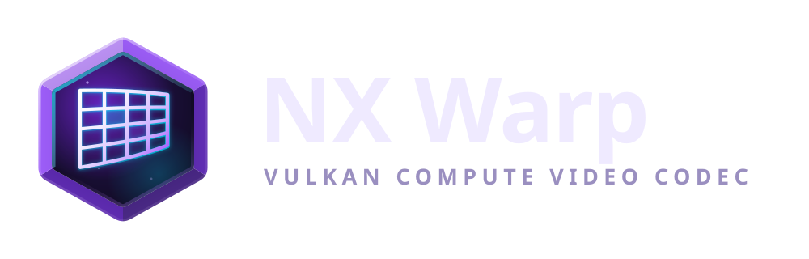
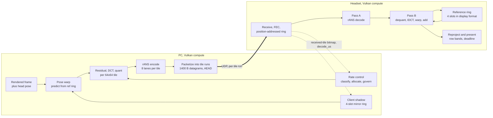

<div align="center">



### A video codec built for one job: putting a rendered VR frame on a headset, fast.

[](../../actions/workflows/ci.yml)
[](../../actions/workflows/format.yml)
[](../../actions/workflows/nightly.yml)
[](LICENSE)
[](docs/PAPER.md)


</div>

<br>

**Nothing here is usable yet.** This repository is a design paper and the code
that is growing underneath it. Read the [status table](#status) before you clone
it with a plan.

<br>

General-purpose video codecs are the wrong tool for VR streaming. H.264, HEVC
and AV1 were built for storage and broadcast: whole-frame slices, reference
lists, serial entropy coding, and fixed-function silicon whose latency and
session limits nobody can change. A VR streamer knows things those codecs cannot
see. It knows the head pose that produced the frame and the pose the next frame
will be rendered at. It knows the two eyes share nearly all their content, that
the lens throws away most of the periphery, and that a headset would rather show
a slightly stale tile than wait for a whole frame. **NX Warp is a codec built
around exactly those facts.** The frame is a set of independent 64x64 tiles,
each its own bitstream, each decoded by one GPU workgroup. Prediction is a
pose-warped reprojection of the last decoded frame plus a small per-tile
correction, so motion search largely disappears and a lost tile conceals itself.
Everything runs in Vulkan compute on both ends, with no CPU on the hot path and
no vendor SDK anywhere, which is what removes the NVENC, AMF and VAAPI session
ceilings on the PC. It is being built for [WiVRn NX](https://github.com/nerdrx/wivrn-nx).

Library and codec identifier: `nxvc`.

<br>

## Contents

- [What it is, and what it is not](#what-it-is-and-what-it-is-not)
- [Design principles](#design-principles)
- [How the pipeline fits together](#how-the-pipeline-fits-together)
- [How it beats hardware codecs, and where it does not](#how-it-beats-hardware-codecs-and-where-it-does-not)
- [Status](#status)
- [Roadmap](#roadmap)
- [Building](#building)
- [Documentation](#documentation)
- [Contributing](#contributing)
- [Licence and patent hygiene](#licence-and-patent-hygiene)
- [Acknowledgements](#acknowledgements)

<br>

## What it is, and what it is not

| It is | It is not |
|---|---|
| A codec for synthetic frames whose renderer hands over pose, depth, stereo and layer structure. | A general-purpose video codec. Do not point it at camera footage. |
| Vulkan compute on the server and on the headset, one workgroup per tile. | A wrapper around NVENC, AMF, VAAPI or MediaCodec. |
| A design for tile-granular latency: partial frames present, lost tiles conceal, there is no IDR. | A drop-in replacement for HEVC in an existing pipeline. |
| Vendor-neutral on the PC, so no encoder session ceilings and no driver-version roulette. | Free of hardware decoders. The hybrid path deliberately uses the headset's licensed HEVC decoder as a base layer. |
| Bit-exact by construction, with a CPU reference decoder as the normative spec. | Fast yet. The reference codec exists to be correct, not quick. |
| Open, Apache-2.0, built from public-domain and expired coding tools. | Patent-cleared. A formal freedom-to-operate review is a Phase 3 gate, not a claim made today. |
| A research project with a paper, a benchmark gate and measured exit criteria. | Shipping. Every number in `docs/` is a target until a report in `tools/quality/reports/` says otherwise. |

<br>

## Design principles

Five rules decide every tool in the format. They are stated in full in
[the paper](docs/PAPER.md#design-principles).

1. **Latency before bits.** Every tool is judged first by what it does to the
   time between render finish and photons, and only then by compression ratio.
2. **The GPU is the codec.** No tool may require serial state across tiles. If
   it cannot run as one workgroup per tile, it does not exist. That single
   constraint is why intra is DC-plane rather than directional, and why entropy
   coding is eight independent rANS lanes rather than CABAC.
3. **Use what the renderer knows.** Pose, depth, motion, stereo and layer
   structure are inputs to the codec, not things it rediscovers by searching.
4. **Degrade, never stall.** Every loss, every deadline miss and every budget
   overrun has a defined graceful output. Under pressure the picture loses
   texture before it loses structure: blur and low-poly surfaces, never blocks.
5. **One format, many decoders.** A hybrid hardware-plus-compute decoder on a
   weak headset and a pure compute decoder on a strong one read the same
   bitstream, selected by capability bits rather than by forks.

Two more rules govern how it gets built rather than what goes in it:
**bit-exact and simulatable** (an integer normative path, a CPU reference
decoder, conformance vectors, fuzzing, and an encoder that runs the real
decoder), and **patent hygiene** (public-domain and expired tools only, with a
written record of the public source for every tool and a formal review before
release).

<br>

## How the pipeline fits together



The loss unit is the datagram, the concealment unit is the tile. A tile
references the newest frame whose 3x3 neighbourhood the client acknowledged, so
a dropped datagram costs bits in the affected tiles for one round trip and
nothing else. There is no IDR to fall back to and no reference list to
resynchronise.

<br>

## How it beats hardware codecs, and where it does not

This is the honest version, drawn from
[paper 7.1, 7.2](docs/PAPER.md#7-conclusion-and-roadmap) and
[4.6.1](docs/PAPER.md#461-the-degradation-ladder-blur-never-block). Everything
below is a design expectation until the quality harness measures it.

**Where it should win**

- **Bits during head motion.** Pose-warped prediction turns most of a frame into
  skip tiles exactly when hardware codecs spend the most bits and add the most
  latency. Head motion is the common case in VR, and it is the case general
  codecs handle worst.
- **Latency.** Row-band pipelining and deadline presentation attack the
  frame-granular floor that hardware encode and decode impose by construction.
  The paper's target is a 12 to 23 ms render-to-photon floor against roughly
  100 ms measured on the current stack, with the compositor phase wait, not the
  network, as the remaining long pole. Target, not a result.
- **Loss behaviour.** Per-tile references plus a deterministic concealment warp
  remove the IDR entirely, along with the IDR ladder and the DPB workarounds
  that exist today purely to survive packet loss.
- **What a low bitrate looks like.** The degradation ladder spends the shortfall
  on texture and then on resolution, so tiles go soft and low-poly while edges,
  outlines and text hold. It is a different failure mode from raising QP until
  the frame turns into 16x16 blocks.
- **Capabilities the hardware simply lacks.** 4:4:4 and alpha on a mobile
  decoder, per-tile foveated resolution and quantization, refreshing one region
  in one frame, presenting a partial frame, and exceeding the decoder's fixed
  pixel rate. The XR2 Gen 1 decoder cannot do two 2160x2160 streams at 90 Hz,
  which is why every hardware-codec streamer encodes below panel resolution.
- **No session ceilings.** Vendor-neutral compute on the PC, so no NVENC session
  limits, no AMF or VAAPI quirks, no encoder that behaves differently per driver.

**Where it does not**

- **GPU time on the headset.** The H.264 and HEVC decoders on a Pico 4 are fixed
  function and cost zero GPU cycles. A compute decoder cannot beat free. The
  paper's own estimate for a full compute decode on Adreno 650 is 4 to 6 ms at
  p50 for two eyes at 2048 squared, which is why the Pico 4 is expected to land
  in *hybrid* mode with the hardware HEVC decoder carrying the base layer.
- **Static scenes.** At rest the paper expects parity with HEVC, not victory,
  and says so plainly. There is no pose delta to exploit when nothing moves.
- **Fast object motion and mirrors.** Content the pose cannot predict falls back
  to one quarter-pel vector per tile, which is far weaker than a mature inter
  predictor with a real motion search.
- **Power.** Fixed-function decode is the low-power path. A compute decoder
  spends GPU and therefore battery and thermal headroom, on a device that
  throttles in seconds and recovers in minutes.
- **Maturity.** x264 and x265 have had two decades of tuning. This has had none.

None of the above is settled by argument. Each is a number in the roadmap, and
the harness in `tools/quality/` prints PASS or FAIL against the paper's own
criteria rather than leaving it to a chart.

<br>

## Status

The tree is being built component by component and several land in parallel, so
this table moves. "Design" means it exists in `docs/` only. "In progress" means
there is code that does not yet meet its own bar. "Builds" means it configures
and compiles in CI. "Tested" means it has tests registered in `ctest` or
`pytest` that CI runs. "Measured" means a checked-in report carries numbers
produced by a named command on named material.

**The measured numbers are not good yet, and this README will not round them
up.** The Phase 1 intra gate and both Phase 2 kill tests have been run, on
band-limited v2 material, and every one of them fails:
[`tools/quality/reports/gates-v2-2026-09-04.md`](tools/quality/reports/gates-v2-2026-09-04.md)
has ten gate verdicts and ten FAILs, with the intra path at +61.4 percent
BD-rate against `x264 --keyint 1` where the criterion is within 1.0 dB.
[`ref/RESULTS-intra.md`](ref/RESULTS-intra.md) and
[`ref/RESULTS-inter.md`](ref/RESULTS-inter.md) are the long form. The one
anchor this codec has beaten so far is the inter path against x264 intra at
4:2:0, by 23 percent, which is a comparison in its own favour and is labelled
as such in the report.

Closing that gap is the live work. Thirteen `tourney/*` branches hold
independently built coding-tool packages -- transform, intra detail, entropy
contexts, inter prediction, encoder RDO, sparsity, perceptual rate control --
judged in pairs against the same anchors on the same material. Two branches
(`tourney/sparse`, `tourney/metric`) are merged into `main`; the other eleven
are judged but not merged, and the merge is the next piece of work. The
branches and their judge reports are local and unpushed, so a clone of this
repository does not have them yet; [ROADMAP.md](ROADMAP.md) lists what each
one is and what its judge decided. No tournament claim belongs in this table
until it lands here.

| Component | Path | What it is | Status |
|---|---|---|---|
| Design paper | `docs/PAPER.md` | Draft 1. The rationale for every decision. | design |
| Normative syntax | `docs/SYNTAX.md` | The v1 bitstream, normatively. The paper is not normative. | design |
| Reference codec | `ref/` | Bit-exact CPU encoder and decoder. Intra plus the Phase 2 inter path behind its tool bit. The thing the Vulkan decoder must equal. | builds, tested, measured (gate FAILs) |
| Conformance vectors | `tests/vectors/` | 56 decode vectors plus 29 rejection vectors, with md5 manifests, covering 4:2:0, 4:4:4, alpha, lossless, `res_level`, custom tables, odd sizes, multi-frame and inter. | builds, tested |
| Pose-warp predictor | `warp/` | Integer homography, CPU reference plus the GLSL kernel, with a cross-vendor determinism check and a GPU-versus-CPU diff. | builds, tested, measured (chain gate FAILs) |
| Phase 0 benchmark | `bench/` | The Adreno gate from paper 3.4. Kernels K1 to K6, Android NativeActivity plus a headless host CLI. | builds; one host run recorded, no headset run |
| Quality harness | `tools/quality/` | Synthetic VR material, x264 and x265 anchors, PSNR, VMAF, FovVideoVDP-style foveated metrics, BD-rate, PASS/FAIL reports. This is what produced every number above. | builds, tested |
| Transport | `transport/` | Wire format, AEAD, FEC, packetizer, multipath scheduler, client shadow. | builds, tested |
| Vulkan decoder | `vk/decoder/` | Pass A rANS decode, Pass B reconstruct, plus their CPU models. Conformance is checked against the reference on both lavapipe and RADV in CI. | builds, tested |
| Vulkan encoder | `vk/encoder/` | E0 to E2 statistics and prefix kernels. No end-to-end GPU encode yet. | in progress |
| Rate control | `rc/` | Tile classification, bit allocation, decode-time governor, plus a simulator. Simulator results only; not wired into `ref/` on `main`. | builds, tested |
| Stereo | `stereo/` | Inter-view prediction simulator and its tests. Not in the codec path. | builds, tested |
| Foveation | `fov/` | The per-tile foveation map from paper 5.1. No tests of its own; exercised only through `rc.foveation`. Not in the codec path. | builds |
| Hybrid path | `hybrid/` | Python simulator for the HEVC base plus compute enhancement layer, with recorded results. | builds, tested |
| Windows platform | `platform/win/` | D3D interop probe, llvm-mingw cross build, Wine smoke test. The probe needs Vulkan headers and is skipped when `NXWARP_BUILD_VK=OFF`. | builds |
| Android client | `android/` | Frame ring, networking, transport glue for the headset side. | in progress |
| WiVRn NX integration | `docs/INTEGRATION.md` | The plan for putting this behind WiVRn NX's encoder interface. | design |

<br>

## Roadmap

From [paper 7.3](docs/PAPER.md#73-roadmap). Every exit criterion is a target to
be measured, not a result.

| Phase | Weeks | Deliverable | Exit criteria |
|---|---|---|---|
| 0 | 3 | Adreno benchmark app, capability probe | K1 to K6 measured on a Pico 4, pure or hybrid decision recorded |
| 1 | 8 | Intra-only codec, reference decoder, conformance, fuzzing, quality harness | Bit-exact on lavapipe, RADV and Adreno; within 1 dB of x264 intra; Pass B under 5 ms p50; 24 h fuzz clean |
| 2 | 10 | Pose-warped inter, skip, per-tile reference tracking | Cross-vendor determinism green; within 10 percent of x265 zerolatency at rest, 30 percent better on motion frames; no drift under 5 percent loss |
| 3 | 6 | WiVRn NX integration, hybrid mode, telemetry, governor | Glass-to-glass under 40 ms at 150 Mbit on WiFi 6; one hour on a Pico 4 without a crash; freedom-to-operate review done |
| 4 | open | Stereo, foveated tiles, 4:4:4 fovea, depth stream | 25 percent saving at equal FovVideoVDP on the fovea; decode time unchanged |

The gate for all of it is Phase 0. Section 7.4 of the paper is blunt about it:
nothing else should be written until that benchmark table exists.

<br>

## Building

`CMakePresets.json` carries twelve configure presets -- `dev`, `dev-vk`,
`release`, `release-lto`, `asan-ubsan`, `tsan`, `gcc`, `clang`, `coverage`,
`fuzz`, `mingw-w64` and `android-ndk` -- each with a matching build and, where
it makes sense, test preset. `cmake --list-presets` prints them. Underneath,
the build is a plain out-of-source CMake configure with one option per
component, and every component is optional, so a missing sibling directory
never breaks the configure.

```sh
cmake --preset dev && cmake --build --preset dev && ctest --preset dev
```

**You need** CMake 3.25 or newer, a C++20 compiler, and Ninja or Make. For the
Vulkan components add the Vulkan headers and loader, plus `glslc` or
`glslangValidator` to compile the shaders. For the quality harness add Python
3.12 with `numpy` and `pytest`, and `ffmpeg` if you want the x264 and x265
anchors.

```sh
# CPU components and their tests. This is the useful default today.
cmake -S . -B build -G Ninja -DCMAKE_BUILD_TYPE=RelWithDebInfo
cmake --build build --parallel
ctest --test-dir build --output-on-failure
```

```sh
# Add the Vulkan encoder and decoder. Off by default because they are landing.
cmake -S . -B build -G Ninja -DCMAKE_BUILD_TYPE=RelWithDebInfo -DNXWARP_BUILD_VK=ON
cmake --build build --parallel
```

```sh
# Just the reference codec, nothing else.
cmake -S . -B build-ref -DNXWARP_BUILD_REF=ON \
  -DNXWARP_BUILD_WARP=OFF -DNXWARP_BUILD_TRANSPORT=OFF -DNXWARP_BUILD_RC=OFF \
  -DNXWARP_BUILD_FOV=OFF -DNXWARP_BUILD_STEREO=OFF -DNXWARP_BUILD_TOOLS=OFF \
  -DNXWARP_BUILD_PLATFORM=OFF
cmake --build build-ref --parallel
ctest --test-dir build-ref -R '^ref\.' --output-on-failure
```

Options are `NXWARP_BUILD_<COMPONENT>` for each of `REF`, `WARP`, `TRANSPORT`,
`RC`, `FOV`, `STEREO`, `HYBRID`, `VK`, `TOOLS` and `PLATFORM`, plus
`NXWARP_BUILD_TESTS`. Everything except `VK` defaults to on.

The Phase 0 benchmark and the quality harness build on their own terms:
`bench/` is a Gradle project for the Android APK with a headless host CLI beside
it, and `tools/quality/` is Python. Both have their own READMEs.

CI runs the same commands on gcc and clang against lavapipe, cross-compiles the
CPU libraries for Windows with mingw-w64, assembles the benchmark APK and runs
the Python harness. If your change is green locally it should be green there.

<br>

## Documentation

Everything of substance lives in `docs/`. Some of these are being written right
now, so a link may briefly land on a stub.

| Document | What it is |
|---|---|
| [`docs/README.md`](docs/README.md) | The map. Start here. |
| [`docs/PAPER.md`](docs/PAPER.md) | The design paper, draft 1. Rationale, alternatives considered, the compute budget stated honestly. Not normative. |
| [`docs/SYNTAX.md`](docs/SYNTAX.md) | The normative v1 bitstream syntax. Where this and the paper disagree, this wins. |
| [`docs/ARCHITECTURE.md`](docs/ARCHITECTURE.md) | How the modules in this tree fit together, and where each paper section landed as code. |
| [`docs/TRANSPORT.md`](docs/TRANSPORT.md) | The normative wire format: datagrams, tile runs, FEC, AEAD, feedback. |
| [`docs/INTEGRATION.md`](docs/INTEGRATION.md) | The plan for WiVRn NX: encoder interface, capability handshake, what gets retired. |
| [`docs/adr/`](docs/adr/) | Architecture decision records. One file per decision that was hard enough to argue about. |
| [`ref/README.md`](ref/README.md) | The reference codec, its Phase 1 scope, and how to run it. |
| [`bench/README.md`](bench/README.md) | The Phase 0 gate: what is measured, how, and every decision the paper left open. |
| [`tools/quality/README.md`](tools/quality/README.md) | The harness, the anchors, and how a criterion becomes a PASS or a FAIL. |
| [`brand/README.md`](brand/README.md) | The mark, the logo, and the rules for using them. |

The paper's sections map to the tree like this: section 1 is `ref/` and
`docs/SYNTAX.md`, section 2 is `warp/` and `stereo/`, section 3 is `vk/` and
`bench/`, section 4 is `transport/` and `rc/`, section 5 is `fov/` and
`tools/quality/`.

<br>

## Contributing

Read [CONTRIBUTING.md](CONTRIBUTING.md) first. The short version:

- **The reference codec is the specification.** Any change to what bits mean
  lands in `ref/` and `docs/SYNTAX.md` together, with a conformance vector. The
  Vulkan path follows; it never leads.
- **Bit-exactness is not negotiable.** The normative path is integer. If a
  change makes lavapipe, RADV and Adreno disagree by one least significant bit,
  it is a bug, not a tolerance.
- **New coding tools need a public-domain or expired source, named.** A tool
  with no written provenance does not get merged. See the patent hygiene note
  below.
- **No serial state across tiles.** If it cannot run as one workgroup per tile,
  it is not a candidate, however good the compression.
- **Numbers are measured or labelled.** Design targets say "target". Results
  come with the report that produced them. This applies to commit messages,
  documentation and this README.
- Formatting is `.clang-format` and `.editorconfig`, enforced by the Format
  workflow. Run it before you push.

Good first contributions right now: conformance vectors for corners the
current 56 miss, fuzz corpus seeds, quality-harness test material, and
independent verification of the Phase 0 kernels on hardware that is not an
Adreno 650. The most useful contribution of all would be a coding tool that
closes the intra gap measured in
[`tools/quality/reports/gates-v2-2026-09-04.md`](tools/quality/reports/gates-v2-2026-09-04.md);
that is the project's open problem, not a matter of polish.

<br>

## Licence and patent hygiene

Apache-2.0. See [LICENSE](LICENSE).

The codec is built from coding tools that are public domain, expired, or
explicitly royalty-free, and the project keeps a written record of the public
source for every tool from day one. rANS is used in Duda's published
construction with fixed precision and fixed state, deliberately steering clear
of the 2022 Microsoft claims on specific variants. CABAC is patented and is not
used. Transforms are integer DCT and Haar family. H.264 and HEVC are never
implemented here: they are only ever touched through the device's own licensed
hardware decoder in the hybrid path.

**This is engineering hygiene, not a clearance.** No freedom-to-operate opinion
has been obtained and none is claimed. A formal review is a gate before Phase 3
ships in a WiVRn NX release, scoped to four items: pose-warped prediction with
per-tile corrections, per-tile foveated quantization driven by eye tracking, the
enhancement-over-hardware-base structure against the LCEVC family, and the
entropy coder. Sections
[5.7](docs/PAPER.md#57-patent-and-royalty-summary) and
[6.12](docs/PAPER.md#612-freedom-to-operate-review-scoped) of the paper are the
engineering map of where the mines are, and are explicitly not legal advice.

<br>

## Acknowledgements

This codec exists because of work other people did first, and it is worth saying
whose.

**The stack it plugs into.** [WiVRn](https://github.com/WiVRn/WiVRn) is the
OpenXR streaming server this targets, by way of the
[WiVRn NX](https://github.com/nerdrx/wivrn-nx) fork.
[Monado](https://monado.freedesktop.org/) is the OpenXR runtime underneath it,
and the reason an open VR stack exists to extend at all.
[ALVR](https://github.com/alvr-org/ALVR) charted most of this territory first.
Mesa's [lavapipe](https://docs.mesa3d.org/drivers/llvmpipe.html) and RADV make
cross-vendor bit-exactness testable in CI rather than aspirational.

**Prior art the design leans on, by name.** Marc Levoy's 1995
polygon-assisted compression is the original render-locally, stream-the-residual
idea. MPEG-4 Part 2 global motion compensation is the prior art for warped
prediction. Jarek Duda's rANS is the entropy coder, published without patent.
GDeflate's lane-interleaved decoding is the model for the per-lane substreams,
and Oodle Texture is the model for rate-distortion decisions on fixed-rate
blocks. JPEG XS and VC-2 prove the low-latency intra tile design point that
Phase 1 resembles, and VC-2 is royalty-free by the BBC's declaration. LCEVC is
the closest existing shape to the hybrid decode path and the honest comparison
point for it. On the perception side: Guenter and colleagues on foveated
rendering, Kaplanyan and colleagues on learned peripheral reconstruction, and
Mantiuk and colleagues on FovVideoVDP, which is how quality gets judged here at
all. Shading Atlas Streaming and QuadStream are the strongest alternative
architecture, and the paper says so; they need engine integration, which this
project refuses to require.

**The design language.** The mark and the visual system come from
[NX Hub](https://github.com/nerdrx/nx-hub), where the NX design language is
specified.

<br>

<div align="center">


<sub>Part of the NX family. Apache-2.0.</sub>

</div>
