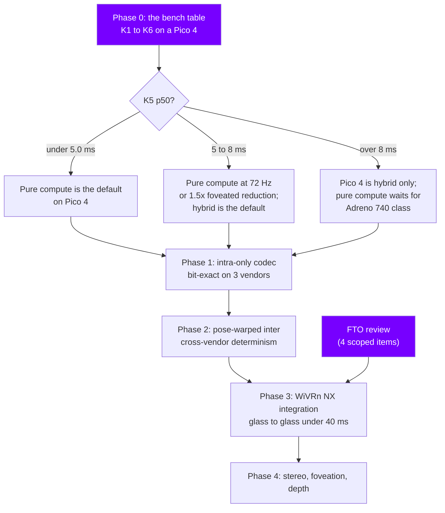

# Roadmap

Phases, exit criteria, and what actually exists in the tree today.

The phases and their exit criteria come from [docs/PAPER.md](docs/PAPER.md) sections 3.11 and 7.3 and
are reproduced here unchanged. The status column is an honest statement of what is in the repository,
not a claim that any of it is finished or correct.

> **No exit criterion has been met.** The Phase 0 gate has not been run on a headset. A headless host
> run exists in `bench/results/` (a desktop RADV device), and `bench/README.md` states plainly that
> host numbers are a regression signal, never the verdict: the gate is the on-device table. Every
> performance figure elsewhere in this project remains a design estimate; see
> [docs/PERFORMANCE.md](docs/PERFORMANCE.md), whose measured column is empty until device numbers
> exist.

## Phases

| Phase | Weeks | Deliverable | Exit criteria | Status |
|---|---|---|---|---|
| **0** | 3 | Adreno benchmark app, capability probe | K1 to K6 measured on a Pico 4; the pure-versus-hybrid decision recorded; the numbers in the tree | **In progress.** The gate app exists (`bench/`, kernels K1 to K6, Android and headless host front ends, thermal mode, self-test against the CPU reference) and a Vulkan capability probe exists (`vk/common`). A headless host run has been recorded in
`bench/results/`; nothing has been run on a headset, which is what the gate requires. |
| **1** | 8 | Intra-only codec: reference decoder, GPU decoder, GPU encoder, conformance, diff harness, quality harness | Bit-exact on lavapipe, RADV and Adreno; within 1.0 dB PSNR of x264 intra at 100 to 400 Mbit on VR captures; Pass B under 5 ms p50 on Pico 4; encoder under 4 ms on RX 580; fuzz corpus 24 h clean | **In progress.** Reference codec, conformance vectors, Pass A, Pass B, encoder stats passes, quality harness and fuzz targets all exist in the tree. None of the four numeric criteria has been measured. |
| **2** | 10 | Pose-warped inter, DC-plane intra refresh, skip, per-tile reference tracking | Cross-vendor determinism test green; BD-rate within 15 percent of x265 zerolatency single-reference on head-rotation sequences at 100 to 200 Mbit; 5 percent segment loss shows no drift beyond one refresh period; Pico 4 p99 under 7 ms at 90 Hz | **Started early.** `warp/` (integer homography, warp kernel, CPU oracle) and `transport/shadow` exist ahead of schedule. No measurements. |
| **3** | 6 | WiVRn NX integration, hybrid mode, telemetry, decode-time governor, FTO review | Glass-to-glass under 40 ms at 150 Mbit on WiFi 6 measured by the existing HUD path; encode plus decode under 12 ms combined; one hour on a Pico 4 without a crash; hybrid mode selectable and functional; FTO review done | **Design only.** `docs/INTEGRATION.md`, `android/` client shell, `hybrid/` simulator and `rc/governor` exist. The FTO review ([ADR-0017](docs/adr/0017-fto-review-scope.md)) has not been performed. |
| **4** | open | Stereo inter-view, foveated tiles, 4:4:4 fovea, depth stream | At least 25 percent bitrate saving at equal FovVideoVDP on the fovea; decoder time no worse than Phase 2 | **Study only.** `stereo/` holds a CPU experiment with recorded simulation results, and `fov/` holds the foveation map generator. Neither is in the codec path. |

Week counts are the paper's original estimates and have no start date attached to them. They describe
effort, not a schedule.

## Component status

Read as: what exists in the tree, at the commit this file was last updated. A component being listed
does not mean it is complete, correct or wired into anything else.

| Component | Directory | Normative doc | What exists |
|---|---|---|---|
| Reference codec | `ref/` | [spec/](spec/), [docs/SYNTAX.md](docs/SYNTAX.md) | Headers, DCT, rANS, DC-plane intra, encoder and decoder, `nxv-enc` / `nxv-dec` / `nxv-info` tools, tool-bit gating, trained default tables |
| Conformance vectors | `tests/vectors/` | [spec/09-conformance.md](spec/09-conformance.md) | 32 `.nxv` vectors with an md5 manifest, covering intra, lossless, alpha, `res_level`, custom tables, odd sizes, multi-frame |
| Pose warp | `warp/` | WARP.md (in progress) | Integer homography quantisation, CPU reference warp, warp oracle, `warp_tile.comp` |
| Transport | `transport/` | [docs/TRANSPORT.md](docs/TRANSPORT.md) | Wire format, packetizer, sender, receiver, AEAD, FEC, multipath, encoder shadow model |
| Rate control and foveation | `rc/`, `fov/` | [docs/RATECONTROL.md](docs/RATECONTROL.md) | Tile classification, allocation, degradation ladder, decode-time governor, synthesis harness, foveation map generation |
| Vulkan decoder | `vk/decoder/` | derived from the spec | Pass A (rANS decode) and Pass B (reconstruct) with models, layouts and GLSL, runtime self-test |
| Vulkan encoder | `vk/encoder/` | derived from the spec | E0 convert, E1 stats, E2 prefix, CPU stats reference, YCbCr 2-plane passthrough |
| Vulkan common | `vk/common/` | | Context, resources, capability probe, probe JSON |
| Phase 0 benchmark | `bench/` | `bench/README.md` | Kernels K1 to K6, Android NativeActivity and headless host front ends, thermal mode, self-test, report tooling. Host results recorded; **no device results yet** |
| Android client | `android/` | [docs/INTEGRATION.md](docs/INTEGRATION.md) | Client shell: UDP receive path, frame ring, HUD, feedback |
| Stereo inter-view | `stereo/` | [docs/STEREO.md](docs/STEREO.md) | CPU experiment, scene and prediction models, recorded simulation results, FTO scoping notes |
| Hybrid layering | `hybrid/` | HYBRID.md (in progress) | Python simulator: base, enhancement, warp, panorama, metrics, sweep |
| Platform | `platform/` | [docs/INTEGRATION.md](docs/INTEGRATION.md) | Windows D3D11 interop probe, llvm-mingw toolchain file, SPIR-V embedding, Wine smoke test |
| Engine extension | | [docs/XR_EXT_NXWARP.md](docs/XR_EXT_NXWARP.md) | Specification of the velocity, depth and stencil extension. Changes no bitstream syntax |
| Quality tooling | `tools/quality/` | `tools/quality/README.md` | Harness core, synthetic VR material generator, compare and report, foveated metrics, BD-rate, example reports |
| Test corpus | `corpus/` | `corpus/README.md` | Manifest schema, generator-driven fetch, hash verification |
| Examples | `examples/` | `examples/README.md` | Decode, encode, round-trip PSNR, tile walk, transport loopback |
| Python bindings | `python/` | | Package skeleton and tests |
| Fuzzing | `fuzz/` | [TESTING.md](TESTING.md) | Fuzz drivers |
| Brand | `brand/` | `brand/README.md` | Logo, mark and social assets |
| Documentation | `docs/`, root | [GOVERNANCE.md](GOVERNANCE.md) | The paper, the normative spec, ADRs, architecture, glossary, FAQ, threat model, performance and compatibility targets, errata |

## What is blocking what

The paper's closing instruction (7.4) is unambiguous: the Phase 0 benchmark is the first thing to
build, it is about a week of work, it reuses real kernels, and every later decision hangs on its
table. Work has proceeded on later phases in parallel, which is a deliberate choice to have the code
ready when the table exists, not a claim that the gate has been passed.

## Known open questions

Each of these is a decision the project cannot make from the desk. They are tracked in the ADRs and in
[spec/annex-c-open-issues.md](spec/annex-c-open-issues.md).

| Question | Resolved by | Record |
|---|---|---|
| Does the pure compute decoder fit on an Adreno 650? | Phase 0, kernel K5 | [ADR-0015](docs/adr/0015-compute-budget-verdict-pending-phase-0.md) |
| Is subgroup ballot available and fast on Adreno? | Phase 0, kernel K4 | [ADR-0003](docs/adr/0003-rans-eight-lanes.md) |
| How large is the intra gap against x264 without directional modes? | Phase 1 | [ADR-0004](docs/adr/0004-dc-plane-intra-no-directional-modes.md), promoted to v1 if above 40 percent |
| Does the pose warp actually beat block motion estimation during head motion? | Phase 2, the kill test in paper 2.11 | [ADR-0005](docs/adr/0005-one-mv-per-tile-five-modes.md) |
| Does a warp-only chain hold quality for 2 s, bilinear versus Catmull-Rom? | Phase 2 | paper 2.2, 2.11 risk 2 |
| What does referencing N-2 on WiFi actually cost? | Phase 3 | [ADR-0006](docs/adr/0006-acknowledged-neighbourhood-references-no-idr.md), estimated 5 to 10 percent |
| Does MediaCodec low-latency mode work on Pico firmware? | Phase 0, kernel K6 | paper 3.4 |
| Do the four FTO items clear? | Before Phase 3 ships | [ADR-0017](docs/adr/0017-fto-review-scope.md) |
| Does the degradation ladder actually look the way it is meant to? | Subjective study, paper 5.3 | [ADR-0013](docs/adr/0013-degradation-ladder-blur-never-block.md) |

## How this file stays honest

- A status only changes when something in the tree changes, never in anticipation.
- An exit criterion is met when a number exists, with a device, a driver version and a date attached.
  Until then it is unmet, whatever the code looks like.
- Errors found in the paper during implementation go to [docs/ERRATA.md](docs/ERRATA.md), and the
  paper text is left as written.

## References

- [docs/PAPER.md](docs/PAPER.md) sections 3.11 and 7.3 (the phases and their exit criteria),
  7.4 (build the benchmark first)
- [docs/PERFORMANCE.md](docs/PERFORMANCE.md) (the targets and the empty measured column)
- [docs/ARCHITECTURE.md](docs/ARCHITECTURE.md), [docs/adr/](docs/adr/), [CHANGELOG.md](CHANGELOG.md)
