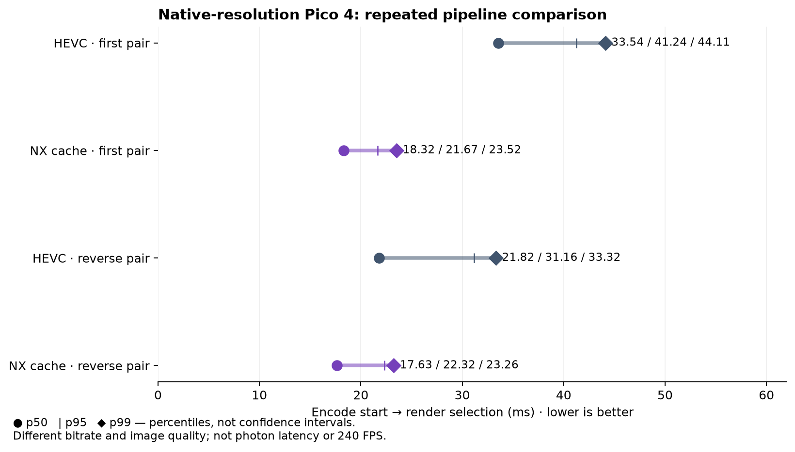

# Corrected-cache v2 live pair

This is a separate v2 pair after the corrected-cache rebuild. The parser uses
stream 0, a 10 s warmup, explicit NX wire-to-outer frame mapping, and the
encode-to-`blit` interval. The normalized CSVs retain the five-column event
shape, including `nx_frame_map`, with timestamps shifted by each file's first
event.

| arm | initial p50/p95/p99 ms | reverse p50/p95/p99 ms | selected frames |
|---|---:|---:|---:|
| HEVC | 33.541/41.237/44.110 | 21.822/31.159/33.322 | 2,235 / 2,337 |
| NX cache v2 | 18.319/21.672/23.516 | 17.633/22.321/23.256 | 1,911 / 3,273 |
| NX cache off | 31.168/38.814/41.362 | — | 2,094 |

These are selected-pipeline timings, not compositor submission, photon, or
end-to-end latency. Both runs show lower NX selection timing here, but bitrate,
render path, and selected populations differ; no quality, causal, H.264, 240
FPS, or production-default claim follows. Screenshots are retained for visual
inspection: [initial HEVC](hevc-screen-29.png), [initial NX](cache-on-screen-06.png),
[reverse HEVC](hevc-rev-screen-34.png), and [reverse NX](cache-rev-screen-29.png), and [cache-off](cache-off-screen-06.png).

Reproduce each arm with:
`python3 summarize_pipeline_latency.py hevc-normalized.csv.gz --codec hevc`
and the analogous `nx-normalized.csv.gz --codec nx`; repeat with the `*-rev`
files, and run `python3 summarize_pipeline_latency.py nx-off-normalized.csv.gz --codec nx`. The cache-off arm is included as an additional NX control. The APK SHA256 is
`3f8f9556f0e7fa30424f271f68a62ddeae5d86c5e1e6183bdd1f8cd02b735ae4`.
The capture server binary SHA256 is `621fb271724b85802391fda266ce47438c9ae5763190aa1e985228d712f62115`. Raw logs remain outside the repo.

## Conditions and interpretation

The host used RX 7900 XTX/RADV; the headset was Pico 4/Adreno 650. Native
encoded source was 2176×2176 per eye (4352×2176 paired NX luma), and output was
2160×2160 per eye. The custom OpenXR scene contains a checkerboard and rotating
cubes. These were resting-headset sessions with presence/focus cycling; the
scene screenshots verify content at capture instants, not every timing row.
CSV session spans in `capture-spans.json` can exceed the screenshot capture
window. The analysis uses all received frames after its 10-second warmup, with
earliest feedback per frame; selected-frame counts are not physical FPS.

The configurations are archived in `nx-config.json` and `hevc-config.json`.
NX used QP40, automatic pacing, and `NXVC_VKE_ATLAS_OPTIMISTIC=1`. HEVC used
VAAPI H.265 with encoder failover disabled. Bitrate was not matched and the
settings do not establish actual measured wire bitrate. NX sends paired stereo;
HEVC uses separate eye streams. NX's atlas render and scheduling path differs.
HEVC encode-to-ready p50 was 10.328/10.244 ms, versus NX 14.671/15.369 ms:
the measured advantage is in eventual frame selection, not faster standalone
encoding or decoding. No H.264 comparison was conducted in this experiment.

The first NX ON capture contains an explicit dirty-catchup activation banner.
The reverse run was requested with the same property enabled, but its retained
startup log lacks that banner. OFF was requested with the property at zero;
its retained log has no activation banner. This limits independent activation
auditing. The additional OFF control is a single later run, not a randomized
causal study. Both NX settings retain visible seams and motion trails.

The full source changes are codec `4000fbf` and WiVRn NX `4df1e8ff`. The APK and
server were built from their corresponding source edits before those commits;
the binary hashes above identify the tested artifacts. The five synthetic parser
tests cover dropped source IDs, wire wrap, stream isolation, duplicate feedback,
and invalid/missing identities. Both legacy and cached borrowed-output GPU
pixel comparisons pass with synchronization validation.
