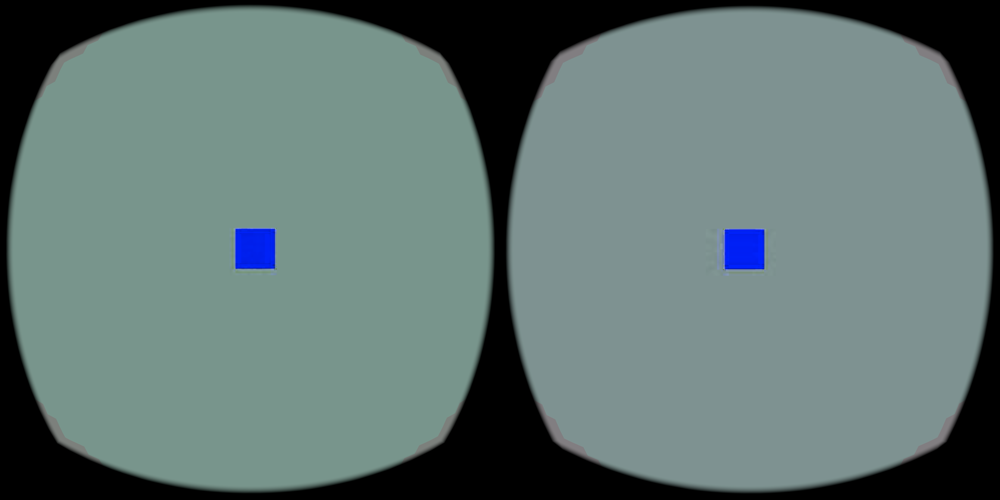

# Native HEVC hardware and observed latency baseline

This sanitized evidence records the full-resolution native HEVC hardware
baseline using APK `1a484ee3a88c57ac74402ba8d7a3a127b2d825c8e03e9b46bb473d560b6aced3` and server `a7b47b3e164eaa1578774526598911546b00ae83b55ba7a33f874e2504040d82`. Runtime
startup selected the Qualcomm HEVC hardware decoder; the device capability
report advertised Qualcomm H.264, HEVC, and VP9 support.

The run reported 80 active sources/s, 5.6 ms renderer GPU time, and 59.745
reported sources/s over its observed wall span. It is a hardware baseline, not
a pure NX or hybrid replacement result. The current base-layer integration is
a no-op/drop path.

With the first 10 seconds excluded, observed arrival-to-ready latency
p50/p95/p99 was 20.284/57.061/86.173 ms for NX and 5.741/11.953/12.907 ms for
HEVC. Arrival-to-render-selection was 26.233/66.546/92.162 ms for NX and
30.658/38.346/40.409 ms for HEVC. These are observed/reported frame
populations, not compositor submission or photon latency. The populations
differ, bitrate was not matched between arms, and host load was uncontrolled.
The HEVC arm uses regular renderer postprocessing (including glow/deband), while
NX uses its specialized renderer path, so this is not a like-for-like visual
or pipeline comparison.

Only the valid HEVC screenshot is included. The NX screenshot was black and is
omitted as non-evidence. The raw private logs remain outside the repository;
`latency-summary.jsonl`, `native-hevc-summary.json`, and the summarizer retain numerical summaries and analysis method
without device serials, process IDs, private paths, or network identifiers. The
normalized CSV is relative-time data. Reproduce and verify it from the evidence directory with `python3 reproduce-normalized.py`; this reconstructs the parser input per arm and compares all stages with `normalized-verification.json`. `normalized-verification.json` records the
summary reproduced by running `summarize-latency.py` on each of its four arms: native-optout, native-optin, native-rev-optin, and native-rev-optout.
Raw capture records remain private.

All four optimistic timing arms use the same SIMPLE scene: a flat gray background with one blue cube, unlike the checkerboard/15-cube HEVC baseline. The retained reverse opt-in screenshot shows this scene with visible ringing; it is a static capture and cannot establish motion correctness.

The audited optimistic atlas pair used source commit `920ac878`, encoder binary SHA `e5a1d0071a6a190cc7aaa0040649bbd487e81ae1f2f21fbd4f0f0b41a54570c2`, and server binary SHA `e220c9c86e465a2363439d0ec4070a524286d87856326234d8f068f73a99d8b6`; its patch and provenance are retained. It is summarized in `atlas-optimistic-summary.json`: native opt-out/opt-in fresh-source medians are 46/75 per second, with arrival-to-ready p50/p95/p99 of 16.526/43.282/57.061 ms versus 10.542/20.152/21.924 ms. This is an opt-in experiment with explicit refresh and validity gates; it is not a general latency or FPS claim. The retained reverse opt-in arm reproduces the same parser stages, with arrival-to-ready 10.863/19.870/21.881 ms and arrival-to-render-selection 17.478/27.736/30.288 ms (p50/p95/p99).
