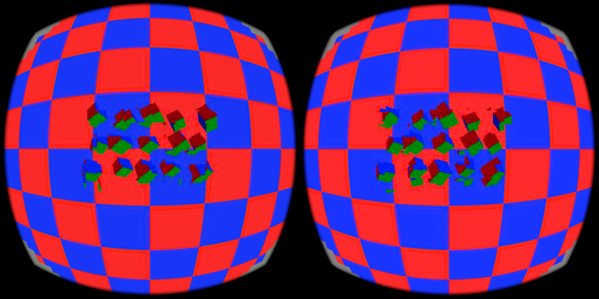
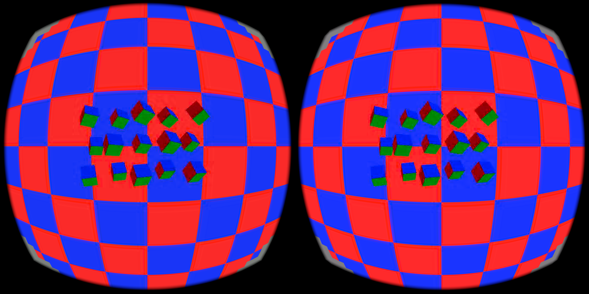

# Pattern 2 visual appendix

This appendix keeps the checkerboard/cubes visual evidence separate from the
SIMPLE-scene optimistic timing runs. The opt-in and opt-out captures use the
same demanding checkerboard scene and show the same broad scene geometry, but
the opt-in screenshot has severe block trails around the cubes. The opt-out capture has substantially cleaner cube edges. Both are
static headset captures and do not establish motion correctness or quality
parity. The audited active-window summary reports fresh sources 39.25→82/s, decoder GPU 13.2→5.0 ms, and renderer GPU 4.0→5.9 ms (opt-out→opt-in). These are window-mean percentile summaries; no per-frame timing CSV exists, so this pair makes no latency claim. The opt-in path remains experimental and is not default.

APK/server/build identifiers and sanitized configuration provenance are in `provenance.json`; the raw logs remain private.
