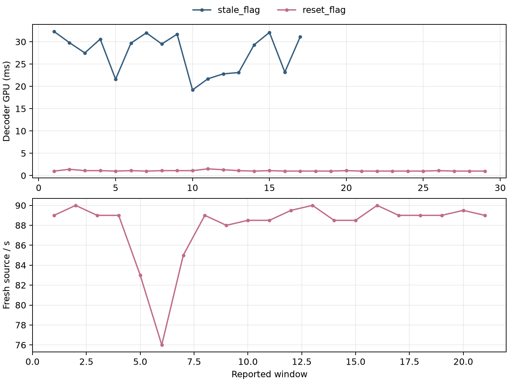

# PICTURE flag reset diagnostic

This evidence compares two same-client QP40/pace90 captures using the same fixture and APK. The arms are named by observed behavior: `stale_flag` is the prior capture whose decoder telemetry remained PICTURE despite server ATLAS reports; `reset_flag` is the reset capture after the codec fix. The server and codec provenance is recorded in `provenance.json`.

The capture tool ran for unequal durations (about 30.1 s and 55.1 s). Decoder values are medians of every available two-second decoder report window. Render values use the printed render report windows. Missing reports remain absent rather than being inferred.

| arm | decoder windows | GPU ms | wall ms | passA / passB ms | render windows | fresh source/s |
|---|---:|---:|---:|---:|---:|---:|
| stale_flag | 17 | 29.5 | 32.3 | 1.8 / 27.8 | 0 | unavailable |
| reset_flag | 29 | 1.0 | 2.0 | 0.2 / 0.9 | 21 | 89.0 |

The stale capture's server logs report ATLAS frames while its decoder telemetry reports PICTURE frames, which is the diagnostic failure being isolated. The reset capture reports low decoder cost and active render windows. Its aligned report span is 53.21 s, with 3,516 sources after the first report, 66.0778 reported sources/s, and a maximum report gap of 6.768 s. The active render-window median is 89/s; this is not a sustained-rate claim. The stale capture has no render/pose reports in its scene log. The old screenshots are at approximately 6 s and 24 s; the reset screenshots are at approximately 6 s and 49 s. The late checkpoint screenshots are black, so this package makes no visual live-scene or 90 FPS claim.



```sh
python3 summarize.py --stale stale_flag/live-lastband-fixed-pace90-measure.log --reset reset_flag/live-picture-reset-pace90-measure.log --out summary.json
MPLCONFIGDIR=/tmp/mpl python3 plot.py --stale stale_flag/live-lastband-fixed-pace90-measure.log --reset reset_flag/live-picture-reset-pace90-measure.log --out picture-reset-windows
```
