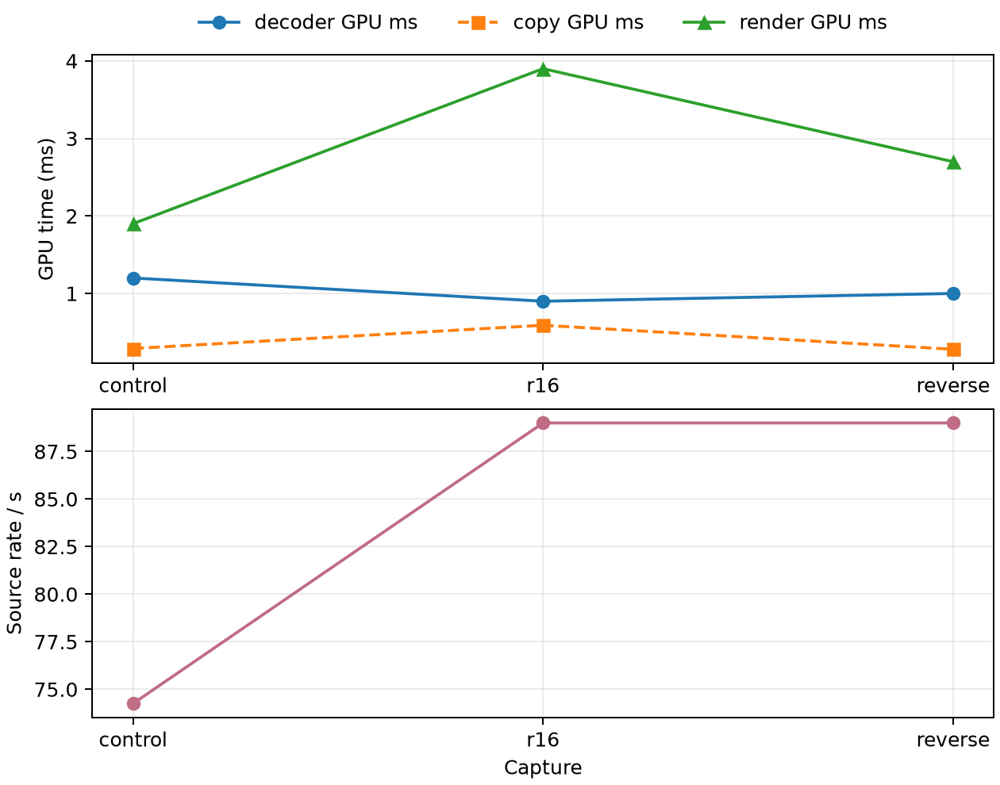

# R16 handoff experiment

The R16 probe was compared with an R8 control and same-binary R8 reverse capture on the same QP40/pace90 fixture. The R16 decoder path reports `R16_UNORM` and six dispatches versus R8’s seven.

| arm | decoder GPU ms | copy GPU ms | render GPU ms | active source/s |
|---|---:|---:|---:|---:|
| control R8 | 1.2 | 0.29 | 1.9 | 74.25 |
| R16 probe | 0.9 | 0.59 | 3.9 | 89.0 |
| reverse R8 | 1.0 | 0.28 | 2.7 | 89.0 |

R16 lowers decoder GPU time but raises copy and render cost. The same-binary reverse has the same source rate, so there is no delivery gain; the experiment is rejected. The failed original probe is retained under `failed-startup` and is not performance data. All captures used shared gaming load, and signed display offsets are not physical latency measurements. Screenshots are retained without visual or FPS claims.

The copy path reference is [`vkCmdCopyImage`](https://docs.vulkan.org/refpages/latest/refpages/source/vkCmdCopyImage.html).

