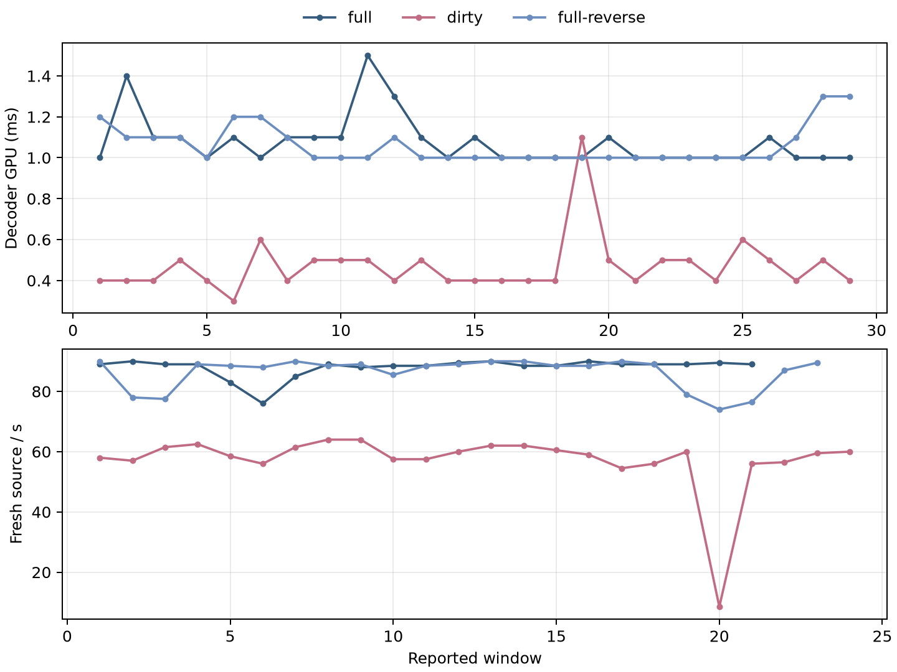

# R8 dirty sparse ATLAS comparison

Three same-fixture QP40/pace90 captures compare the full path, an opt-in dirty path, and a full reverse-order repeat. The dirty server also encoded fewer frames because pace admission dropped work, so its lower decoder cost is not direct causal evidence for the dirty change. A concurrent Counter-Strike workload was active with uncontrolled start and load, further limiting causal interpretation.

| arm | decoder GPU ms | active source/s | aligned wall-rate source/s | decoder windows | render windows |
|---|---:|---:|---:|---:|---:|
| full | 1.0 | 89.0 | 66.08 | 29 | 21 |
| dirty (opt-in) | 0.4 | 59.25 | 47.83 | 29 | 24 |
| full-reverse | 1.0 | 88.5 | 68.07 | 29 | 23 |

All captures are approximately 55 seconds. These are observed report-window medians and aligned report spans, not FPS claims. The dirty screenshot at 49 s shows the binocular checkerboard scene with block/ghost artifacts and cube edges; this is an authenticity observation, not a quality claim. The inspected full and full-reverse checkpoints are black; the remaining screenshots are retained without interpretation. Raw logs, manifests, patch, parser, chart, and hashes are retained.



```sh
python3 summarize.py full/*measure.log dirty/*measure.log full-reverse/*measure.log --out summary.json
MPLCONFIGDIR=/tmp/mpl python3 plot.py --full full/live-picture-reset-pace90-measure.log --dirty dirty/live-picture-reset-dirty-pace90-measure.log --reverse full-reverse/live-picture-reset-full-reverse-pace90-measure.log --out r8-dirty-sparse-windows
```
