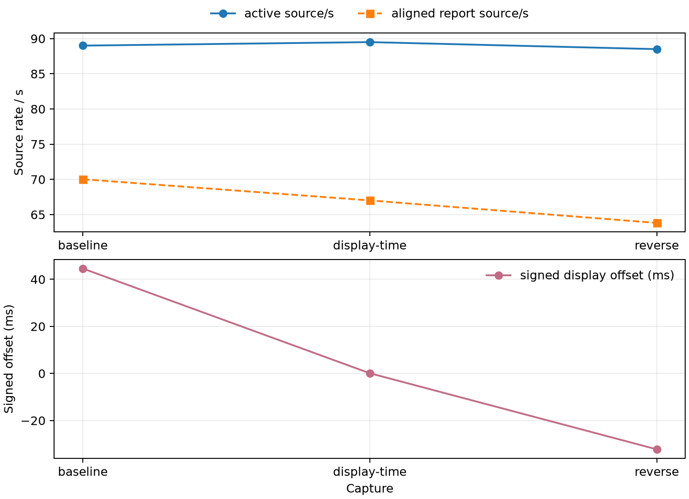

# Shared-load display pacing evidence

Three approximately 55-second captures use the same full APK and QP40/pace90 fixture while a concurrent Counter-Strike workload was active. The arms are baseline, display-time prototype (`NXWARP_PACE_DISPLAY_TIME=1`), and same-binary reverse with the variable unset. The display-time prototype is removed; this package records its diagnostic behavior only.

| capture | active source/s | aligned report source/s | decoder GPU p50 (ms) | decoder wall p50 (ms) | signed display offset p50 (ms) |
|---|---:|---:|---:|---:|---:|
| baseline | 89.0 | 70.02 | 1.0 | 2.2 | 44.6 |
| display-time | 89.5 | 67.01 | 1.1 | 1.8 | 0.1 |
| reverse | 88.5 | 63.81 | 1.1 | 2.1 | -32.25 |

Active source is a median of render report windows. Aligned rates use the printed report span after the first report; gaps and off-head intervals remain visible in the raw records. The signed offset shifts from 44.6 to 0.1 to -32.25 ms, so it is not a physical pose-age or latency measurement and gives no latency claim.

Host samples record the display GPU at roughly 78–100% busy. Temperature ranges are kept per sensor path: baseline card1 temp3 98–100°C, temp1 84–86°C, temp2 92–98°C; display-time 100–102°C, 88°C, 99–100°C; reverse 94–98°C, 80–84°C, 91–95°C. Card0 stayed 0% busy at 55–57°C. Shared gaming load and thermal variation prevent causal attribution. Screenshots and all raw logs/manifests are retained without a visual or FPS claim.



```sh
python3 summarize.py baseline/*measure.log display-time/*measure.log reverse/*measure.log --out /tmp/shared-pacing-parser.json
MPLCONFIGDIR=/tmp/mpl python3 plot.py --out shared-load-pacing
```
