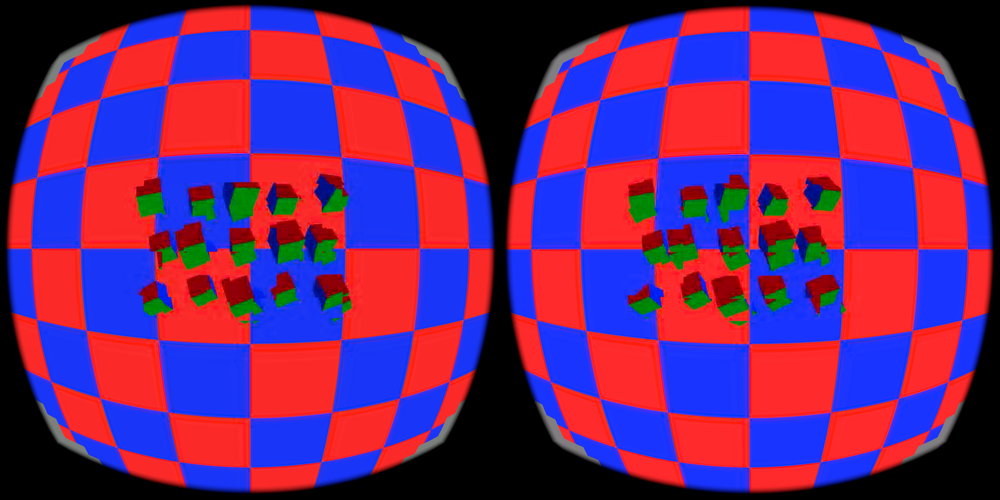

# Final vertex-warp v3 pair

Retained rendering source: [WiVRn NX `25d7458e`](https://github.com/nerdrx/wivrn-nx/commit/25d7458e).
The APK was built before committing those source changes; subsequent edits were
documentation only. The switch is `debug.wivrn.atlas_vertex_warp=1`, off by
default. Old image-breaking diagnostic modes are absent from this build.

This subfolder is separate from the v1 vertex-warp evidence. It contains the final clean APK pair: `on` has the vertex warp profile enabled and `off` is the same client with it disabled. Both rendered 2160x2160 per eye. The APK SHA-256 is `5e68cda5e6a5b218e44a213c02f0391eea3aac1cd242b8f2ccb51a5fce6dde1`.

GPU results exclude the first 10 seconds using embedded capture-start timestamps and are medians of periodic window means: `on` 10 windows, **3.1 ms/iteration**, adjusted non-cache estimate **3.1174 ms**, duty **277.45 ms/s**, fresh-source median 178; `off` 9 windows, **6.3 ms**, **6.3354 ms**, **563.85 ms/s**, fresh-source median 178. These are diagnostic GPU aggregates, not frame-level p95/p99 or an FPS claim.

`vertex-v3-on-run.log` and `vertex-v3-off-run.log` preserve the harness arm selection records (`1` and `0`). The filtered logs retain render/decoder reports and vertex-grid observations. Screenshots are capture checkpoints without a visual quality claim. Normalized CSV gzip files retain all timing rows, with timestamp column 2 shifted by each file's common minimum; use `summarize_pipeline_latency.py` for canonical receive/decode-end/blit p50/p95/p99. The parent-folder reviewed source patch is not exact v3 APK provenance.

Both the original strip-grid regression and new tile-grid tests passed. Android
client and both shader stages compiled successfully. After capture, the vertex
warp and dirty-catchup switches were verified at `0`; owned probes were stopped.

| Vertex warp enabled | Same APK, vertex warp disabled |
|---|---|
|  |  |
