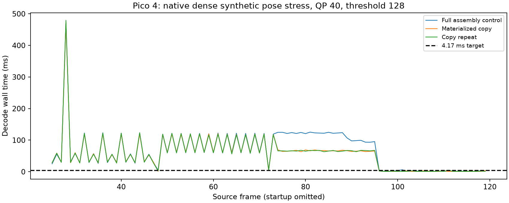

# Reuse an already materialized atlas reference

## Result

When two PICTURE frames are consecutive, the earlier frame already reset every
atlas entry to valid, identity transform and full resolution. Re-running ASSEMBLE
then computes a full-picture identity warp. The decoder now copies reference
slot 0 to slot 1 instead, preserving the independent read reference for the next
reconstruction. It leaves ordinary prediction, reconstruction and output intact.

| Native Pico d128 motion stress | Full assembly | Copy | Copy repeat |
|---|---:|---:|---:|
| Eligible frame median GPU, ms (22 frames) | 118.20 | 63.18 | 62.28 |
| Eligible frame median wall, ms | 121.82 | 66.11 | 66.27 |
| Entire motion phase median wall, ms (71 frames) | 98.56 | 64.71 | 65.15 |

The eligible-frame median improvement is about **46%**; the whole motion phase
median improves about **34%** in this control. These are short-run decoder
measurements, not live FPS or motion-to-photon latency. The remaining ~65 ms
motion median is still far from acceptable streaming latency or the 4.17 ms target.

*Figure 1. All recorded motion/recovery frames from frame 25 onward, including
first-use pipeline stalls. Reuse becomes eligible in the consecutive PICTURE
run at frames 74–95. Static source pixels with changing pose metadata deliberately
stress residual reconstruction; this is not a physically rendered head turn.*

## Correctness and conservative eligibility

- Default on; `NXVC_VKD_ATLAS_FORCE_ASSEMBLE=1` restores the control path.
- A successful PICTURE submission establishes eligibility; an intervening ATLAS
  frame, map reset, external tile import or later failed submission drops it.
- Copy covers one entire packed ring slot, all eyes and planes. Transfer and
  compute barriers order the source writes, copy, and subsequent reconstruction.
- Native 120-frame output matches byte-for-byte with the shortcut disabled and
  enabled on Pico (threshold 128) and RADV (threshold 8). Retained SHA256 files
  identify outputs; the host comparison covers 1,704,591,360 bytes per arm.
- Conformance in both candidate-on and force-assembly control: **161 streams checked, 3 unsupported
  skipped, zero failures**, including reference comparisons of each atlas table
  and plane. Added mixed PICTURE/ATLAS cadence coverage alongside consecutive
  PICTURE coverage. The skips do not count as passing tests.
- RADV synchronization validation over all 120 native threshold-8 frames reports
  no errors. Device hashes verify pixels, not all possible synchronization paths.

## Reproduce and evidence

Reuse the [native motion fixtures](../native-motion-stress/README.md), decoder
CLI and atlas-view settings. Run the current decoder normally, then with
`NXVC_VKD_ATLAS_FORCE_ASSEMBLE=1`, then normally again. Keep the streamer and
headset renderer stopped. Use `--no-out --atlas-view r8 --stats --throughput`.
The initial retained candidate logs used opt-in
`NXVC_VKD_ATLAS_COPY_MATERIALIZED=1` for on and unset for off; the final implementation
inverts this to the force-assembly control above. `pico-copy-default.log` tests
that final default. Output-hash runs use `--out /dev/stdout --quiet` piped through
SHA256, outside timing runs. `summarize.py` reproduces the table and figure using
Python and Matplotlib. The manifests in the fixture directory identify inputs.

The custom WiVRn NX client was rebuilt with this decoder. APK SHA256:
`2bb72f0f6e159c63d925ea6d61b2d66e71bbbd1055c1e7110ecc72178a8af99c`.
Live moving-head benefit still requires confirmation; no filter changes are included.
