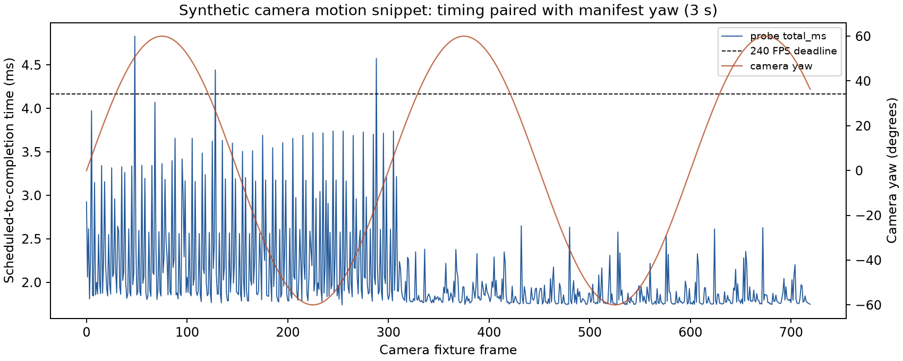

# Motion proof attempt — target not met

| Test | Frames | Deadlines missed (>4.1667 ms) | Worst completion |
|---|---:|---:|---:|
| Full-frame pan, 30 seconds | 7,200 | 41 | 5.066 ms |
| Rendered camera motion, 3 seconds | 720 | 3 | 4.831 ms |
| Camera repeat, separate 3 seconds | 720 | 17 | 4.787 ms |

All tests render **4352 × 2176 RGBA output on Pico 4 / Adreno 650**. Counts above include every timed frame. The camera follows yaw ±60° (peak speed approximately 302°/s), pitch ±25°, and translation through a ray-rendered floor/rear-wall scene. Encoding uses approximate GPU R2/coarse PLANAR at QP40, approximately 157 Mb/s at 240 updates/s. This is a simple synthetic scene, not a game or a live headset pose replay.



## Actual Pico output

These separate GPU readbacks occur after their runs' timers, at the original 4352 × 2176 resolution. They establish captured appearance, not presentation cadence. Aliasing and block artifacts remain visible.


Raw RGBA and PNG SHA-256 values are in `capture-identities.json`.

## Reproduction and scope

This directory retains the compressed timing CSV, probe log, device SHA256
identity file, and the 7200-frame pan manifest used for the 2026-09-08 run.
`input-evidence.tar` contains those retained inputs. No stream binary is
included. `summarize.py` reads that tar directly and reports all 7200 rows and
the warm-after-24 subset.

The retained run reports 7200 frames over 29,997.674 ms (240.018606 inclusive
FPS). For `total_ms`, the 240 FPS deadline is 4.166667 ms. Both the all-frame
and warm-after-24 sets have 41 deadline misses; p50, p95, p99, and maximum are
reported by the script.

The source manifest records 7200 distinct generated source-frame hashes. That
establishes source-fixture motion identity only; it does not establish coded
pixel uniqueness. The run uses a synthetic plane pan and the log identifies
the Adreno 650 device. The evidence does not establish a live camera,
network, encoder, compositor, or motion-to-photon path. Average 240 FPS is not
consistent deadline compliance.

The camera-motion evidence is a separate 720-frame, three-second synthetic
rendered-camera snippet at 240 FPS. Its manifest contains 720 distinct
`sourcehash` values and a separate encoded-stream `streamhash`, which is
verified against `camera-device-sha256.txt` by `summarize.py`. The paired
repeat run is retained for comparison. The 7200-frame pan evidence covers
approximately 30 seconds; these records must not be combined into a
continuous 33-second claim.

`plot_camera.py` creates `camera-timing-vs-yaw.png`, pairing probe timing with
the manifest camera yaw. The plot describes fixture metadata and timing only;
it is not motion-to-photon or live-path evidence.

Run:

```sh
./summarize.py
./plot_camera.py
```

Generate the camera input from the repository root:

```sh
GPUflat=1 python3 probe/planar-direct/make-camera-fixture.py --encoder build-vk/bin/nxvc-vkenc --out camera.nxv --frames 720 --width 4352 --height 2176 --fps 240 --qp 40 --workers 8
```

Build the probe as described in `probe/planar-direct/README.md`, push its binary and tile shaders to `/data/local/tmp/planar-proof`, and push `camera.nxv` there. The recorded binary was named `nx-planar-camera`:

```sh
adb shell 'cd /data/local/tmp/planar-proof && NX_PLANAR_QUEUE_PRIORITY=high NX_PLANAR_TILE=1 NX_PLANAR_PACE_FPS=240 NX_PLANAR_PACE_SPIN=1 NX_PLANAR_ASYNC=1 NX_PLANAR_SPIN=1 NX_PLANAR_REUSE_COMMANDS=1 taskset 80 ./nx-planar-camera camera.nxv . 720'
```

Busy waiting consumes CPU; no power-efficiency conclusion follows. Source rendering and encoding happen before these timed device runs. Runtime parsed/rendered counters do not prove pixel uniqueness: the independent source manifests and device stream hashes provide input identity. The final generator reproduces native source frame 75's SHA-256, `26c2d073a75846421f4f529c191b49cfad715069b204460a39aa5bae946109c7`.
