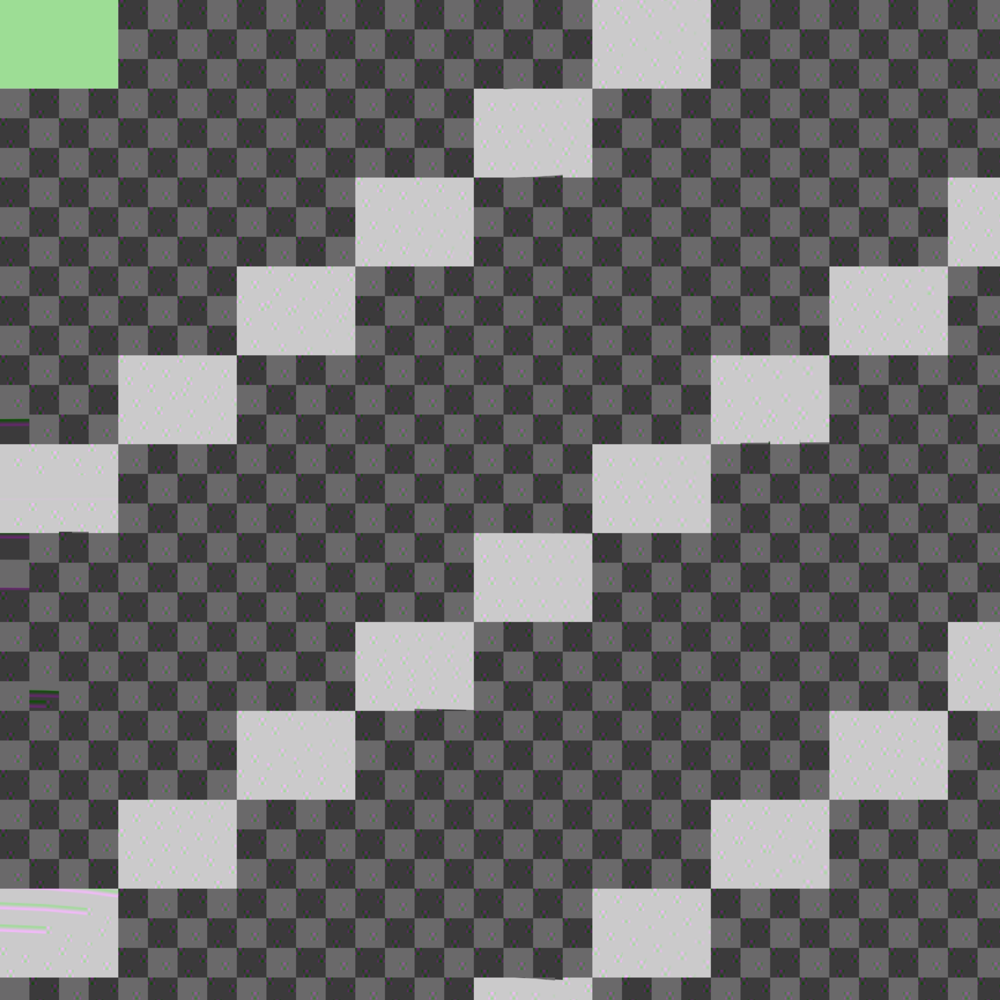
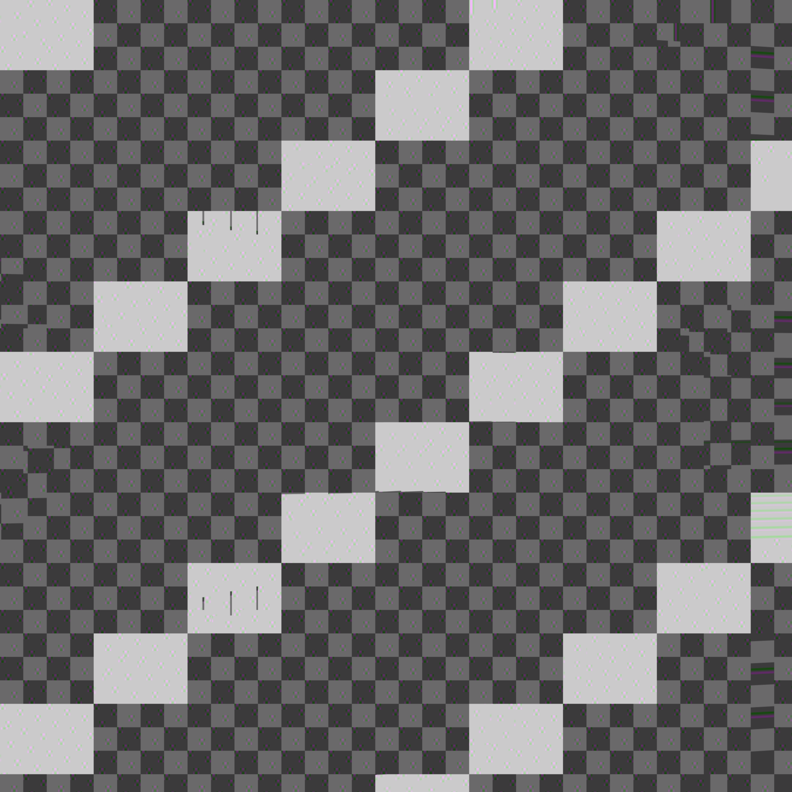

# Native motion stress on Pico 4 — 2026-09-08

## Finding

The moving-head slowdown is reproducible without the streamer. Full-picture
assembly contributes substantial cost, but avoiding it does not meet the budget.
The current 128-pixel threshold's motion phase has a 94.24 ms median decode wall
time; a second run gives 95.44 ms. Static recovery returns to roughly 1–2 ms.
These results invalidate extrapolation from sparse/static-pose tests to dense motion.

| Picture displacement threshold (pixels) | PICTURE frames / 120 | Motion median GPU ms | Motion median decode wall ms |
|---|---:|---:|---:|
| 8 | 69 | 115.11 | 120.05 |
| 128 (current live setting) | 40 | 90.83 | 94.24 |
| 4096 (diagnostic) | 0 | 54.83 | 58.48 |

4096 is not a recommended live setting: quality/reference-age consequences are
unqualified. It removes PICTURE frames in this fixture, yet remains far above
4.17 ms. The 128 threshold repeat gives 91.01 ms median GPU and 95.44 ms wall.
Disabling atlas-view conversion gives 114.73 ms median motion wall time in one
run; this does not establish a regression, but rules out view conversion being
the sole explanation. Short-run clocks, thermal state and order are uncontrolled.

## Method and scope

- Pico 4 / Adreno 650; streamer and WiVRn client stopped with user permission.
- 4352 × 2176 padded stereo, 2312 tiles; QP 40, LITE entropy, 120 unique source frames.
- Deterministic dense texture remains static while pose metadata changes. This
  is deliberately adversarial residual stress, **not physically rendered head motion**.
- Frames 0–23 static; 24–47 yaw 0→18°; 48–71 yaw 18→80°;
  72–95 return 80→0°; 96–119 static recovery.
- Phase statistics use frames 2–23, 25–95 and 96–119. Frames 0–1 have cold
  pipeline creation; first-use costs can also occur at later mode transitions.
  No claim of fully warmed mode coverage or thermal qualification is made.
- Runs were sequential, in order 128/r8, 8/r8, 4096/r8, 128/none, 128/r8 repeat.
- Decode-only wall includes parse/submission/completion, excludes network,
  encoding, rendering, compositor and display. GPU is the decoder query interval.
- A separate async native renderer run (UNORM, one render per decoded frame)
  completed 120 pairs in 7.670 s, or 15.64 pairs/s including startup; after two
  startup frames, 17.18 pairs/s and p99 128.03 ms. No 240 Hz claim follows.

## Quantizer control

A further run at QP 52 (same 128-pixel threshold) reduced stream size from
3,672,005 to 268,922 bytes, yet motion median wall time was 116.50 ms
(GPU 103.68 ms). This single short run does not establish that higher QP is
slower; it demonstrates that sharply reducing bytes did not remove the stall.
QP 40 and 52 produce different tile decisions. Decode-cost control must account
for actual reconstruction, rather than assuming bytes predict GPU time.

## Actual output captures



*Figure 1. Actual 2160 × 2160 Pico GPU readback after frame 71 (80° metadata yaw),
using the native atlas renderer. Static source pixels deliberately disagree with
pose; artifacts are not a physical head-turn quality assessment. Readback occurs
after timing.*



*Figure 2. Same renderer after frame 119, at zero-yaw recovery. Neither image is
an OpenXR compositor screenshot or evidence of display cadence. No Kuwahara
filter is applied; the native atlas path currently ignores its settings.*

## Reproduce

From the repository root, generate each fixture using the built CLI encoder:

```sh
python probe/sequence/make-motion-fixture.py --encoder /path/to/nxvc-vkenc \
  --frames 120 --atlas-picture-d 128 --out /tmp/dense-d128.nxv
adb push /tmp/dense-d128.nxv /data/local/tmp/dense-d128.nxv
adb shell 'NXVC_VKD_ATLAS_VIEW_DIRTY=1 /data/local/tmp/nxvc-vkdec-throughput --in /data/local/tmp/dense-d128.nxv --no-out --atlas-view r8 --stats --throughput'
```

Repeat with thresholds 8 and 4096. The retained manifests identify input hashes;
`.info` files preserve frame flags; raw logs preserve startup and outliers.
Run `python summarize.py` from this directory for phase/mode statistics.

## Implication

PICTURE assembly already uses a warp/store-only shader, but reconstructs a full
reference before subsequent prediction and output. Avoiding repeated pixel work
is the architectural target. Composing transforms alone is not a bit-exact
replacement for two rounded resampling steps; any fused path needs explicit
output validation and encoder/decoder reference agreement. An expensive image
filter cannot repair stale updates.
