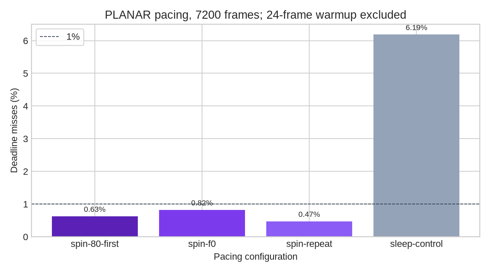

# PLANAR pacing follow-up

This follow-up packages four same-binary, HIGH-priority, 240-paced Android
runs of the 4352×2176 full-resolution synthetic changing-pixel PLANAR fixture
(approximately 157 Mb/s). Each run completed 7,200 fresh frames; the first 24
frames are excluded from the summary. Deadline misses are `total_ms` greater
than 1000/240 (4.1667 ms).



The three spin configurations miss **0.47–0.82%** of post-warmup deadlines
(34–59 of 7,176); the sleep control misses **6.19%** (444 of 7,176). The
processes report approximately 240 updates/s, but these results do not establish
consistent 240 Hz delivery. Busy-wait pacing is a CPU and thermal tradeoff; no
power measurement was collected. The renderer remains the vertex-fed flat-region
approximation, with no PC encoder, network, XR compositor, or live presentation
path.

Reproduce the packaged configuration with the new pacing binary:

```sh
adb shell 'cd /data/local/tmp/planar-direct && NX_PLANAR_QUEUE_PRIORITY=high NX_PLANAR_TILE=1 NX_PLANAR_PACE_FPS=240 NX_PLANAR_PACE_SPIN=1 NX_PLANAR_ASYNC=1 NX_PLANAR_SPIN=1 NX_PLANAR_REUSE_COMMANDS=1 taskset 80 ./nx-planar-direct-pace pan-7200.nxv . 7200'
```

`summary.json` is generated by `summarize.py`; `raw-captures.tar.gz` contains
the source CSV and logs. `final-probe-binaries.json` records the actual probe
and shader hashes for this follow-up and does not overwrite the earlier archive's
identity record.

## Final controls and rejected cell path

The additional `final-unpaced-7200.csv` / `.log` run reports 848.16 inclusive
updates/s, but queues work: after the 24-frame warmup it misses 380 of 7,176
240 Hz latency deadlines. It is therefore not a win. `cell-1000.csv` / `.log`
uses the rejected `NX_PLANAR_CELL=1` candidate (64 cell quads per tile); its GPU
median is about 3.118 ms and backlog reaches about 61 ms. The matching
`tile-safe-1000.csv` / `.log` control reports about 1.259 ms GPU median and
2.166 ms total median. These controls use a different binary/shader build from
the earlier paced tests. The rejected `rejected-cell.vert` and
`rejected-cell.frag` sources are retained only inside the raw archive; no
production shader is retained.

A sampled-output-layout experiment also showed no GPU gain: both it and the safe-build tile control had approximately 1.259 ms GPU medians over 1,000 frames. Its native three-frame readback matched the earlier tile image SHA-256 (`2b95791f2b0808291320fb3f6bca59b06b1c5c7f7f41b15559ad8b9c99f9beb2`), with no host validation-layer errors. The extra switch was removed. Final probe builds use the shared Adreno-safe shader optimization rules; the older recorded binary identities remain historical.
