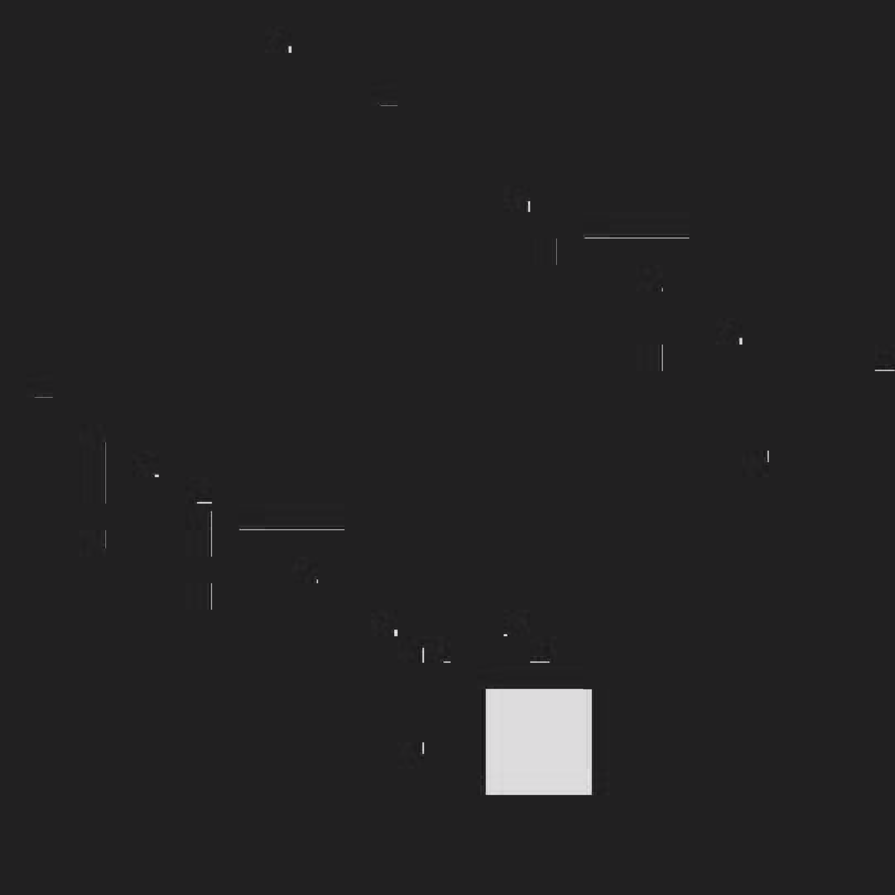

# Sequential decoder plus atlas-render throughput

This is a cold-to-steady offscreen Pico 4 measurement of the native R8 atlas
path. The input is a 1200-frame, 4352x2176 stereo `yuv420p` stream (2176x2176
per eye, with 2160x2160 visible output). Each frame was decoded, submitted to
the native renderer, and waited to a GPU fence before the next frame. The
capture used an Adreno 650 and did not involve OpenXR, transport, encoding, or
headset presentation.

The first 120 frames are warmup, but were still decoded and rendered. Across
all 1200 pairs, wall throughput was 131.122/s. The 1080 steady rows reached
143.042/s; their logged p50/p95/p99 total pair times were 6.993/8.600/9.370
ms, with zero pairs at or below the exact 240-Hz budget of 4.166667 ms. These
numbers describe completed offscreen work, not physical display FPS or a
240-Hz result.

| run | frames | mode | throughput |
|---|---:|---|---:|
| combined | 1200 (1080 steady) | decode + atlas draw + fence | 131.122/s overall; 143.042/s steady |
| decoder dirty | 1200 | decode only, no output | 271.101/s |
| decoder full | 1200 | decode only, no output | 129.347/s |

The decoder-only rows are stage comparisons, not complete-pipeline estimates.
The combined measurement is sequential and therefore does not establish
pipeline overlap or sustained presentation cadence. The retained Pico logs
show 72-Hz and 90-Hz runtime modes; no retained evidence shows a 240-Hz
presentation mode. Offscreen throughput on other hardware remains an open
measurement.

Reproduction uses the sequence harness described in
[`probe/sequence/README.md`](../../../../probe/sequence/README.md). The copied
`sequence-pico-baseline.log` is the authoritative aggregate report;
`timings.csv` contains per-frame decode, render, and total rows, including the
120 warmup rows. `left-native.png` is the lossless 2160x2160 left-eye
readback; `left-resized.png` is a smaller preview. They are sanity images, not
quality or motion proofs. The fixture metadata records the generator and
encoded-stream SHA; raw YUV was streamed through a FIFO and is not retained.

## Controlled output-format experiment

On the same Android binary, retaining synchronous completion of every render:

| Mode | Steady completed pairs/s | p99 pair ms | Pairs within 4.166667 ms |
|---|---:|---:|---:|
| UNORM, first | 177.824 | 7.704 | 159/1080 |
| UNORM, repeat | 177.235 | 7.754 | 143/1080 |
| SRGB restored | 148.690 | 8.982 | 0/1080 |

All three use async decode submission on the same graphics queue, with an explicit
compute-to-sampling dependency and a completed render fence before reuse. UNORM
removes the fragment shader's sRGB-to-linear conversion together with the output
attachment's inverse conversion. Scale is one and bias zero. Compared with the
original SRGB left-eye readback, the final UNORM image differs by at most one
8-bit value per channel. This grayscale sparse-motion fixture does not establish
color accuracy on a broad scene suite or the OpenXR compositor's color handling.
This is an offscreen probe option, not an enabled WiVRn production feature.

`unorm-timings.csv` contains the first UNORM run. `unorm-binary-sha256.json`
identifies the executable and shaders used for these three runs. Host Vulkan
synchronization validation passed for 16 complete pairs; that short validation
run is not a performance result.

Other short experiments did not establish a useful gain: async submission alone
144.958/s; static FDM with peripheral byte value 128, 145.596/s; corrected value
127, 153.293/s; no GPU timestamps, 157.105/s; FDM127 plus no timestamps,
152.003/s; UNORM plus both, 176.765/s. The control repeat was 144.343/s.
FDM keeps the central circle at full density and requests lower peripheral
shading density; actual fragment sizes are implementation-defined. These
exploratory single runs are retained as negative/inconclusive evidence, not
additive speedups. No variant met the 240-Hz deadline throughout the capture.

## Cadence-4 follow-up

A follow-up capture rendered each decoded frame four times at a static pose:
4800 renders from 1200 decoded frames. It reports 304.453 render iterations/s,
but only 76.113 fresh corrections/s; render p99 was 6.651 ms and 2968/4320
steady render iterations met 4.166667 ms. This is repeated static-pose work,
not 240 fresh frames/s or proof of a 240-Hz deadline. The retained
[`sequence-pico-cadence4.log`](sequence-pico-cadence4.log) and
[`cadence4-timings.csv`](cadence4-timings.csv) contain the aggregate and
per-render rows; the plot keeps render and fresh-correction rates distinct.

## Sustained multi-rate capacity check

The 6,000-frame fixture produced **24,000 completed renders over 81.526495 s**.
After 120 decoded warmup frames, 23,520 renders completed over 78.951640 s:
**297.904 renders/s and 74.476 fresh corrections/s**. Render p50/p95/p99 were
2.943/6.216/7.289 ms; **15,907/23,520 (67.63%)** met 4.166667 ms.
Thus repeated-render capacity exceeded 240/s for more than a minute, while
240-Hz deadline consistency still failed. This is the same static-pose sparse
fixture experiment, not 240 independent frames, a paced presentation test,
a thermal qualification, or motion-to-photon latency proof.

The long CSV includes every render. The manifest records fixture and binary
hashes plus opt-ins; both final eye readbacks are retained as PNG files.
