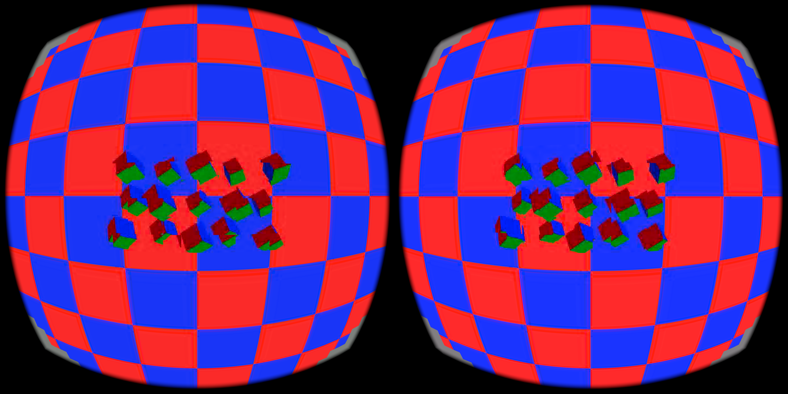
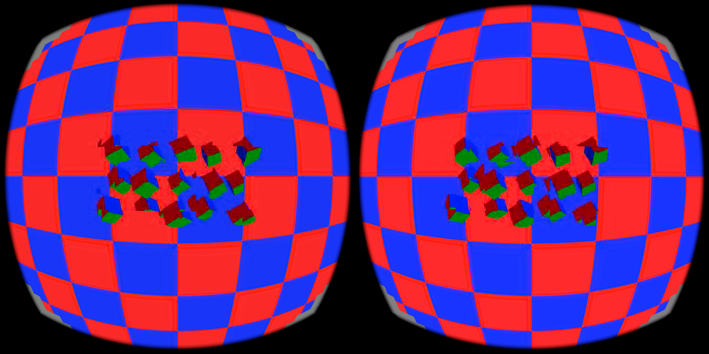

# Removing unused coefficient readback

Rebuild this figure with `python3 plot.py` (Matplotlib required). It reads
`summary.json`; markers show p50, p95 and p99, not uncertainty intervals.

Lite entropy does not select probability tables on the CPU. The live encoder
nevertheless copied its entire coefficient allocation from device memory to
host staging after every E3 submission. The new guard omits that copy when
Lite is active, coefficient checking is off, and trellis is off. rANS, trellis,
and CPU-reference checks retain their required readback.

At native paired stereo resolution, 2,312 tiles × 6,240 words × 4 bytes equals
57,707,520 bytes (55.03 MiB) per frame. Removing this unused transfer avoids
5.19 GB/s at 90 frames/s, or 13.85 GB/s at a hypothetical 240 frames/s.
The coefficient buffer remains on the GPU for entropy coding. No syntax or
quality setting changes.

## Live results

RX 7900 XTX/RADV host, Pico 4/Adreno 650, 2176×2176 encoded source per eye,
2160×2160 output per eye. All arms used the custom checkerboard/rotating-cube
scene, QP40, Lite entropy, optimistic atlas admission and borrowed-target caching.
The headset was operating at 90 Hz. `NXE_TIME=1` was enabled in every arm.

| Condition, in run order | Encoder profile p50 / p95 / p99 (ms) | Profile frames | Encode→selection p50 / p95 / p99 (ms) |
|---|---:|---:|---:|
| Original copy | 8.720 / 10.054 / 12.531 | 2,593 | 18.957 / 21.515 / 22.895 |
| Copy omitted | **2.380 / 2.700 / 3.490** | 2,606 | **10.953 / 15.781 / 16.993** |
| Original restored | 8.710 / 9.570 / 11.840 | 2,600 | 16.628 / 21.726 / 23.123 |

The encoder profile median fell 72.7%; 99.5% of the optimized profile samples
were below 4.167 ms. This establishes an encoder-stage budget result in this
sparse scene, not sustained 240 fresh frames/s. It does not establish a general
speed result for dense scenes. Encoder profiling includes submission/fence
waits inside the codec; it excludes later packetization and headset work.
All encoder profile samples are retained. The mapped encode→selection analysis
uses stream 0, earliest feedback per frame, and a 10-second arrival warmup;
selected counts are 1,547 / 1,438 / 1,395. Selection is not photons or scanout.

Snapshots verify the same scene at capture instants. Resting-headset presence
cycling, different scene phases, and uncontrolled shared GPU load limit the
comparison. Existing optimistic-atlas seams and trails remain; the transfer
removal itself preserved every output byte in the fixtures below. A requested
second optimized repeat failed to launch; it supplies no result. The table
contains only the three successful runs.

| Optimized | Original restored |
|---|---|
|  |  |

## Reproduction and checks

`python3 summarize.py` reproduces both percentile tables from normalized CSVs
and filtered profiler logs. CSV normalization subtracts a single timestamp
origin and retains all frame IDs and NX wire mappings. Run it inside this repo
so it can import `tools/summarize_pipeline_latency.py`.

`python3 reproduce.py --before <encoder-before> --after <encoder-after> --output <directory>`
generates deterministic eight-frame inputs and checks byte identity in four
cases: Lite 256×128, Lite 4352×2176, rANS 256×128, and Lite with trellis 1.
All use QP40, paired stereo, ATLAS/ATLAS_MODE and inter coding. The generated
hashes exactly reproduce `validation.json`. Small inputs move a 32-pixel square;
native inputs move one 256-pixel square in each eye. A separate Lite CPU-reference
check passed E3 coefficient equality and E4/E5 byte identity.

GPU validation exposed the same pre-existing missing Pass B binding 16 in both
baseline and optimized binaries. The source follow-up binds the existing planar
buffer in both reference-store descriptor sets. This correctness fix is separate
from the readback measurements above; no speed improvement is attributed to it.
After the correction, the eight-frame Lite atlas run passes Vulkan validation
without errors and all four byte-identity cases still reproduce the original
digests.

The live APK was `3f8f9556f0e7fa30424f271f68a62ddeae5d86c5e1e6183bdd1f8cd02b735ae4`.
Original/restored server SHA256:
`621fb271724b85802391fda266ce47438c9ae5763190aa1e985228d712f62115`.
Measured optimized server SHA256:
`1595bdea8fc19678b864e734c539a544e9139eed147c7dfe002d8b61997c3d05`.
Those captures precede the separate binding correction. Ordinary target caching
was reset to its disabled device override and benchmark processes were stopped.
