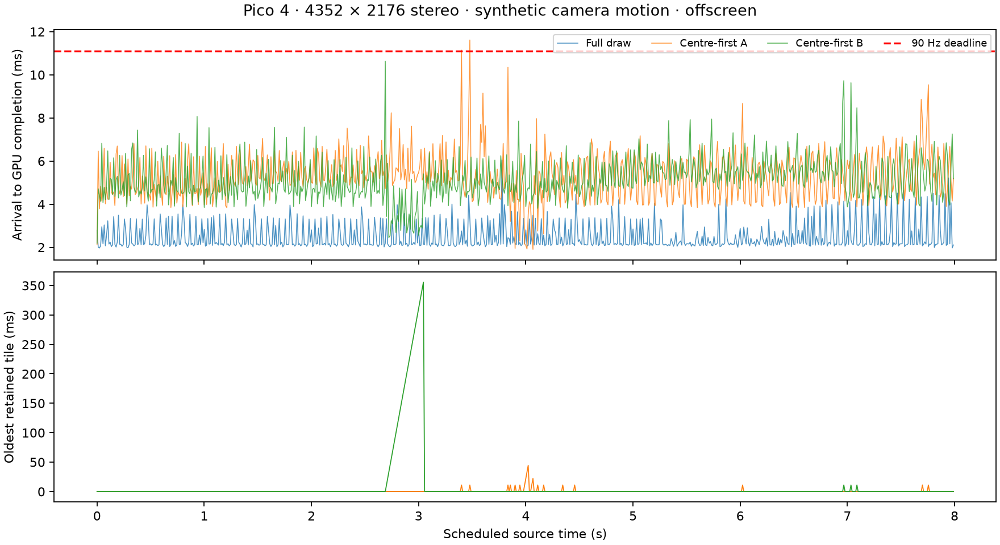
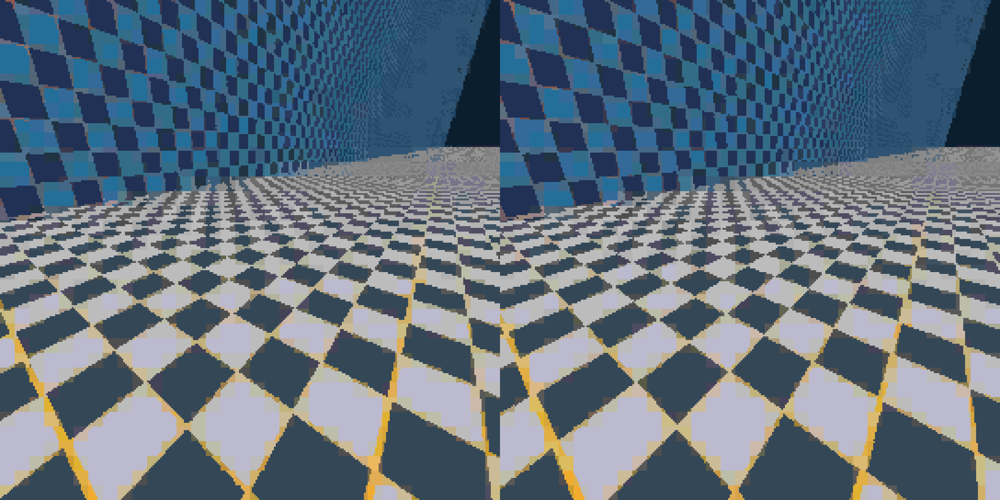

# Centre-first rendering at 90 Hz

## Finding

Centre-first updates are feasible, but splitting this lightweight renderer into
four submissions is **slower than one full draw**. Keep the experiment opt-in.
The current scheduler is not a hard deadline guarantee and does not guarantee
bounded peripheral age. This is not enabled in custom WiVRn NX.

All rows below use the final v2 binary, native padded stereo 4352 × 2176 on
Pico 4 / Adreno 650, 720 distinct source frames generated at 90 FPS. The
synthetic pinhole camera turns ±60° in yaw, with pitch and translation as well.
Each run covers eight seconds; no warmup rows are removed. These are offscreen
parser + upload + approximate PLANAR rendering measurements, excluding PC
encoding, network, compositor, display scanout and real headset pose input.

| Path | Median ms | p99 ms | Maximum ms | Misses / 720 (>11.111 ms) | Oldest tile, frames |
|---|---:|---:|---:|---:|---:|
| Full draw | 2.157 | 4.448 | 6.049 | 0 | 0 |
| Centre-first A | 5.231 | 8.220 | 11.616 | 2 | 4 |
| Centre-first B | 4.991 | 7.912 | 10.637 | 0 | 32 |



The longest retained age in B is 356 ms. Meeting most deadlines while allowing
that age is not proof of acceptable moving-head quality. Longer thermal runs
and end-to-end streaming remain untested here.

## Implementation and controls

Each eye has its own symmetric centre. Four square tile bands are submitted
inside-out. First-frame full rendering initializes every pixel; subsequent
render passes LOAD the existing image. CPU parsing and upload still process
all tiles. Later bands are admitted only if the estimated remaining budget
allows them; submitted work cannot be cancelled. The centre always runs.

The v2 estimate is 1.25 times the largest recent wall time for the corresponding
band (0.5 ms floor), with samples expiring after 32 source frames. This is a
heuristic, not a worst-case execution bound. Separate submissions/fences and
attachment traffic explain why the full-draw control is essential.

The initial v1 lifetime-maximum estimate was rejected: one stall suppressed
outer updates for 442 frames. A forced 2 ms v1 budget left outer pixels stale
for 719 frames. Both traces are retained in the archive. Do not interpret their
low completion times as a quality win. `full-a` overlapped initial ADB readback
transfers and is excluded from the primary comparison; preliminary 240-FPS
fixtures replayed at 90 Hz are also excluded. `summary.json` includes named
historical controls separately from the final v2 rows above.

## Pixel preservation

All-band output exactly matches the single full draw at source frame 19. With
`NX_PLANAR_FOVEATED_MAX_RINGS=0`, all centre pixels match fresh frame 19 and all
outer pixels match initial frame 0. The fixture changes 470,528 centre pixels
and 7,392,192 outer pixels between those frames, so this is not a static-image
test. Both v1 and v2 readback hashes agree. See `pixel-check.json` and archived
`pixel-v2-test.log`.




The second image deliberately shows stale outer geometry around each fresh
centre. These are real GPU readbacks, converted losslessly from RGBA to PNG;
captures occurred outside the timed tests. They do not show physical display
cadence or headset tracking. `full0.png` retains the initial control image.

## Reproduction

Build with `probe/planar-direct/build.sh` and the Android paths documented in
its README. Generate a fixture with:

```sh
GPUflat=1 python3 probe/planar-direct/make-camera-fixture.py \
  --encoder build-vk/bin/nxvc-vkenc --out camera90.nxv \
  --frames 720 --width 4352 --height 2176 --fps 90 --qp 40 --workers 8
```

Push the binary, `tile.vert.spv`, `tile.frag.spv`, and fixture to the Pico.
Run in that device directory (unset FOVEATED for the full-draw control):

```sh
NX_PLANAR_QUEUE_PRIORITY=high NX_PLANAR_TILE=1 NX_PLANAR_FOVEATED=1 \
NX_PLANAR_PACE_FPS=90 NX_PLANAR_SPIN=1 NX_PLANAR_REUSE_COMMANDS=1 \
taskset 80 ./nx-planar-foveated-v2 camera90.nxv . 720
```

Admission uses sleep, not the optional busy-wait admission switch. GPU fence
waiting uses spin. ASYNC is rejected for retained-image scheduling. Use the
optional fifth CLI argument for a final-frame readback. `MAX_RINGS=0` admits
only band zero after initialization; a large budget such as 1000 ms forces
all-band completion in this fixture for the equality check.

`raw-inputs.tar.gz` contains raw CSVs, logs, source-frame hash manifest and
fixture/device binary/shader identities. Extract it to a temporary directory
and run `summarize.py CSV... --fps 90` to reproduce statistics. `plot.py` reads
the archive directly. `check_pixels.py DIRECTORY` verifies native raw readbacks
named full0.rgba, full19.rgba and centre19.rgba; the PNGs preserve those bytes.

## Integration boundary

This probe accepts only complete self-contained all-PLANAR frames. Production
inter prediction cannot simply drop reconstruction: receiver reference state
and encoder shadow state must agree. A future implementation should prioritize
correction tiles before expensive encoding/decoding, preserve valid atlas state,
and warp old peripheral content using current pose. Higher centre quality can
use existing encoder quality maps, but is a separate, unmeasured change here.
