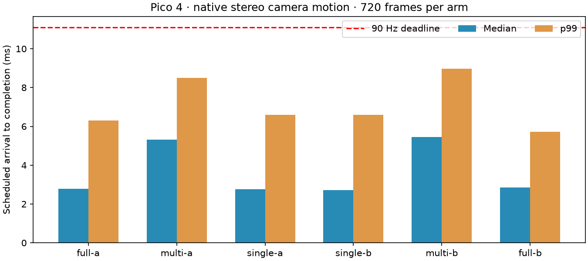

# Single-pass priority admission

This experiment removes repeated render-pass submission from centre-first
PLANAR rendering. The four band prefixes are prepared once. Before submission,
the CPU selects the largest permitted prefix predicted to fit the remaining
budget, with centre-only as the fallback. Selected bands are drawn in one
render pass and completed with one fence wait.

This is priority admission, not guaranteed centre-first physical GPU execution
or progressive display scanout. The renderer cannot cancel work after
submission. It still parses and uploads the complete self-contained PLANAR
frame and preserves skipped peripheral pixels. It is not live WiVRn NX
integration and does not change encoder quality maps.

The controlled comparison uses the same binary and fixture on Pico 4 at 90 Hz:
full draw, old multiple-pass scheduler, single-pass scheduler, then reverse
order. Every arm receives 720 native padded stereo frames (4352 × 2176), with
synthetic camera yaw, pitch and translation generated at 90 FPS. Startup is
excluded, but no frame warmup is removed. PC encoding, network, compositor and
display latency are excluded. Power and sustained thermals are unmeasured.

The full-prefix case uses one cached instanced draw rather than many tile-row
draws. A partial draw invalidates that cached recording, and the initial image
clear is never replayed from the cache. These details matter: removing fence
waits alone left avoidable command and clear work in the path.

Enable `NX_PLANAR_FOVEATED=1 NX_PLANAR_FOVEATED_SINGLE_PASS=1` along with the
existing tile renderer and 90 Hz cadence switches. The previous multi-pass
path remains available without SINGLE_PASS. This remains opt-in; there is no
hard deadline guarantee. Prefix estimates expire after 32 source frames.

## Final paired results

| Arm | Median ms | p99 ms | Max ms | Misses / 720 | Oldest tile, frames |
|---|---:|---:|---:|---:|---:|
| full-a | 2.777 | 6.296 | 14.397 | 1 | 0 |
| multi-a | 5.319 | 8.492 | 10.027 | 0 | 2 |
| single-a | 2.758 | 6.592 | 10.934 | 0 | 1 |
| single-b | 2.727 | 6.600 | 7.370 | 0 | 0 |
| multi-b | 5.450 | 8.960 | 9.579 | 0 | 2 |
| full-b | 2.848 | 5.713 | 8.846 | 0 | 0 |

Single-pass median latency is about half the multi-pass control, with zero
misses across its two 720-frame runs. Single A skips 960 tiles for one frame;
Single B refreshes every tile. This is an optimization of priority scheduling,
not evidence that partial updates beat full rendering. Rare deadline tails
remain possible: one full-draw control itself missed a deadline. Eight-second
runs cannot establish sustained production reliability.

## Correctness and evidence

All-prefix frame 19 matches the full-draw RGBA hash exactly. Forced centre-only
frame 19 matches the previous tested centre-only result exactly, preserving
outer pixels. See archived `pixels-and-identities.log` for readback, binary,
shader and fixture hashes. The mode rejects use without FOVEATED.

This lossless GPU readback was captured outside timing. No image quality
change is introduced by this scheduling optimization; the underlying PLANAR
flat approximation remains visibly blocky.

`raw-inputs.tar.gz` contains all six final CSVs, logs, the exact run script,
and the 720-frame source-hash manifest. Only the final implementation is in
this archive; earlier development trials are not used for the results table.
Use `verify.py` to validate summaries and fixture identity, and `plot.py` to
regenerate the chart. The shared summarizer lives in `../centre-first/`.

