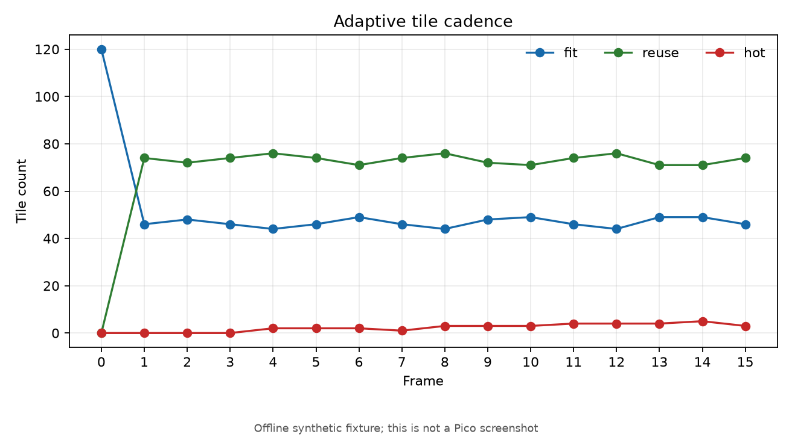
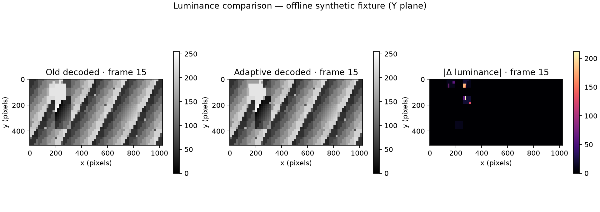
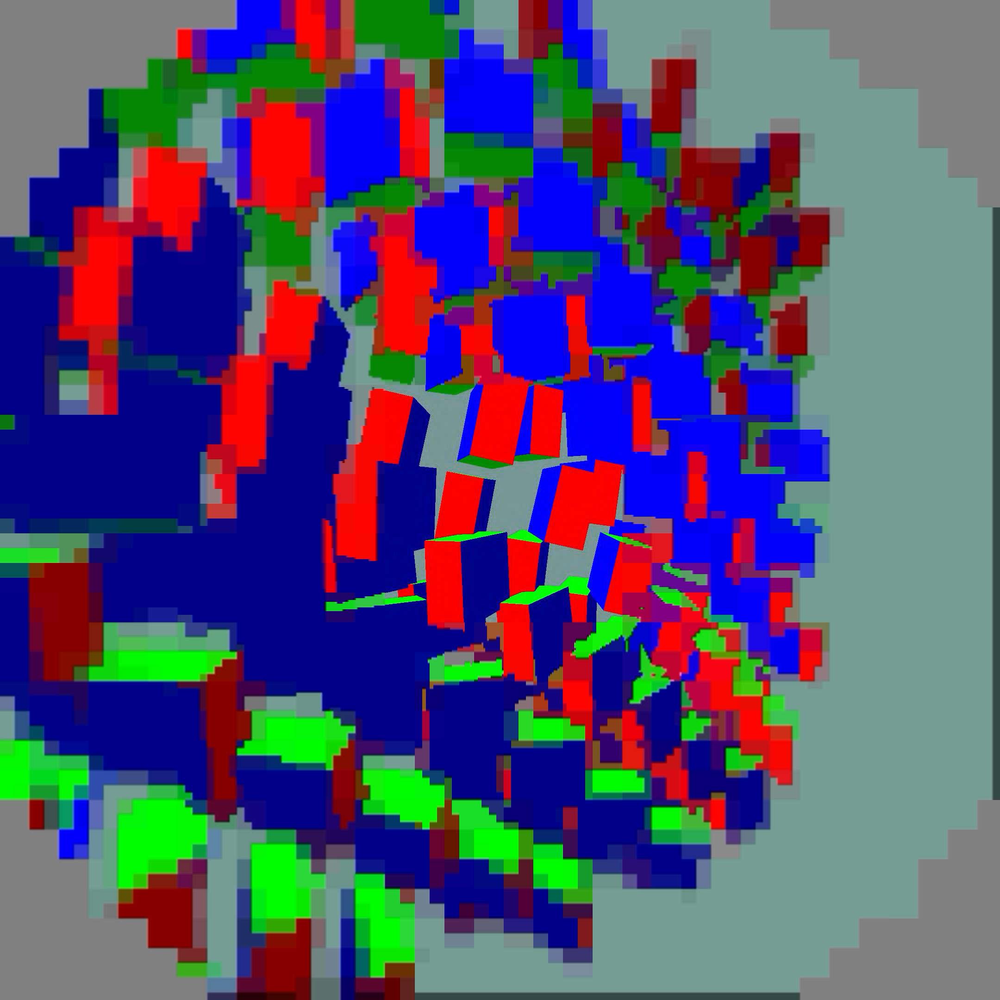
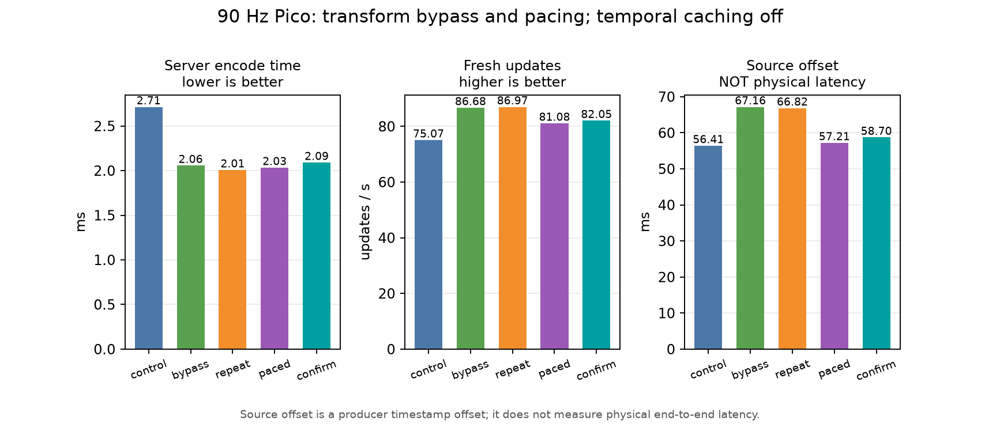

# Adaptive peripheral PLANAR fit caching

Experimental encoder-only approximation, opt-in with `NXVC_PLANAR_CADENCE=1`.
Native centres remain full rate. Fine peripheral tiles fit every second admitted
frame, other peripheral tiles every fourth, with bounded opportunities for
change-triggered promotion. Every output still carries independent tile bodies:
**this does not skip decoder work**, and it does not attach historical tile poses.
The live profile keeps caching disabled. See [cache contract](../../../../docs/TEMPORAL-TILES.md).

## Offline results

Radeon RX 7900 XTX, 4352×2176 stereo fixture, 512×512 native centre per eye,
32 frames with moving patches; first four excluded. GPU timestamps measure
encoder work, not physical latency. Runs were sequential, not randomized.

| Variant | Mean GPU ms | p95 ms |
|---|---:|---:|
| Original transform path, cadence off | 6.077 | 6.492 |
| Original transform path, cadence on | 5.841 | 6.217 |
| Original transform path, off repeat | 5.869 | 6.153 |
| Unused PLANAR transforms bypassed, off | 4.806 | 5.216 |
| Bypass + cadence on | 4.689 | 5.090 |
| Bypass, off repeat | 4.745 | 5.187 |

The larger saving is removing transforms whose coefficients have no consumers.
The bypass applies only to independent GPU PLANAR, excluding diagnostic checks
and trellis. Ordinary inter/atlas paths retain their coefficient behavior.
Cadence reuses a mean 1591 of 2184 peripheral fits (72.9%), but its marginal GPU
saving is small and not an established latency win. Full-field changes can
increase refresh work and expose stale peripheral imagery.

## Correctness and images

The 16-frame 1024×512 fixture has 128×128 native centres per eye. Tests preserve
baseline bytes with cadence disabled, static content, and per-frame QP changes.
Centre Y/Cb/Cr pixels remain exact with cadence enabled. Dropping alternate
frames still decodes identically. CPU and Vulkan decode agree, including the
Pico Adreno 650 standalone decoder. Small-fixture checks do not establish
moving-head comfort, thermal behavior, or sustained 90 Hz delivery.





These are decoded fixture images, not headset screenshots. Peripheral differences
are the deliberate approximation; the native centres have zero difference.

## Reproduce

Build the tools, then run from this directory:

```sh
python3 check.py /absolute/path/to/nx-warp/build-vk/bin
python3 perf.py /absolute/path/to/nx-warp/build-vk/bin
python3 plot.py
```

Requires NumPy and Matplotlib. Scripts generate raw YUV locally; large raw fixtures
are intentionally untracked. `old*.nxv` are saved pre-change baselines from
e7e37bf. `checks.json`, `perf.json`, logs, `pre-transform/`, and `metadata.json`
preserve the recorded observations and identities. The Pico decode result is in `pico-decode.log`; its decoded hash is in metadata.
Device command (after pushing `on.nxv`):

```sh
/data/local/tmp/nxvc-vkdec-independent --in /data/local/tmp/cadence-on.nxv --out /data/local/tmp/cadence-on.yuv --pix yuv420p --format ycbcr420
```


## Full-image motion stress fixture

`python3 full_motion.py /absolute/path/to/tools` scrolls every plane and includes
high-frequency chroma. Centre Y/Cb/Cr equality, alternate-frame loss, maximum age
3, and refresh above the ordinary schedule all pass. Of 1920 peripheral tile
opportunities, 1124 fit and 796 reuse. Mean peripheral luma error versus source
rises from 37.04 to 53.96 on the 8-bit scale; cadence versus full-rate output is
24.28. This is a visible approximation cost, not a free motion optimization.
The crop regression initially included peripheral chroma rows; correcting the
per-plane centre bounds resolved that test error without changing codec output.

## Live Pico capture



Actual 2160×2160 eye output from the animated full-field cube test in custom
WiVRn NX. This capture uses full-rate tile fits, not adaptive temporal caching.
Sharp native centre and coarse outer regions remain visible. Rendering a moving
scene on the Pico does not reproduce tracked human head motion.



## Live 90-second controls

The initial three runs passed advancing-scene, current-telemetry and client-liveness
checks. Last 30 two-second log windows, same native-centre configuration, FDM1,
4000µs ready wait, postfx off; adaptive fit caching disabled throughout.

| Run | Encode ms | Fresh/s | Source offset ms | Decoder queue ms |
|---|---:|---:|---:|---:|
| Pre-bypass control | 2.713 | 75.07 | 56.41 | 3.20 |
| Transform bypass | 2.057 | 86.68 | 67.16 | 5.16 |
| Bypass repeat, capture off | 2.007 | 86.97 | 66.82 | 5.20 |

The encoder improves, but faster admission fills downstream queues. **This is
not a latency improvement.** Source offset is a scheduling diagnostic, not
physical motion-to-photon latency. The sender reports a ~71 FPS pacing target
while admitting ~90 FPS in the repeat; its half-tick tolerance can admit every
90 Hz compositor tick. Fractional admission control is the next experiment.
See `live.json` and the raw logs for bitrate and full telemetry.

### Fractional admission experiment

`NXWARP_PACE_ACCUMULATE=1` retains sub-frame phase between admissions and drops
whole missed periods after a stall. The actual helper is tested at 45, 60, 71,
75 and 90 FPS on 90 Hz input for 100 simulated seconds, including duplicate
same-tick calls and a two-second stall. Legacy mode is unchanged by default.
Rate control uses the nominal admission rate only in this mode.

The first 90-second run admitted 84.72 FPS against an 84.10 FPS reported target,
delivered 81.08 fresh updates/s, and returned source offset to 57.21 ms. This
recovers most of the bypass-induced scheduling regression while improving
throughput over the original control; **it does not halve latency**. Raw data
are included in `live.json`. The reference test is WiVRn NX
`tests/pace_rate_test.cpp`, compiled with C++20 and executed successfully.

Confirmation: another complete 90-second run delivered 82.05 fresh updates/s,
58.70 ms source offset and 3.47 ms decoder queue time. Encode time was 2.09 ms;
admitted 84.67 FPS versus the reported 84.86 FPS target. Compared with the original
75.07 fresh/s and 56.41 ms offset, this trades slightly older source content for
more fresh updates. The live server retains fractional admission; both cadence
caching and screenshot capture remain off. Neither 90 fresh/s nor 240 fresh/s
is established by these runs.
