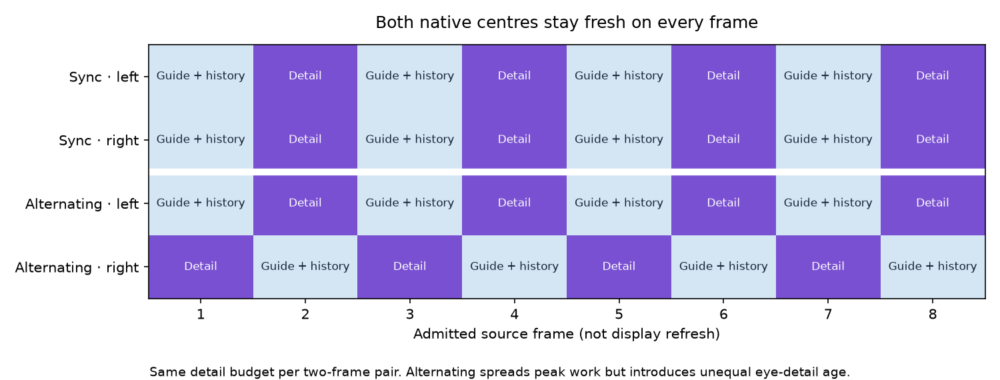
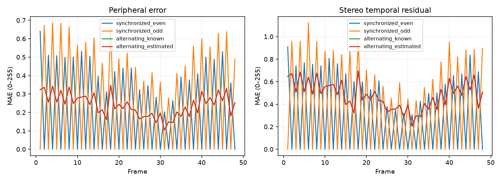
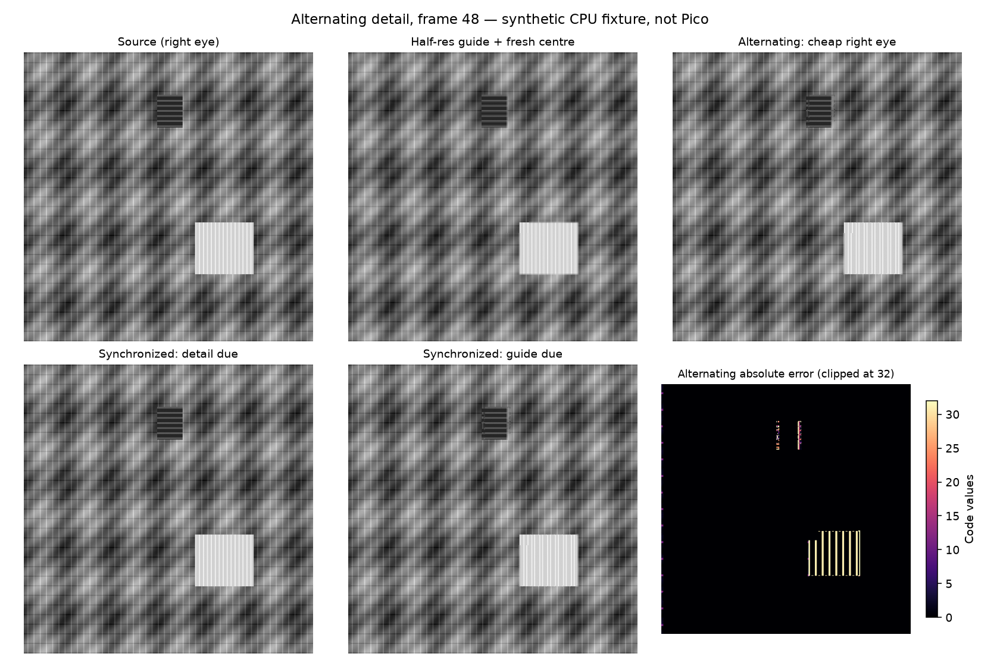

# Alternating eye detail refresh

**Implemented CPU quality model; not integrated into the live codec or Pico.**
The current wider-ring streaming profile remains enabled. This experiment tests
whether a fresh low-resolution guide can steer older sharp detail while full
peripheral detail alternates between eyes. Both centres stay current.



## Method

49 synthetic stereo frames, 512×512 per eye, with one full-detail bootstrap
excluded from the 48 measured frames. The 128×128 centre is exact every frame.
A current guide has half the width and height of the model image. Background
translation alternates +1/+3 pixels; foreground objects have independent motion
and different stereo offsets. The known-motion model receives only background
translation. The estimated variant searches horizontal shifts −4 through +4
using current guides and history, with a confidence guard.

Compare synchronized even/odd refresh phases against alternating eyes. Each
mode reads exactly 11,796,480 fresh peripheral detail samples across the measured
sequence: half of the full-rate stereo detail budget. A complete guide is also
computed every frame. Full-detail refreshes overwrite history; cheap refreshes
use warped history, rejecting invalid, old or guide-inconsistent samples.
Foreground truth masks are used only for evaluation, never for rejection.
The loss stress assumes guide and centre survive while one detail payload is lost.

## Results

Errors are intensity MAE on a 0–255 scale, not codec quality scores or geometric
disparity. The stereo residual is the error in same-coordinate left-minus-right
intensity relative to the source pair; it is not a binocular comfort metric.

| Schedule | Peripheral MAE | Stereo residual MAE | Disocclusion MAE |
|---|---:|---:|---:|
| Synchronized, even detail | 0.2121 | 0.3060 | 5.3864 |
| Synchronized, odd detail | 0.2668 | 0.3888 | 8.8318 |
| Alternating, known motion | 0.2394 | 0.4788 | 7.7587 |
| Alternating, estimated motion | 0.2394 | 0.4788 | 7.7587 |

Fresh half-resolution guides plus exact centres alone produce **5.1990**
peripheral MAE on this fixture. Alternating history preserves much more detail,
but its stereo residual is worse than either synchronized phase. Its mean
peripheral error lies between those controls. Known and estimated motion agree
on all 48 transitions here; this does not validate general motion estimation.

Alternating spreads scheduled detail from zero/two eyes per frame to one eye
per frame. That is a **work-distribution hypothesis**, not a measured GPU or
latency improvement. Equal average detail budgets do not establish equal GPU
cost, and a persistent stereo mismatch may be less comfortable than synchronized
quality changes. Neither mode is selected for live deployment from this test.





## Validity checks

- Exact native centres and equal refresh budgets across all compared modes.
- Normal retained detail age at most one source frame.
- Lost detail at source frame 2 and history reset at frame 5: retained detail
  age bounded at two frames; the unrefreshed eye has no valid detail after reset.
- Source sequence determines eye phase; a lost update does not switch it.
- A one-pixel checkerboard phase change is invisible in the guide. The independent
  check verifies that low confidence selects guide fallback for the cheap eye
  instead of keeping the wrong sharp phase.

[Machine-readable metrics](metrics.json) · [Independent checks](review-checks.json).
These are CPU assertions, not packet transport or real decoder validity tests.

## Why this cannot simply be enabled on Pico

The live decoder already packs each eye to 928×928 with a native 512×512 centre.
A half-native-resolution guide alone is larger than that whole packed eye.
An ideal guide that halves each dimension of the *current packed peripheral
samples*, while retaining the centre, would reduce alternating decoder output
samples by **26.1%**. This does not count history reads, warping, entropy, centre
transforms, dispatches, metadata, or unchanged final presentation writes.

[Exact sample accounting](packing-budget.json) and the
[integration boundary](INTEGRATION.md) identify the codec signaling, history
lifetime and pose handling that must change before measuring actual savings.
No Pico timing, hardware decoder comparison, head rotation/translation,
physical latency, sustained thermal behavior or user comfort is measured here.

## Reproduce

With Python, NumPy and Matplotlib, run from this directory:

```sh
python3 prototype.py
python3 review_checks.py
python3 packing_budget.py
python3 plot_schedule.py
```

The scripts regenerate only CPU fixture data, figures and accounting. The
bootstrap, masks, output arrays and timing scope are explicit; no generated
image is presented as a headset capture.
