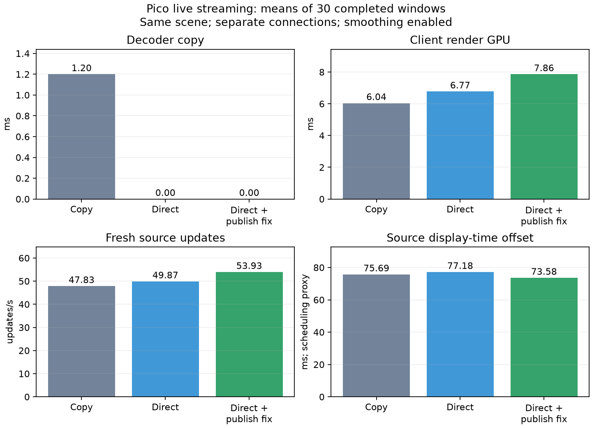
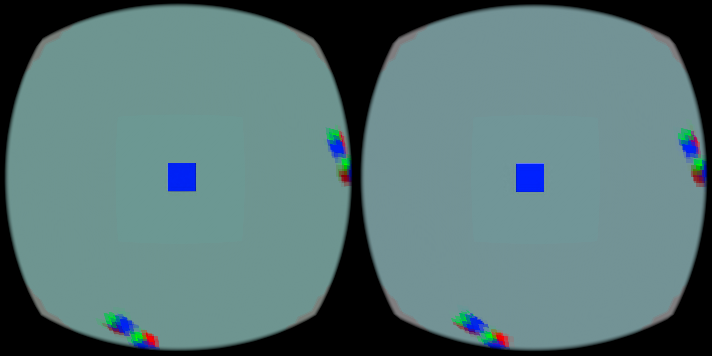

# Direct NV12 output and independent frame publication

Two changes remove unnecessary work from the custom WiVRn NX receiver:

1. Decode into storage views of the existing NV12 display pool. Two full-image copies disappear; the publication barrier and submission remain.
2. Publish valid independent frames after frame-ID gaps. The decoder's `INDEPENDENT_TILES` mode rejects predictive, skipped and concealed tiles, so these completed pictures need no preceding frame. The reference-continuity gate remains for ordinary predictive streams.

## Live results

Pico 4, 4352 × 2176 stereo output, native 512 × 512 centre per eye, graduated periphery, two-tap smoothing enabled, 90 Hz requested. Headless `hello_xr -g Vulkan2` supplied the same scene. Each row summarizes the last 30 completed approximately two-second windows of a separate connection. These are means of reported window means, **not per-frame percentiles**.

| Path | Fresh updates/s | Render GPU ms | Copy GPU ms | Decoder completion wait ms | Source offset ms |
|---|---:|---:|---:|---:|---:|
| Copy, original publication gate | 47.83 | 6.04 | 1.20 | 12.87 | 75.69 |
| Direct, original publication gate | 49.87 | 6.77 | 0.00 | 11.93 | 77.18 |
| Direct, independent publication | 53.93 | 7.86 | 0.00 | 12.43 | 73.58 |



Direct output removes approximately 1.2 ms of measured copy work. Publishing independent frames eliminates the receiver's withholding counter in the final capture. The combined run delivered about 13% more fresh updates, with source offset about 2.1 ms lower than the initial baseline. **Render GPU cost increased**, and total completion wait improved much less than copy time alone. This is not a claim of a universal performance gain.

Source offset compares the selected frame's intended display timestamp with the runtime's next predicted display timestamp. It is a scheduling proxy, **not measured motion-to-photon latency**. Connection, pacing feedback and thermal/load variation remain confounders; there was no automated physical head-motion sweep. These runs do not establish sustained 90 or 240 fresh frames/s.

A same-session JIT-off check measured 53.73 fresh updates/s and 73.43 ms source offset. It added no clear benefit; the override was cleared. Raw filtered logs, timestamp ranges and JSON summaries are included. Recompute a summary with `python3 analyze_live.py borrowed-direct-independent-filtered.log`; regenerate the figure with `python3 make_graph.py`.

## Pixel correctness

The [standalone probe](../../../../probe/borrowed-output/README.md) decoded three full-resolution frames into two real mutable NV12 images, rotating targets 0/1/0. It tested invalid dimensions and an asynchronous final decode followed immediately by `NULL` restoration to decoder-owned output.

After deinterleaving UV, all **42,614,784 bytes** matched the CPU reference. Both SHA-256 values were `db00e8acdedf1d24a7270c99188f700823a2ae6f223392af24a2a0743d8a891e`. Input `api-native-graduated-fine-final.nxv` SHA-256: `6d6e58c57a1e2049e9182ec5bf8e475e675cfa5302d6863c0ba2f9be4e141471`. Host UNORM roundtrip and tool-mask regression checks also passed.



The image documents the installed client rendering the test scene; it is not a visual-quality or physical-motion benchmark.

## Reproduction and build identity

Use [server-config.json](server-config.json) with the matching custom WiVRn NX server. The tested client properties were:

```sh
adb shell setprop debug.wivrn.nx.planar_centre 1
adb shell setprop debug.wivrn.nx.peripheral_smooth 1
adb shell setprop debug.wivrn.nx.borrowed_output 1
```

Reconnect after changing borrowed output. Set it to `0` and reconnect for the copy control. Borrowed output remains default-off; unsupported allocations or target bindings fall back to copies. Smoothing remains optional and protects the fixed 512-pixel centre.

| APK | SHA-256 |
|---|---|
| Copy/direct control, borrowed1 | `db24bcdc94b4159aff391c6885c5dd60cf8fa0405b2c9d8c947b422ec246a3ac` |
| Final independent publication, borrowed2 | `812d21cfaea120a33c933741562e59c370ff50a774bcdb70f1e497fa54ce1a50` |

Final embedded native library SHA-256: `ef3e69d1107d4b2bb5089c285ed3415263b205bc2e5652e043417b73cfac2ab7`. Both APKs used the existing signing certificate. The final build is installed with borrowed output and smoothing enabled; the headless test application was stopped afterward.
