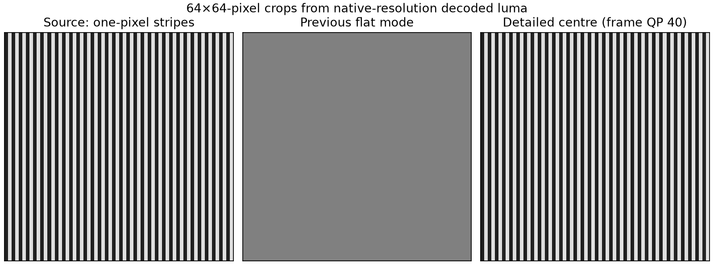
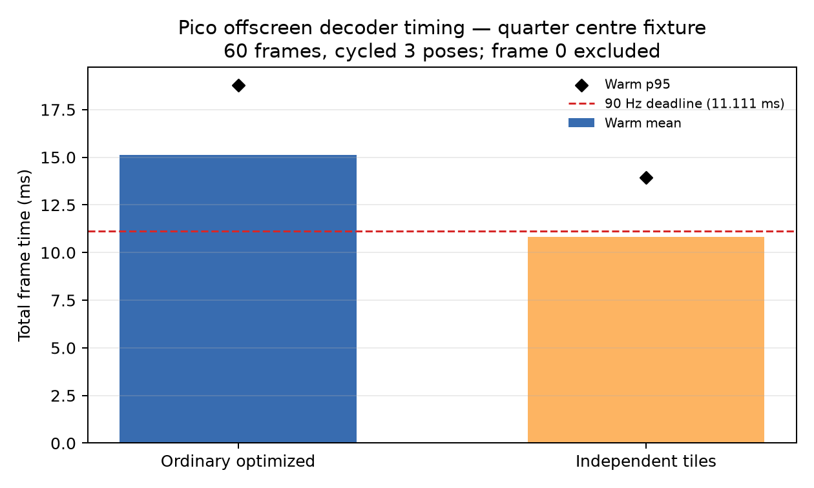

# Centre detail independent tiles validation

The decoder measurements below are offscreen tests. A subsequent matching-client
[live smoke test](live/README.md) confirms integration and a visible image, with
54.27 fresh updates/s across short active windows; it does not reach sustained 90 Hz.

Both benchmark commands included `NXVC_VKD_PLANAR_FLAT=1` and `--format ycbcr420`.
The independent and ordinary quarter outputs (3 frames, 42,614,784 bytes each)
were byte identical, SHA-256
`3f6723bd2c7037ce14771b08c0da1670b6b8f2e21a1903b92b020d99d450fbd1`.

Independent command:

    NXVC_VKD_PLANAR_FLAT=1 /data/local/tmp/nxvc-vkdec-independent --in /data/local/tmp/centre-detail/camera60-lite-quarter.nxv --out /dev/null --format ycbcr420 --no-out --independent-tiles --stats --throughput --frames 60

Warm independent timing (frames 1-59): Pass A mean/p50/p95 `2.273/1.824/3.939 ms`; Pass B `5.862/5.275/7.405 ms`; GPU `8.134/8.232/9.456 ms`; total `10.831/11.134/13.924 ms`, max `17.527 ms`. The run reports 3 dispatches/frame. Overall throughput includes cold pipeline setup and is not a steady-state delivery rate. This remains borderline/over the 90 Hz deadline and is an opt-in path only.

Predictive fixture rejection remains verified: `independent tiles rejects predictive tile 0`, exit 77. Raw logs are adjacent; raw YUV captures were removed after hashing.

## Ordinary versus independent timing

Both results are offscreen Pico runs on the quarter centre-detail fixture with
cycled three poses. Cold frame 0 is excluded from these timing statistics.
Ordinary optimized warm total is mean/p95 `15.134/18.816 ms`; independent tiles
is `10.831/13.924 ms`. The independent path is opt-in and remains borderline
against the 11.111 ms 90 Hz deadline. See `timing-comparison.png`.

## Native-detail check

The encoded image is 4352 × 2176, containing two 2176 × 2176 eyes. Mode
`--planar-gpu-centre` chooses ordinary INTRA tiles in a 1024 × 1024 centre per
eye, starting at (576, 576). Adding `--centre-quarter` chooses a 512 × 512
centre starting at (832, 832). Both retain native pixel sampling; the smaller
option changes the area, not the sampling inside it. The region is fixed in
image space and is not eye-tracked. Outer tiles use the existing two-colour,
8-pixel-cell PLANAR approximation. Centre quantization is capped at QP 26 for
the tested server range QP 22–40.

A synthetic YUV420 fixture places alternating one-pixel luma stripes (32/224)
in a 512 × 512 region within each default centre. At base QP 40, centre coding
retains 191.96046 luma levels of alternating-column contrast, with 1.51368 mean
absolute luma error. The all-flat control has zero contrast and 96 mean absolute
error in the same region. The 64 × 64 figure crop begins at (832, 832) in the
left eye. This controlled decoded-pixel comparison is not a headset screenshot.

The timing fixture cycles three rendered camera poses across 60 frames at
native stereo dimensions, encoded with LITE entropy and the quarter centre.
It is not a continuous physical head-motion test. The 512-centre fixture
averages 162835 encoded bytes/frame, approximately 117 Mbit/s at 90 frames/s
before transport overhead; this is content-specific, not a fixed bitrate.

Decoder binary SHA-256:
`722c7c1ed87a0e7982c5cab9a6dec6a8de052c59de375ee8639a04694d788ce5`.
