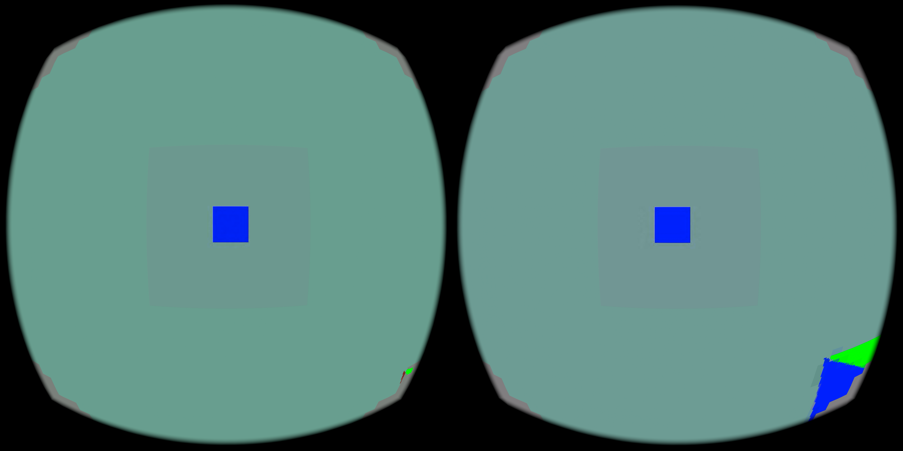

# Mixed native-detail centre: live Pico smoke test

The matching custom WiVRn NX client and server streamed a headless `hello_xr`
Vulkan2 application through gamescope. The decoder selected the logged
`PLANAR centre mode requested; using generic mixed-frame decoder` route.
Server configuration is adjacent: native 4352 × 2176 stereo coding, 512 × 512
INTRA centre per eye, PLANAR periphery, 90 Hz requested.

Across all 14 reported windows (37.5 seconds), fresh-source delivery averaged
37.65/s. That includes an XR session interruption. Reporting windows of at most
3 seconds give 54.27 fresh updates/s across 26.0 seconds,
range 43.50–58.50/s. This exclusion is explicit;
the raw session transitions and every window are retained in the adjacent logs.
It is **not sustained 90 Hz delivery**, and no physical head-motion result is
claimed. Typical live decode wall time was 12–14 ms; GPU decode about 6 ms,
with additional copy and queue time. The sender reported worker-backlog drops.

This actual 4320 × 2160 Pico capture shows the test scene and a visible centre/
periphery boundary. It establishes a rendered live image, not one-pixel fidelity
or moving-head quality; see the parent directory's controlled stripe comparison
for the pixel-detail check. The hidden test application was stopped afterward;
the centre-enabled server remains running for user applications.

APK SHA-256: `d0eb933bb096cd846ebac16a21bc8b4a57e64f915594c517531b5c1026da92ec`.
Server SHA-256: `b9c0255f0978732ead2110edf43357e8111ff3ed66cd3ccda29a725b018d717f`.
APK native library SHA-256: `ad0090c756fbc7a3d765a36988c32e685d529ca600caff5396addc3ef77d89be`.

Client activation: `adb shell setprop debug.wivrn.nx.planar_centre 1`, then
reconnect with the matching centre server configuration. The independent-tile
flag rejects predictive frames rather than allowing invalid reference reuse.
