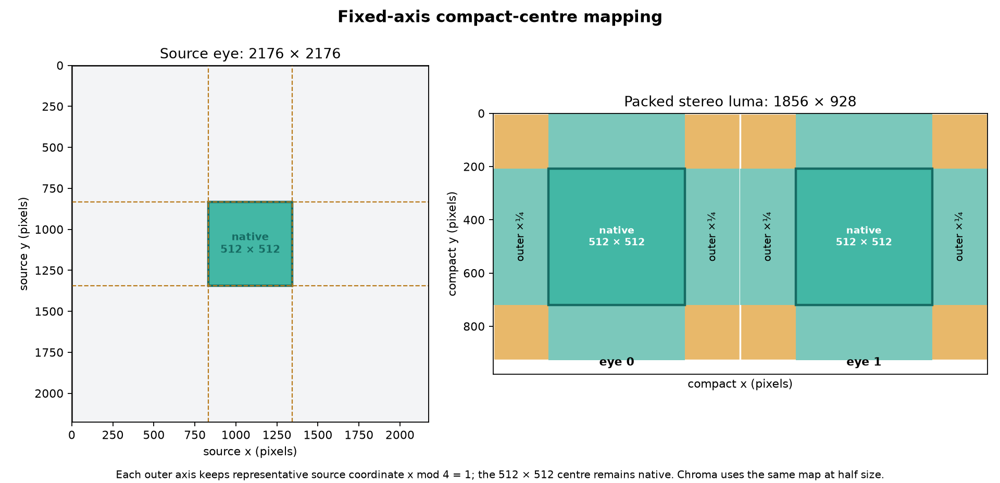
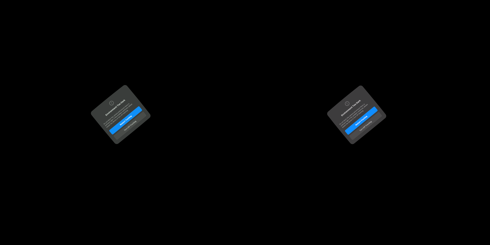
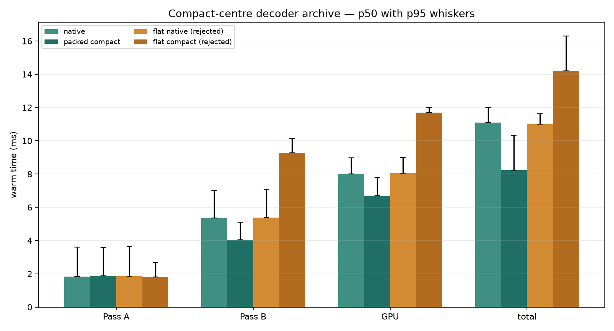
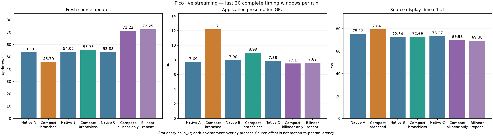

# Compact centre storage map

This schematic records the experimental fixed-axis presentation mapping. Each
eye starts at 2176 × 2176 source pixels. The central 512 × 512 square is kept
at native sampling. The 832-pixel outer band on every axis is represented at
one quarter density, producing 208 + 512 + 208 = 928 samples per eye axis.
Two eyes therefore occupy an 1856 × 928 luma image; the corresponding 4:2:0
CbCr image is 928 × 464.

The map is separable: the centre is a native square, while the peripheral
representation is formed by independent horizontal and vertical axis maps.
It therefore includes native cross-stripes extending through the centre and
does not claim uniform square peripheral resolution.

The prototype keeps outer representatives where the source coordinate is
`x mod 4 == 1` (and likewise for y), while every centre coordinate is kept.
Chroma applies the same rule to its half-resolution axes: 1088 maps to 464
with a 256-sample native centre. This is a storage/presentation description;
the measurements below evaluate its decoder and live integration separately.



Generate the figure with:

```sh
python3 figure.py --out .
```

## Archived decoder experiments

The `flat-*` logs preserve the first masked-store prototype; that variant is
rejected for this comparison. The `packed-*` logs preserve the direct packed
store.

Exact commands for the archived flat and packed runs (the two packed commands
were alternated ABBA with the native commands) were:

```sh
NXVC_VKD_PLANAR_FLAT=1 nxvc-vkdec --in camera60-lite-graduated-fine.nxv --format ycbcr420 --unorm 0 --no-out --independent-tiles --stats --throughput --frames 60
NXVC_VKD_PLANAR_FLAT=1 nxvc-vkdec --in camera60-lite-graduated-fine.nxv --format ycbcr420 --unorm 0 --no-out --independent-tiles --compact-centre --stats --throughput --frames 60
```

`analyze.py` excludes frames 0–9 from both native and compact groups and
writes `summary.json` plus `timing-comparison.png`, with all timings in ms.
The flat compact p50 total is about 14.2 ms; it is retained as rejected
evidence. The packed compact p50 total is about 8.23 ms versus about 11.10 ms
for native in this archive. The three-frame CPU exactness check uses the
borrowed-output and CLI readback paths plus the probe validator; both compact
outputs match SHA-256
`d4defecfef9e5440a35567f450c1ffb9ee72dac9278a42140322d18892f56b30`.
These are decoder-only device logs, not a source FPS, smooth-motion,
photon-latency, or live 90-fps claim. The source fixture cycles three camera
poses.


## Live integration protocol

The same `compact1.apk` was used for native A, compact A and native B,
changing only `debug.wivrn.nx.compact_centre` between reconnects. Each run
lasted 90 seconds with headless gamescope and hello_xr Vulkan2. Full-size
2160 × 2160 presentation per eye, native 512 centre, graduated PLANAR cells,
borrowed NV12 output, peripheral smoothing and server pacing window 0.4
remained enabled. The Pico was stationary; its dark-environment system dialog
covered the headset view. These runs measure the streaming application's
work under that condition, not visual correctness or physical head motion.

`compact2.apk` replaces the presentation map's per-axis branches with the
identical expression `p*0.25 + clamp(p-832, 0, 512)*0.75`. Decoder code and
wire format remain unchanged. This is a second candidate, not a repeat of
the first binary.

The parser reports unweighted means of the last 30 complete, approximately
two-second timing windows. Client and decoder windows are asynchronous.
Source display-time offset is predicted display time minus the selected
source's intended display time; it is **not motion-to-photon latency**.
Zero-copy output removes the copy but does not remove GPU queue waiting.
Some streaming logcat captures returned no data; `*-recovered.log` files
were recovered from the device log buffer using the application's PID.



This screenshot is evidence of the visual-validation limitation. It is not
an image-quality comparison of the compact renderer.

APK SHA-256 (`compact1.apk`):
`5246a022a9822a976ed00e0d8b624a2a340dbdaeeaed7632b61154d118ec38d8`.

Reproduction helper `capture_live.py` records the local runtime paths used;
adapt these paths and the server address before running elsewhere. Reproduce
summary values with `python3 analyze_live.py logs/live-*.log`.


The decoder allocates about 18.2% as many output pixels. It still reconstructs
full tiles in shared memory: the present optimization visits only packed
output samples when storing them. The rejected masked-store prototype shows
why fewer writes alone do not guarantee lower execution cost.

Compact decoder readback contains 7,750,656 bytes for three frames and matches
all expected CPU-reference representative samples. `correctness.json` records
the result. The normal output control also matched the complete CPU reference.
Host Vulkan roundtrip and tool-mask regressions passed (3 CTest tests).

APK SHA-256 (`compact2.apk`, branchless mapping):
`557eedd52d5c0ba8c4630d232c1c9ae081c383d90301960687640b1a8c140032`.
Both APKs use the same signing certificate and were installed with `adb install -r`.




A final native C control used the same branchless APK with compact storage
disabled. The separately labelled **bilinear-only** candidate enabled compact
storage and disabled the extra two-tap peripheral smoothing property. It still
uses hardware bilinear NV12 sampling, but this is a different quality setting:
it cannot be interpreted as an equal-quality performance comparison. Bilinear
filtering smooths the lower-resolution sampling grid; it need not hide the
larger PLANAR cell edges as well as the original wide filter.

The final implementation uses the branchless map. The slower branched mapper
is not retained in production. The first masked-store experiment is also
rejected; logs remain as negative evidence.


## Fixture identities

The replay commands require the existing local fixtures; this directory
archives logs and analysis rather than duplicating large input/reference files.

| Fixture | SHA-256 |
|---|---|
| camera60-lite-graduated-fine.nxv | `6c40fab6cebdbf185c6f3e22cdfff84b8e4a233c01f7cf5ddfc5b7ae82130111` |
| api-native-graduated-fine-final.nxv | `6d6e58c57a1e2049e9182ec5bf8e475e675cfa5302d6863c0ba2f9be4e141471` |
| fine-cpu.yuv | `db00e8acdedf1d24a7270c99188f700823a2ae6f223392af24a2a0743d8a891e` |

Validate the three-frame GPU compact NV12 readback against the native CPU
planar YUV reference from the repository root:

```sh
python3 probe/borrowed-output/validate_compact.py fine-cpu.yuv compact.nv12
```

This verifies every retained luma/chroma sample, not merely a checksum of the
GPU output against itself. Central samples are retained at native density;
peripheral interpolation and lens presentation are approximate.


## Live results and decision

| Variant | Fresh updates/s | Decode GPU ms | Presentation GPU ms | Source offset ms |
|---|---:|---:|---:|---:|
| Native A | 53.53 | 6.47 | 7.69 | 75.12 |
| Compact, branched | 45.70 | 4.78 | 12.17 | 79.41 |
| Native B | 54.02 | 6.35 | 7.96 | 72.54 |
| Compact, branchless + filter | 55.35 | 4.68 | 8.99 | 72.69 |
| Native C (same APK) | 53.88 | 6.38 | 7.86 | 73.27 |
| Compact, bilinear only | 71.22 | 4.73 | 7.51 | 69.98 |
| Compact, bilinear repeat | 72.25 | 4.71 | 7.62 | 69.38 |



The bilinear-only candidate reproduced a throughput improvement of about
32–34% against the same-APK native C control, with source offset lower by
3.3–3.9 ms. This is a promising workload-specific quality/performance tradeoff,
not proof of 90 Hz, 240 Hz or physical motion-to-photon improvement. The extra
filter largely consumed the compact decoder savings in the live pipeline.

Default compact mode remains **off**. After testing, the Pico was restored to
full-size storage with the existing peripheral filter, the streamer reconnected,
and headless test scenes stopped. The tested candidate remains available via
`compact_centre=1` and `peripheral_smooth=0`, followed by reconnecting. Visual
verification is required before selecting it as the normal user configuration.

Next architectural target: avoid reconstructing unused peripheral pixels and
avoid full-resolution intermediate presentation work. Measurements here show
that shrinking decoder storage helps only when presentation cost is controlled.
