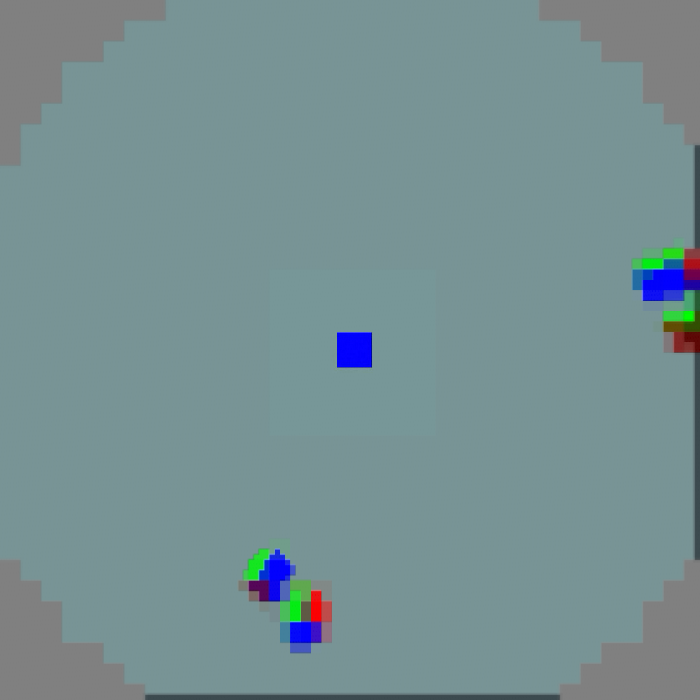
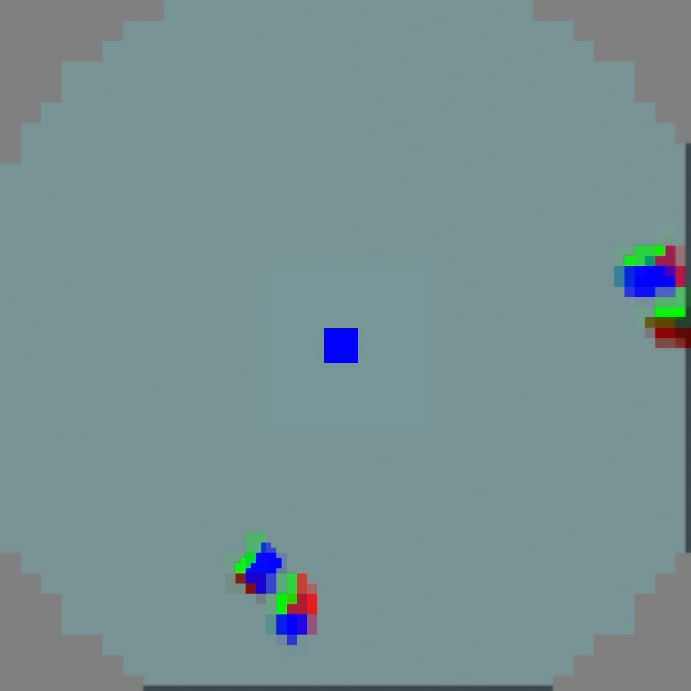
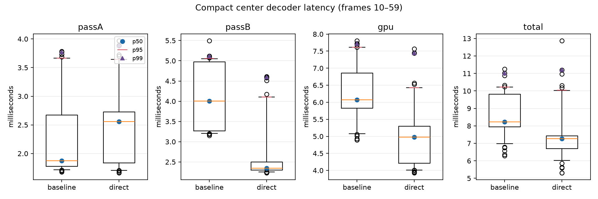
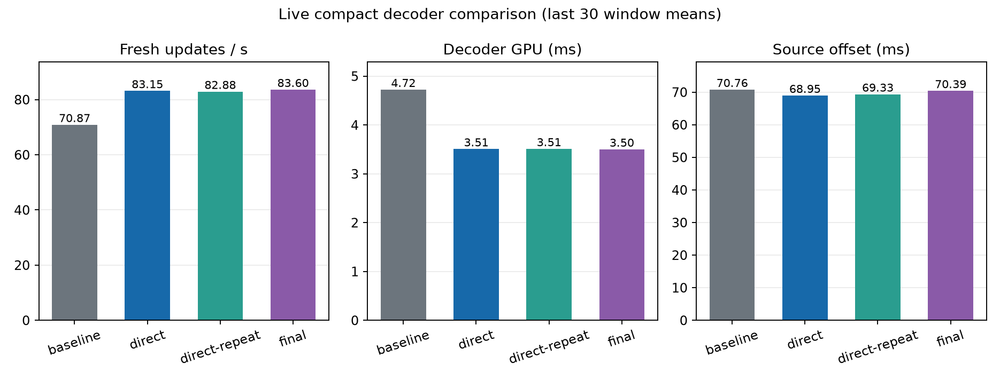

# Compact direct store evidence

This archive measures the specialized flat PLANAR compact center path. It
computes only retained native samples and writes the NV12 output directly,
skipping reconstruction of discarded samples into shared storage. The normal
native path is unchanged.

Correctness was checked for both UINT and UNORM output on three frames. Both
readbacks are byte exact: 7,750,656 bytes and SHA-256
`d4defecfef9e5440a35567f450c1ffb9ee72dac9278a42140322d18892f56b30`.

The paired logs are four decode-only runs on an Adreno 650 using the
native `4352x2176` fixture and `1856x928` compact output, `--no-out`, independent tiles, and 60
frames per run. Analysis excludes warm-up frames 0–9 and uses 100 samples per
variant. The inherited input fixture is
`camera60-lite-graduated-fine.nxv`, SHA-256
`6c40fab6cebdbf185c6f3e22cdfff84b8e4a233c01f7cf5ddfc5b7ae82130111`.
`summary.json` and `latency.png` are regenerated with:

```sh
python3 analyze.py
```

The plot reports p50, p95, and p99 for Pass A, Pass B, GPU, and total frame
wall time. This is decoder-only evidence; it does not establish 90 FPS or
live end-to-end latency.


## Live stereo output capture

The client can now read both acquired swapchain eye layers before OpenXR adds
its system overlays. The capture waits for GPU completion, preserves the
color-attachment layout, and writes independent 2160 × 2160 PNGs. The Pico
tracking dialog remains present, so this verifies application output rather
than the final compositor image or physical head motion.




These are actual Pico GPU readbacks from the headless hello_xr streaming test,
not CPU reconstructions or illustrations. They show a sharp central cube and
coarse peripheral controllers; quality remains deliberately approximate.
The optimization retains exactly the same decoder samples as the preceding
compact layout. The live setting here uses hardware bilinear sampling without
the additional peripheral filter.

Set `debug.wivrn.nx.capture` to a unique alphanumeric request before connecting.
PNG files are written under the Android application's external files directory
as `nx_capture_REQUEST_0.png` and `_1.png`. A request is handled once per stream.
Set the property to `0` and reconnect before benchmarking: capture opts the
swapchain into transfer-source usage and performs blocking readback/PNG work.
Visual-capture timing windows are excluded from the performance comparison.

Baseline APK SHA-256:
`557eedd52d5c0ba8c4630d232c1c9ae081c383d90301960687640b1a8c140032`.
Direct decoder + capture APK SHA-256:
`e5e04c4cd1bf2e720f54b0ef32b6d29fb36cf8b20a78f24284a07206d5c87c6c`.




## Live comparison

Both baseline and direct builds used compact output, native 512 × 512 centres,
hardware bilinear sampling, no extra peripheral filter, borrowed output, and
the unchanged server pacing window 0.4. Each headless hello_xr run lasted
90 seconds at a configured 90 Hz display rate. Capture was disabled and the
application reconnected before timing. These are means of the last 30 complete
approximately two-second windows, not frame percentiles.

| Build | Fresh updates/s | Decode GPU ms | Presentation GPU ms | Source offset ms |
|---|---:|---:|---:|---:|
| Previous compact | 70.87 | 4.72 | 7.47 | 70.76 |
| Direct compact | 83.15 | 3.51 | 8.23 | 68.95 |
| Direct repeat | 82.88 | 3.51 | 8.22 | 69.33 |



This reproduces about 17% more fresh updates at the same retained pixel values.
Source offset improves by 1.4–1.8 ms in these captures; this is not a physical
motion-to-photon measurement. GPU queue wait grows from 5.91 to 7.10–7.17 ms,
so the decode completion wait barely changes despite lower decoder GPU cost.
The application presentation pass remains the larger GPU stage. Neither
sustained 90 Hz nor 240 Hz has been demonstrated.

The full-size output control matches the CPU reference too
(`correctness-native.json`). Three host regression checks passed. Capture
instrumentation was built into the direct APK but performed no image copies
during timing. Thermal/power and physical head-motion behavior were not measured.

The next candidate is actual client fragment-density foveation: this Pico log
advertises XR_FB_foveation, XR_FB_foveation_vulkan and
VK_EXT_fragment_density_map, while current presentation still shades the full
2160 × 2160 output per eye. Advertisement alone does not establish a working
or faster path; feature enablement, integration and profiling remain necessary.


## Diagnostic failure investigation

A full-size native-output capture saved both PNGs, then failed several seconds
later with Adreno `wait_on_sync_fd: Invalid argument` and
`vk::Device::waitForFences: ErrorInitializationFailed`. The raw failure and
client log are retained. A subsequent 35-second native run with capture disabled
completed. The two compact 90-second performance runs also completed with
capture disabled. The failure occurred before the later second capture request.

The diagnostic was changed to submit its readback and wait for queue idle under
the queue lock, avoiding a short-lived separate capture fence. This is an
isolated diagnostic synchronization change; it does not alter the decoder or
the capture-disabled render path. Correlation does not establish the driver's
root cause. Follow-up capture checks are recorded below.


The original fence-based capture passed its 35-second retry, so the earlier
failure was not consistently reproducible. The revised queue-idle diagnostic
then completed a 45-second native run with two separate requests (startup and
mid-stream), saving both eye layers each time. This is a smoke check, not proof
that the underlying driver issue is resolved. Diagnostic capture remains opt-in.

Final APK SHA-256, with queue-idle diagnostic:
`d1465a89b54a35856590b9dd9b470767b4701e677c933b12419b13bda7fde5d9`.

[Native-output capture with the wider peripheral filter, left](native-final-eye0.png)
and [right](native-final-eye1.png) show the alternative filter setting. These
were captured in a separate run, not from the same source frame as the compact
images. Centre sharpness is retained in both; peripheral smoothing differs.


The final APK completed a further 90-second capture-disabled run: last-30-window
means were **83.60 fresh updates/s**, **3.50 ms decoder GPU**,
and **70.39 ms source offset**. The headless test scene was stopped;
the streamer remains connected with compact centre enabled, peripheral extra
filter disabled (bilinear sampling retained), and diagnostic capture disabled.

The final source offset is close to the baseline, so the strongest conclusion
is a reproducible throughput improvement, not a robust latency reduction.
Presentation and queueing must be addressed next.
