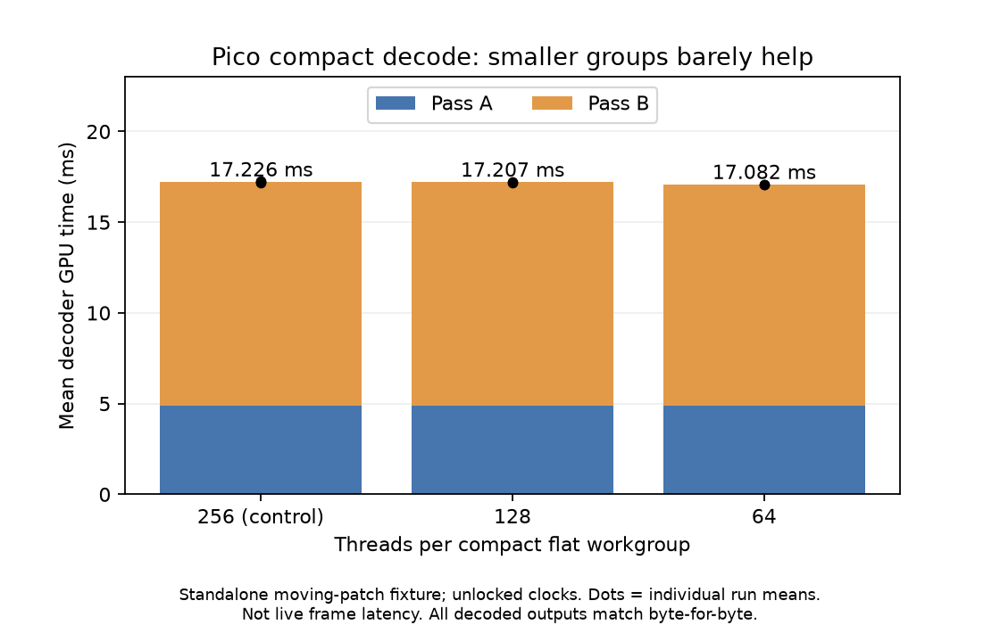

# Compact decoder workgroup experiment — rejected for production

The compact flat PLANAR shader was tested with 256, 128 and 64 threads per
workgroup. Its existing direct compact store already avoids discarded samples,
so this changes scheduling rather than reconstruction or output resolution.
Default/noncompact paths stayed at 256. `experiment.patch` contains the opt-in
prototype against NX Warp da43dcc; it was removed from production after testing.

## Measured on Pico / Adreno 650

32-frame 4352×2176 stereo moving-patch fixture from
[the adaptive PLANAR experiment](../adaptive-planar/README.md), decoded to
1856×928 compact stereo YUV420. Native 512×512 centres per eye are retained.
App stopped during standalone tests. UNORM stores enabled. GPU clocks were not
locked; these absolute times **must not be compared with live decoder timings**.
Each timed run discards four startup frames and reports the remaining 28.
Order: 256, 64, 128, 256, 128, 64, 256. This is a small experiment, not a thermal soak.

| Threads | Mean total GPU ms across runs | Decision |
|---|---:|---|
| 256 | 17.226 | Keep existing default |
| 128 | 17.207 | No meaningful saving |
| 64 | 17.082 | About 0.8% lower; insufficient benefit |



All three 32-frame outputs have the same SHA-256. The first compact frame also
matches the independent CPU decoder after extracting the exact retained native
samples in all three planes. `results.json` includes hashes, per-run mean and
p95, and binary/stream identities. The change adds no useful demonstrated live
latency benefit and does not warrant another production option.

## Reproduce the archived experiment

Apply `experiment.patch` to its base, build the Android `nxvc-vkdec` tool, then:

```sh
python3 bench.py /path/to/adb /path/to/android/nxvc-vkdec /path/to/large-off.nxv /path/to/host/nxv-dec
```

Requires NumPy and an idle Pico. Generate `large-off.nxv` with the earlier
experiment's `perf.py`; raw YUV fixtures are generated locally and untracked.
Without applying the patch the workgroup environment variable has no effect.

## Ready-frame wait check — also rejected

A separate 90-second live test reduced ready wait from 4000 to 1000 microseconds,
with the existing fractional sender admission enabled. It passed advancing-scene
and fresh-telemetry checks, but delivered 78.27 fresh updates/s and 59.06 ms source
offset versus the preceding 4 ms controls at 81–82 updates/s and 57–59 ms offset.
It did not improve this tradeoff; the 4 ms setting was restored. Source offset is
not physical latency. Raw logs and `ready1.json` preserve the observation.

The next architectural proposal is a [low-resolution guide with retained detail](../../../../docs/TEMPORAL-TILES.md#proposed-low-resolution-guide-with-retained-detail).
It is a proposal, not an implemented half-resolution or alternating-eye decoder.
