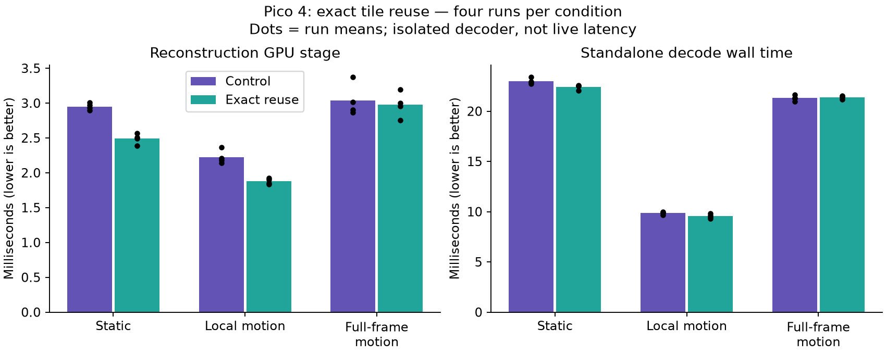

# Exact PLANAR reconstruction reuse: small isolated saving, no motion latency win

This experiment retains decoder-owned compact pixels when every input to their
PLANAR reconstruction is unchanged. The full-resolution centres remain freshly
decoded. It does not intentionally retain stale detail or alternate eye quality.

**Decision:** retain the prototype as a patch, not a live integration. It reduces
reconstruction cost on unchanged content, but does not demonstrate lower live
latency, and almost never matches tiles during full-frame motion. Production
source and the installed Pico APK are unchanged by this experiment.

## Results

Four alternating-order runs per condition; means below average the four run
means. Each run excludes its first four frames. Static/full-motion runs retain
12 samples, and the local-motion fixture retains 28. These are short isolated
runs without locked clocks or a thermal characterization, not sustained FPS or
motion-to-photon measurements.

| Fixture | Pass B control → reuse | GPU total control → reuse | Decode wall control → reuse |
|---|---:|---:|---:|
| Static | 2.950 → 2.489 ms | 18.805 → 18.246 ms | 22.983 → 22.413 ms |
| Local motion | 2.223 → 1.877 ms | 7.187 → 6.859 ms | 9.857 → 9.556 ms |
| Full-frame motion | 3.041 → 2.975 ms | 17.620 → 17.601 ms | 21.307 → 21.388 ms |

Static frames reuse all 2,184 eligible PLANAR tiles after initialization.
Full-frame motion reuses four tiles on frame 1 and zero on the remaining frames.
Consequently its small timing differences are not evidence of useful work
omission. Host submission preparation also costs more with the cache: roughly
0.17–0.20 ms on average. Entropy/Pass A remains dominant (about 14.6–15.9 ms on
these deliberately textured fixtures).

The control uses the same patched binary with reuse disabled. Both conditions
explicitly enable `NXVC_VKD_PLANAR_FLAT=1`, compact centre, and UINT output
(`--unorm 0`). Performance runs use `--no-out --stats`; correctness runs read
back all Y, U and V pixels. App force-stopped during isolated Pico tests.
This decoder-owned output comparison does **not** include the copy cost that
live integration may require relative to the borrowed-output baseline.

## Correctness

- All 16 frames of static, full-motion and changing-QP fixtures are byte-identical
  with reuse off/on, across all output planes.
- All 48 frames also exactly match an independent CPU decoder at the compact
  layout's retained sample positions.
- Dropping every second input frame gives the exact expected eight-frame subset
  in all three fixtures, with reuse both off and on.
- QP changes invalidate the relevant keys; their first frames reuse zero tiles.

See [checks](checks.json), [independent reference checks](cpu-checks.json),
[dropped-frame checks](drop-checks.json), and raw `*-0.log` / `*-1.log` files.
These tests do not establish corruption recovery, caller image mutation safety,
all reconfiguration paths, or asynchronous live integration correctness.

## Prototype and reproduction

[prototype.patch](prototype.patch) applies to commit `b402574`. It compares the
26 normalized PLANAR words, tile record, base QP and chroma offset. A private
marker makes the specialized shader return before reconstructing unchanged
tiles. Owned output images retain their contents in GENERAL layout. Reuse
requires completed prior GPU work with clean status, independent tiles, compact
8-bit UINT output, and the specialized PLANAR path. Borrowed output and atlas
paths are excluded. Callers must preserve owned images and their expected layout.
No network bytes, entropy work, dispatches, or presentation passes are removed.

The patch is opt-in with `NXVC_VKD_EXACT_REUSE=1` (environment, not an Android
app property). `NXVC_VKD_EXACT_REUSE_TRACE=1` exposes per-frame reuse counts.
[Identities](identities.json) record binaries, streams, base and patch hashes.
[benchmark.json](benchmark.json) contains every retained run mean.

The scripts preserve the original workspace-relative layout. From the workspace
containing `nx-warp`, copy these Python scripts into `nx-scratch/exact-reuse/`.
Apply the patch in an isolated checkout, build `nxvc-vkdec` for Android and the
host encoder/reference decoder. Run `fixtures.py`; push the Android binary and
three generated `.nxv` files to `/data/local/tmp/nx-exact/` and make the binary
executable. Then run `test_pico.py`, `cpu_check.py`, `drop_check.py`, and
`bench_pico.py`. Adjust the explicit adb/build paths for another machine.
The local-motion benchmark additionally uses the existing
`nx-scratch/wide-ring/wide.nxv` fixture, whose hash is recorded; it is not generated
by `fixtures.py`. The static/full-motion/QP fixtures are fully generated here.

## What this changes about the next experiment

Merely suppressing peripheral output writes cannot remove the dominant decode
work observed here. The next representation should omit entropy-coded detail
before submission, refresh both eyes together, and sample retained history
inside presentation. Gate retained history on motion/disocclusion and age;
keep centres fresh. Compare against the actual borrowed-output live baseline
using canonical encode-to-selection timings, including full-frame motion.
Neither this patch nor the earlier standalone history shader proves that
integration will be faster.
