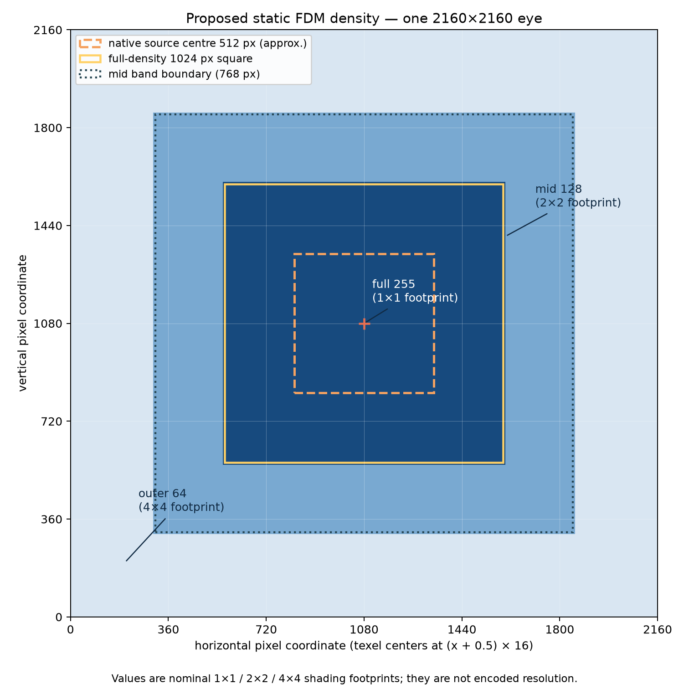
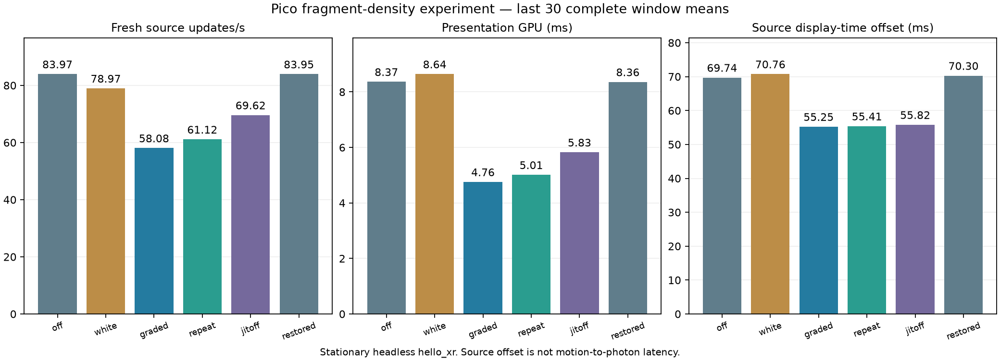
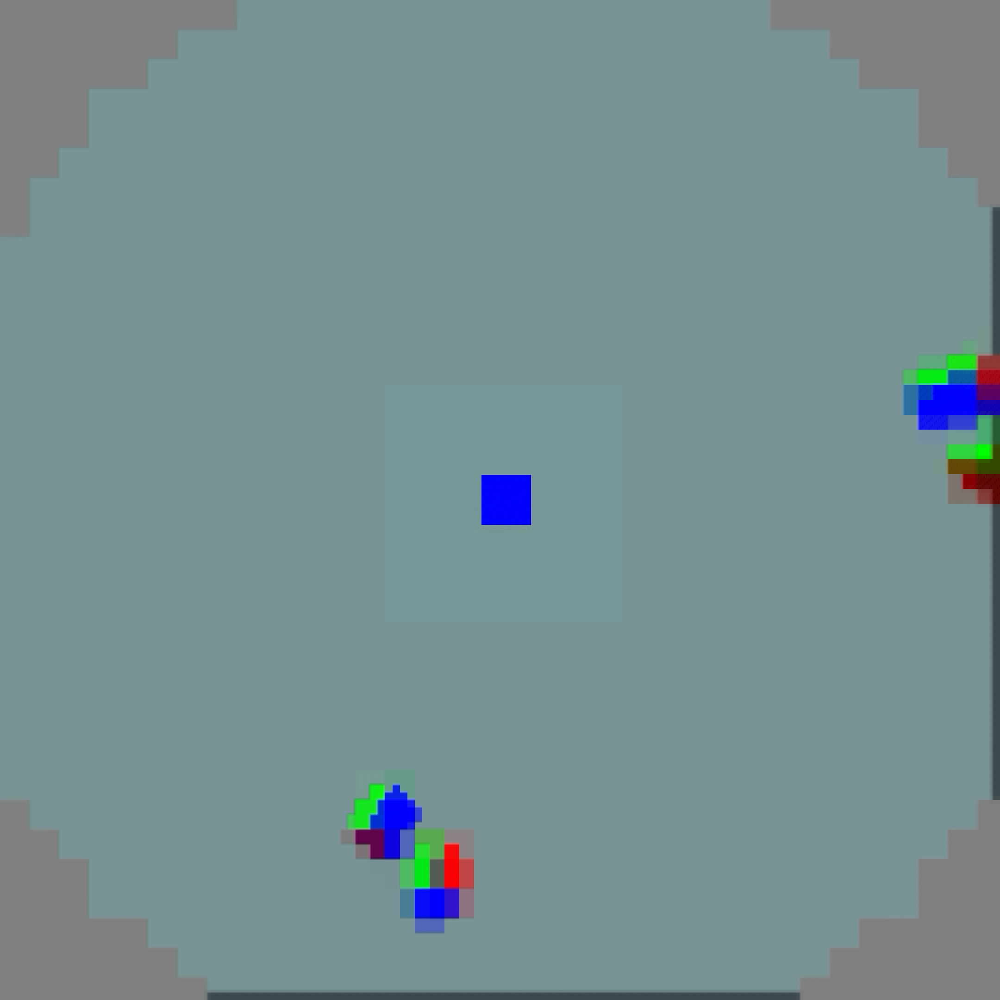

# Static fragment density maps on Pico

**Outcome: lower presentation cost and source age, but worse fresh-frame cadence.**
This remains an opt-in experiment; the headset was restored to FDM off.
It is not a sustained 90-fresh-FPS or physical-motion result.

## Method

Same signed client APK, unchanged server/configuration, native 4352 × 2176 source,
compact reconstruction, and 2160 × 2160 output per eye. The stationary Pico ran
headless `hello_xr` through WiVRn NX. Each performance trial lasted 90 seconds;
statistics use the last 30 complete client/decoder reporting windows, approximately
two seconds each. Rates derived from printed counts/durations have rounding error.
These are window means, **not per-frame p95/p99 measurements**.

| Trial | FDM property | JIT | Purpose |
|---|---:|---|---|
| off | 0 | on | No density attachment |
| white | 2 | on | All-255 full-density attachment control |
| graded | 1 | on | Graduated density |
| repeat | 1 | on | Graduated density repeat |
| jitoff | 1 | off | Scheduling-delay control |
| restored | 0 | on | Reverse-order baseline check |

All performance runs used `compact_centre=1`, `planar_centre=1`,
`borrowed_output=1`, `peripheral_smooth=0`, and `capture=0`.
Hardware bilinear filtering remains; the optional extra smoothing is off.
The capture runs were separate, 25-second diagnostics and excluded from timings.

## Implementation

[WiVRn NX commit 3f81e87a](https://github.com/nerdrx/wivrn-nx/commit/3f81e87a)
enables `fragmentDensityMap` and `fragmentDensityMapNonSubsampledImages` only when
requested and supported. Pico reports both features, static maps, and minimum
16 × 16 density texels ([device query](device-features.txt)).

One immutable RG8 map is uploaded before rendering and shared between the two
mono eye renderpasses. Both regular and optional UNORM output paths attach it.
At 2160 × 2160, the map is 135 × 135. Texel-centre distance from the eye centre
uses square bands: radius ≤512 → 255, ≤768 → 128, otherwise 64. Thus roughly
1024 × 1024 central output pixels retain full shading, surrounding the native
512-pixel source centre with a margin. The outer bands request nominal 2×2 and
4×4 shading footprints. Stream dimensions and encoded sampling do not change.

The map follows Vulkan's [fragment-density extension](https://docs.vulkan.org/refpages/latest/refpages/source/VK_EXT_fragment_density_map.html)
and [non-subsampled image feature](https://docs.vulkan.org/refpages/latest/refpages/source/VkPhysicalDeviceFragmentDensityMapFeaturesEXT.html).
Set `debug.wivrn.nx.fdm` to 0/1/2 and restart the client; desktop equivalent:
`WIVRN_NX_FDM`. Default is 0. The APK hash and source patch are archived in
[manifest.json](manifest.json) and [client-change.patch](client-change.patch).

## Measurements

| Trial | Fresh/s | Render/s | Presentation GPU ms | Source offset ms |
|---|---:|---:|---:|---:|
| off | 83.97 | 83.87 | 8.37 | 69.74 |
| white | 78.97 | 81.34 | 8.64 | 70.76 |
| graded | 58.08 | 89.64 | 4.76 | 55.25 |
| repeat | 61.12 | 89.65 | 5.01 | 55.41 |
| jitoff | 69.62 | 89.98 | 5.83 | 55.82 |
| restored | 83.95 | 83.85 | 8.36 | 70.30 |

The first two graduated runs reduced presentation GPU cost by about 40–43%
and source display-time offset by about 21%, but fresh updates fell to 58–61/s.
The decoder still completed approximately 90 frames/s. Repeats and skipped
source indices therefore require investigation in arrival/selection pacing;
a specific root cause is not established. Disabling JIT alone did not recover
baseline fresh-frame throughput. Lower GPU time alone is insufficient to
promote this configuration.

Source offset is predicted display time minus the chosen source's intended
display time, **not measured photon latency**. `metrics.json` also records Pico's
internal MTP estimate, GPU utilization, clock and temperature. Neither MTP nor
reported GPU temperature is a physical photon/skin-temperature measurement;
these sequential trials do not establish power consumption or thermal equilibrium.
There was no physical head motion. Earlier startup windows are preserved in logs.

## Actual application-eye captures

These 2160 × 2160 GPU readbacks precede Pico's tracking overlay. The small central
cube remains visibly sharp; peripheral source blocks remain. Independently timed,
simple-scene captures establish visible output, not general quality equivalence.

| Density off | Graduated density |
|---|---|
|  |  |

Right eyes: [off](off-eye1.png), [FDM](fdm-eye1.png).

## Reproduction

`capture_live.py` records a bounded headless run (local paths must be adjusted).
`analyze_live.py` summarizes raw logs; `summarize.py` regenerates the chart and
summary; `metrics.py` parses runtime samples inside the selected client window.
`density_figure.py` regenerates the policy diagram. Logs ending in `recovered.log`
are PID-filtered device dumps; all six measured runs use the same APK.
