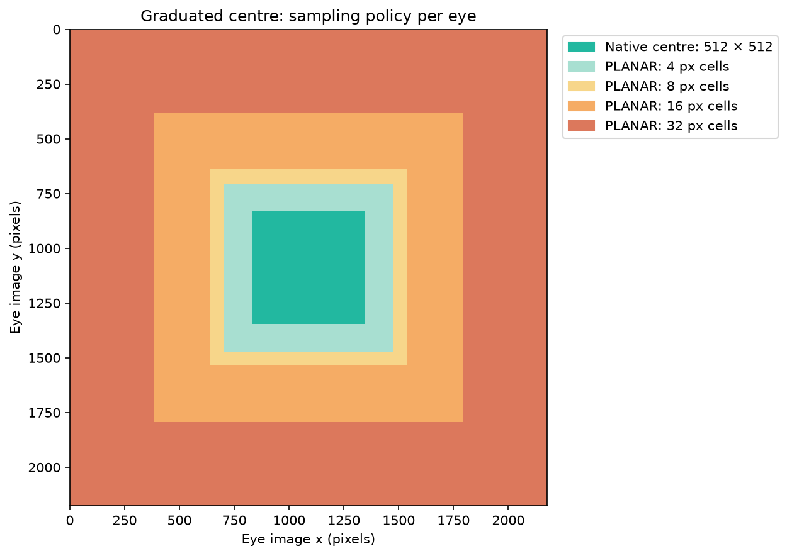
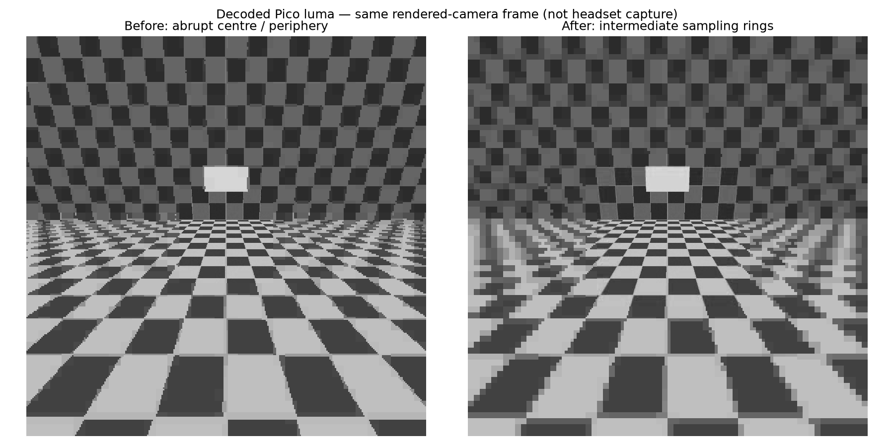

# Graduated centre sampling

The matching [live integration smoke test](live/README.md) averaged 53.39 fresh
updates/s across 74.7 seconds, including startup. The installed mode is ready
for user applications; the Pico capture encountered a tracking warning.

## Selected implementation: graduated PLANAR cells

The native 512 × 512 INTRA centre stays unchanged. A 128-pixel-wide surrounding
band uses fine PLANAR cells (4 pixels), followed by progressively coarser 8,
16 and 32-pixel cells. Each tile still has only two region colours. This is a
stepped detail falloff, not a continuous blur; tile boundaries can remain visible.
The outer approximation is intentionally coarser, as requested.

The comparison shows luma from an offscreen decode, not a compositor capture.
All native-centre luma pixels matched the previous mode across three frames and
both eyes. The full Pico output matched the CPU reference byte for byte:
42,614,784 bytes, SHA-256
`db00e8acdedf1d24a7270c99188f700823a2ae6f223392af24a2a0743d8a891e`.

| Pico decode, warm frames 1–59 | Mean | Median | p95 | Maximum |
|---|---:|---:|---:|---:|
| Graduated fine PLANAR | 10.206 ms | 10.055 ms | 11.715 ms | 17.906 ms |
| Coarse quarter control, immediately afterward | 10.213 ms | 10.059 ms | 13.682 ms | 17.003 ms |

Both runs used 3 dispatches/frame and the same cycled three-pose fixture. These
short runs show no meaningful average decode penalty; they do not establish a
p95 improvement, sustained 90 Hz streaming, or physical head-motion quality.
The encoder image-input test averaged 2.044 ms (maximum 2.367 ms). Fine tile
bodies grow from 27 to 51 bytes; larger outer cells retain 27-byte bodies and
full output writes, so coarsening is not automatically a GPU or bitrate saving.

Fixture: `--planar-gpu-centre --centre-quarter --centre-graduated --entropy lite
--image`, native stereo dimensions 4352 × 2176, base QP 26. The three-frame NXV
SHA-256 is `6d6e58c57a1e2049e9182ec5bf8e475e675cfa5302d6863c0ba2f9be4e141471`.
Decoder: `NXVC_VKD_PLANAR_FLAT=1 nxvc-vkdec --independent-tiles --format ycbcr420
--stats --throughput --no-out --frames 60`, with input/output arguments supplied.

The existing PLANAR encoder checks passed (three selected tests plus their tool
fixture). The old coarse output remained byte-identical with the updated decoder.
Rejected reduced-resolution ring code was removed rather than retaining an
additional unhelpful encoder path.

WiVRn: enable `planar-centre-graduated=true` alongside the existing centre/quarter
options and use the matching client with `debug.wivrn.nx.planar_centre=1`.

## Rejected first experiment: reduced-resolution INTRA rings

The first candidate preserved the native 512 × 512 centre and added two
64-pixel-wide INTRA bands at half and quarter sampling. Outer PLANAR cells
increased to 16 and 32 pixels. Its Pico output matched the CPU reference exactly
(SHA-256 `4dccca5ea692b887bc31f3d259283a7821ba24bcc8a518f4cf0a8c3c7f18cd34`,
42,614,784 bytes). All centre luma pixels across three frames and both eyes
matched the earlier centre mode exactly.

However, the candidate took **18.724 ms mean / 20.690 ms p95** for warm frames,
versus **10.190 / 13.440 ms** for the quarter control immediately afterward.
Both used `NXVC_VKD_PLANAR_FLAT=1 --independent-tiles --format ycbcr420` on
Pico 4. These were offscreen 60-frame tests cycling the same three camera poses,
with cold frame 0 excluded. An earlier control averaged 15.529 ms, demonstrating
run-to-run variability; the candidate still failed to justify its added work.
The candidate was not deployed and its reduced-resolution INTRA implementation
was removed in favour of testing finer PLANAR cells near the centre.

The right image is the rejected candidate, not the final installed mode.
