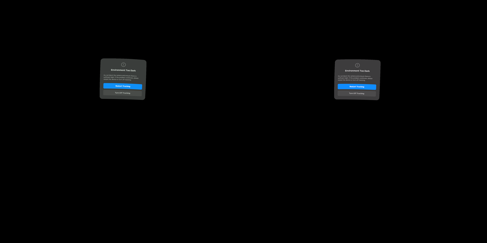

# Graduated centre: live integration smoke test

Matching WiVRn NX client/server streamed `hello_xr -g Vulkan2` under a headless
gamescope session. The native stereo stream used centre + quarter + graduated
options, with Android property `debug.wivrn.nx.planar_centre=1`. Configuration
and filtered logs are adjacent.

All 37 reported windows (74.7 seconds) averaged
**53.39 fresh-source updates/s**, range
0.37–58.50/s. Layer submissions averaged
79.59/s. These are distinct measurements; neither is
sustained 90 Hz delivery. Backlog drops remain. This simple live scene and an
uncontrolled headset pose do not establish physical head-motion quality.

The capture shows Pico’s “Environment Too Dark” tracking warning, not the
streamed scene. It cannot establish live visual quality. The logs establish
frame delivery; the offscreen images establish decoded appearance.

The hidden test app was stopped afterward. The graduated-centre server remains
running for user applications. The parent directory contains the more informative
same-frame decoded-pixel comparison and the offscreen control timings.

APK SHA-256: `efcf5e5479b0fa8d68060c1dfdf71271de7ba6fca6f55019f2fddf94f2af0296`.
APK library SHA-256: `cc73e9fd8b647723b3ad589c7ccdb22d0ce8ba990328087c4fc3622042ccc629`.
Server SHA-256: `77ff7d544a0d8041a2d4a3fb5babaa2f69d3b3714de077bcf2a755cd751eceeb`.
