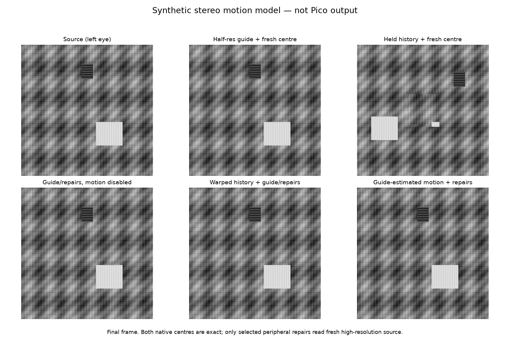
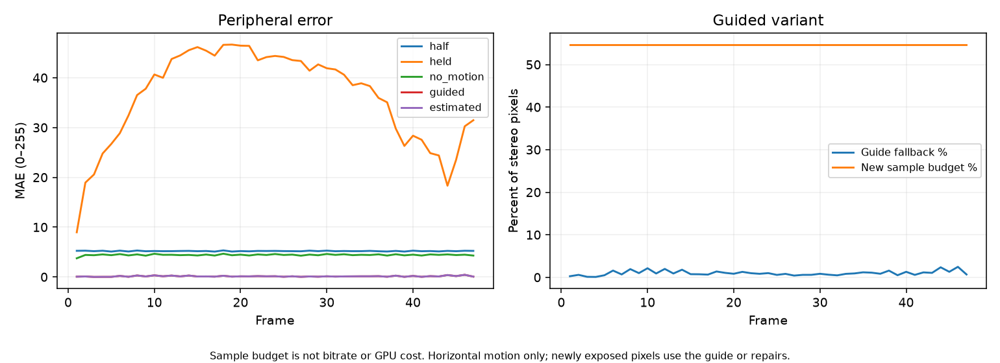
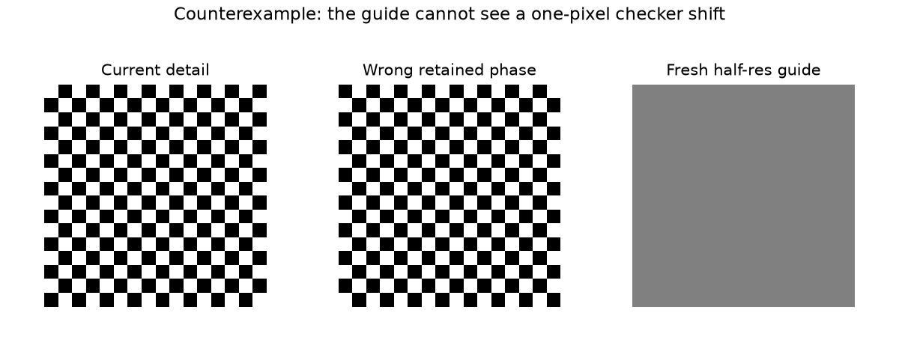

# Guide-history prototype fixture

This artifact records a CPU-only, synthetic grayscale experiment: each eye is
512×512 over 48 frames. The central 128×128 region is sampled exactly. The
periphery has a 60-tile repair budget out of 240 tiles per eye (25%). A full
detail stereo frame bootstraps the sequence and is excluded from steady-state
summaries.

The renderer uses horizontal translation only, with known and estimated motion
of 1 or 3 pixels per transition. The known-motion case uses the renderer
motion; the estimated case searches guide/history and recovered the correct
displacement on all 47 evaluated transitions. For this fixture, guided and
estimated rendering produced MAE 0.1234, periphery MAE 0.1316, and
disocclusion MAE 4.1298.
The fresh-sample fraction was 54.6875%. This is a sampling proxy, not a
bitrate, GPU-work, or speedup measurement; metadata and compute costs are
excluded.

For comparison, half-resolution guides alone yielded MAE 4.8732 and
disocclusion MAE 11.1841, while holding the initial detail yielded MAE 33.8118
and disocclusion MAE 51.3331. The ambiguity checker is a deliberate
counterexample: with identical guides and true displacement 1, raw estimated
periphery MAE was 191.25 versus 127.5 for the half baseline; the confidence
guard reduced this to 95.625.

The confidence guard is a heuristic based on the best-versus-runner-up error
gap. It is not a general 6DoF motion estimator. Packet loss, depth, codecs,
GPU cost, transport, latency, rotation, and live headset/Pico output were not
tested. This directory is a reproducible synthetic fixture, not live-device
capture.

Reproduce with Python, NumPy, and Matplotlib:

```sh
python3 prototype.py
```

Outputs include `metrics.json`, `comparison.png`, `trace.png`,
`ambiguity.png`, and `final_review.npz`.






