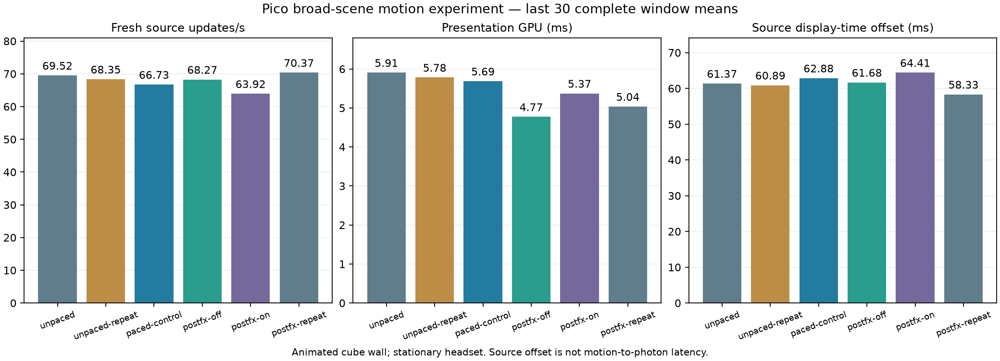
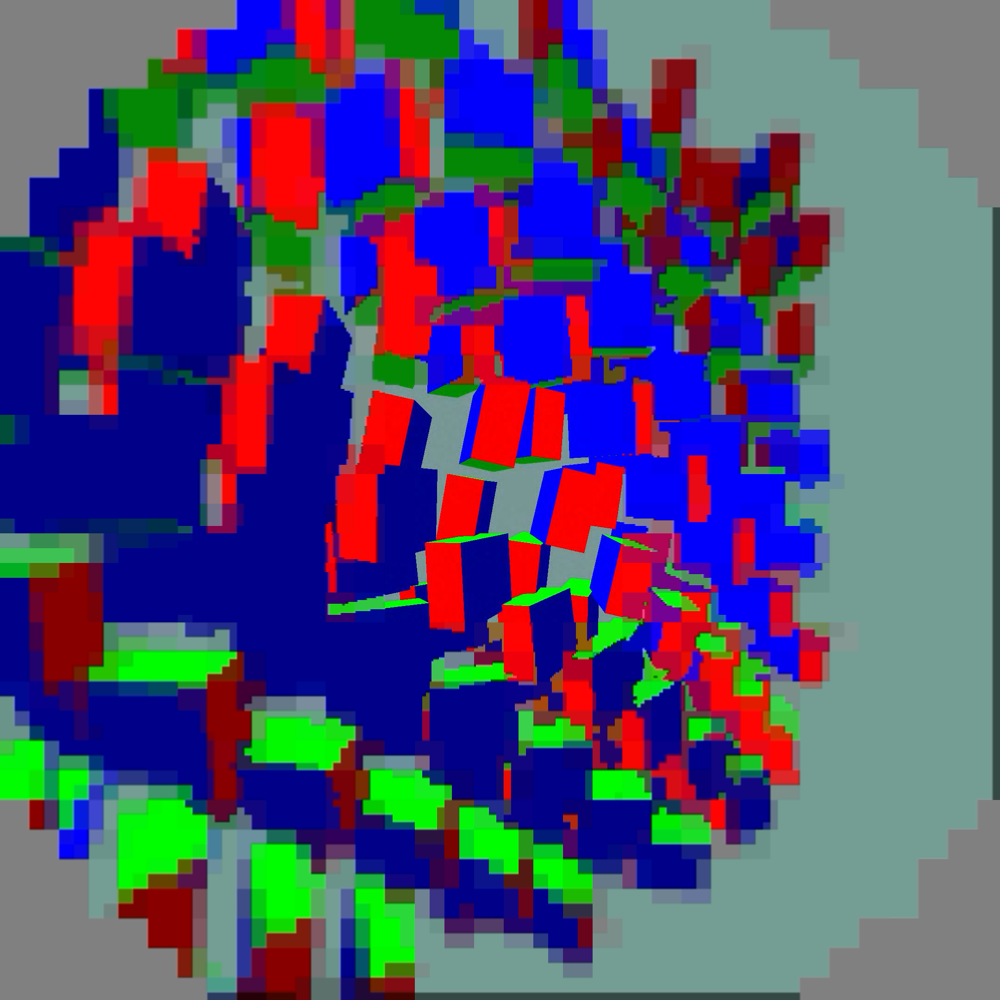

# Latency probes: packet pacing and post-processing

Goal: halve latency without reducing the native centre resolution. **Not achieved.**
The source display-time offset below is the difference between two predicted
display timestamps, not a physical motion-to-photon measurement.

## Method

Same animated 195-cube wall, stationary Pico, native 2160×2160 eye output and
compact decoded centre, FDM on, readiness wait 4000 µs. Each timing run lasts
90 seconds; statistics use the last 30 complete approximately two-second
report windows, not per-frame percentiles. See the adjacent
[motion workload and provenance](../motion-live/README.md).

`unpaced` and `unpaced-repeat` disable server packet pacing only; admission
pacing remains separate. `paced-control` restores the saved server JSON
(`config-before-unpaced.json`). The restored control did not return to the
previous session's 70 ms offset: comparisons against that earlier session
are confounded and do not establish a 9 ms pacing benefit.

`postfx-off`, `postfx-on`, and `postfx-repeat` use the same new APK with
`debug.wivrn.nx.postfx` set to 0, 1, and 0 respectively, restarting the app
between runs. Packet pacing is enabled. Setting 0 disables glow and dithering
only for NX Warp; absence or any other value preserves configured behavior.
Neither resolution nor the peripheral smoothing setting changes.

The new APK SHA-256 is
`6c4045edbc00f930c72d65397c1c338eb608d260012066945069abb22731b403`.
WiVRn source: `64afe113` (server budget fix: `0579f26a`). Release build passed,
the signed APK verified against the existing WiVRn NX certificate, and its
embedded library contains the new property. The running server is unchanged
from the preceding motion trials.

For the effects runs, the harness line-buffers scene output and verifies
animation advances to within 10 seconds of trial end. Older logs may lose
buffered scene output when the process is stopped; their status checks only
prove some animation advancement and client survival.

## Limitations

These sequential tests are not randomized or a sustained thermal study.
Fresh-source throughput varies across sessions; an increase in rendered
iterations is not equivalent to more fresh frames. Runtime MTP telemetry
is an estimate and cannot prove that physical latency has halved.

## Measured window means

| Trial | Fresh updates/s | Presentation GPU ms | Source offset ms |
|---|---:|---:|---:|
| unpaced-client | 69.52 | 5.91 | 61.37 |
| unpaced-repeat-client | 68.35 | 5.78 | 60.89 |
| paced-control-client | 66.73 | 5.69 | 62.88 |
| postfx-off-client | 68.27 | 4.77 | 61.68 |
| postfx-on-client | 63.92 | 5.37 | 64.41 |
| postfx-repeat-client | 70.37 | 5.04 | 58.33 |

The effects-off repeats save GPU work and show smaller source offsets than the
effects-on run, but do not establish a 50% latency reduction. The active test
profile keeps packet pacing enabled and disables glow and dithering.

Separate 28-second diagnostic capture, excluded from timing averages. Scene
phase differs from earlier captures; this is not a pixel-matched quality comparison.
