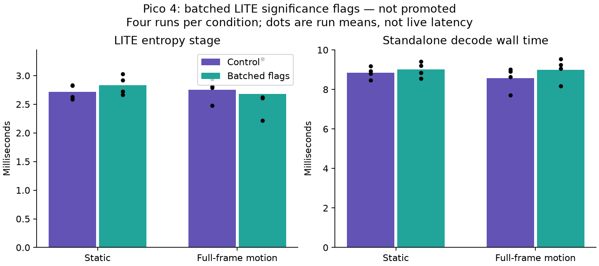

# Batched LITE significance counts: correct, not a measured win

**Decision: archive the patch; leave production unchanged.** Counting up to 24
significance flags at once passes correctness checks but does not reduce
standalone decode wall time in these Pico runs. No APK was installed.

## Why this experiment

The preceding exact-reuse fixtures used the encoder's default **rANS** entropy.
The active WiVRn NX server explicitly negotiates **LITE** with this Pico. The
rANS result of roughly 15 ms in Pass A is therefore not evidence that entropy
dominates the current live pipeline. This experiment regenerates the same
16-frame, 4352 × 2176 static and full-motion sources with `--entropy lite`, wide
PLANAR ring, native centres, QP 40 and cadence disabled.

The existing LITE shader counts significance flags one bit at a time when
calculating body offsets. The prototype replaces those loops with `bitCount`
on chunks of up to 24 flags. Its four-byte funnel load remains safe at every
bit alignment: 24 + 7 is less than 32. It changes no stream bytes, reconstruction
coefficients, centre resolution, frame freshness, or network behavior.

## Results

Four alternating-order runs per condition, 16 frames each, first four excluded.
Each table entry is the mean of four 12-frame run means. The app was stopped;
clocks were not locked and thermal behavior was not characterized. Control and
candidate have identical decoder sources except for the archived patch.
Both explicitly use the specialized PLANAR shader and compact UINT output.

| Fixture | Entropy control → batched | GPU total control → batched | Decode wall control → batched |
|---|---:|---:|---:|
| Static | 2.718 → 2.833 ms | 6.183 → 6.352 ms | 8.848 → 9.004 ms |
| Full-frame motion | 2.756 → 2.683 ms | 6.097 → 6.284 ms | 8.569 → 9.002 ms |

The small motion entropy-stage reduction does not translate into a total-time
win. Run-to-run variation is visible in the graph; these short runs do not
establish a sustained regression magnitude either. No live latency or display
FPS improvement is claimed.

- All 32 candidate frames exactly match the control across Y, U and V.
- All 32 also match independently CPU-decoded retained samples.
- The host Vulkan LITE Pass A corpus passes dense/sparse and ballot/LDS checks
  with zero coefficient, CBF, length, mode or status mismatches.

See [raw run means and pixel hashes](results.json), [CPU checks](cpu-checks.json),
[Pass A corpus output](passA-test.log), and individual benchmark logs.

## Reproduction

[prototype.patch](prototype.patch) applies to decoder source at `84976e3`.
[identities.json](identities.json) records patch, binary and stream hashes.
Apply it in a separate checkout and build Android `nxvc-vkdec` for the candidate;
build the unmodified source for the control. Keep both binaries.

Scripts preserve the original workspace layout: copy them to
`nx-scratch/lite-bitcount/` beside `nx-warp`. Generate the source YUV with the
[preceding fixture generator](../exact-reuse/fixtures.py), then run `prepare.py`
to encode LITE fixtures. Place the binaries at `control` and `candidate` in that
scratch directory. `test.py` performs Pico pixel checks and alternating timed
runs; `cpu_check.py` validates retained samples against the CPU decoder. Adjust
hardcoded adb and build paths on another system. The host corpus command is
`nxvc-passA-test --entropy lite --quick` after rebuilding the candidate shader.
The test script force-stops the Pico app; restart it after the isolated run.

## Next measurement

Use LITE, the actual borrowed-output path, and live canonical frame IDs for the
next experiment. Attribute the gap from first receive to decode completion to
queue age, assembly, CPU work and GPU work before choosing another optimization.
The available results do not justify assuming that removing entropy alone will
halve the measured 27.646 ms encode-to-selection baseline. That baseline is
not motion-to-photon latency.
