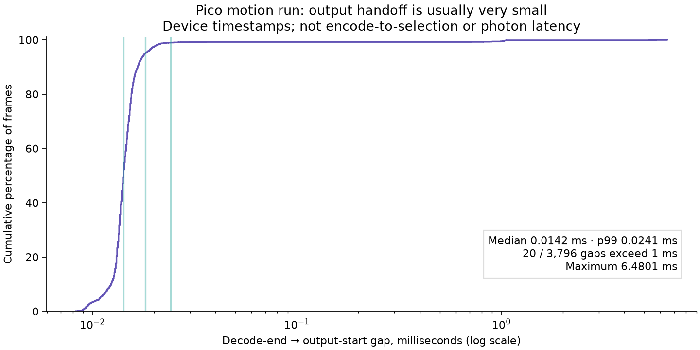

# Live decode-to-output handoff: 0.014 ms median, occasional long tail

A new 60-second headless animated-scene run on Pico measures the device-time
interval between NXVC's final decode timestamp and the beginning of the
borrowed-output transition command buffer. **The typical gap is tiny.** This
does not support expecting several milliseconds of typical latency improvement
from combining those submissions.

After ten seconds of warmup, stream 0 contributes **3,796 unique frames** over
49.063 seconds of observed trace time:

| Device interval | Mean | p50 | p95 | p99 | Maximum |
|---|---:|---:|---:|---:|---:|
| Decode timestamp span | 5.0811 | 4.8180 | 6.0657 | 6.7409 | 7.6451 |
| Decode end → output start | 0.0292 | 0.0142 | 0.0181 | 0.0241 | 6.4801 |
| Output command timestamp span | 0.0003 | 0.0002 | 0.0004 | 0.0004 | 0.0007 |

Units are milliseconds. **20 frames (0.53%) have handoff gaps above 1 ms.** Those
outliers remain in all statistics; they are not removed as noise. Short output
spans approach timestamp precision and are not a claim that all image visibility
or driver overhead costs only fractions of a microsecond.

## Measurement and validity

The new `nxvc_vk_decoder_completed_gpu_span()` accessor exposes raw masked GPU
ticks from the decoder's existing queries. It returns unavailable for in-flight
or unavailable measurements. No new GPU commands or scheduling changes are
introduced. The client compares the end tick against its existing output-start
query, using the decoder queue family's timestamp period and valid-bit mask.
For borrowed output, the second submission waits at ALL_COMMANDS on decoder
completion. Both submissions use the same decode queue and device clock.

The gap includes work after the decoder's last query, semaphore/driver effects,
and any scheduling delay before the output-start query. It is **not pure idle
GPU time**. The decode span likewise has the scope of existing decoder queries,
not the entire host decode call. There is no host/device clock subtraction.

The client trace is explicitly gated by
`debug.wivrn.nx.trace_handoff=1`, successful query results and a completed-frame
span. Frame IDs, durations and raw logs are retained. The parser rejects missing
activation, duplicate IDs, nonmonotonic capture time and implausible spans.
The host API check verifies unavailable/null state, three completed spans
against `gpu_ms`, rejected-frame invalidation and stream reset. Host and Android
builds pass. A separate review checked validity and masking.

The first 90-second attempt kept the client alive and animated through 88.41 s,
but failed the harness's minimum-telemetry check after verbose logging displaced
earlier log-buffer contents. Its [rejected status](rejected-capture-status.json)
is retained. The accepted repeat streamed logcat directly to disk, filtered the
new client PID, and passed scene progress, process survival and recent telemetry
checks. It animated through 58.43 s. Only the accepted repeat feeds this table.

This is an instrumented run, not an on/off latency comparison. Per-frame logging
can perturb timing. No physical head-motion test, external photon measurement,
or new canonical encode-to-selection result is claimed.

## Decision

Keep the opt-in measurement path; do not add submission fusion based on the
old approximately four-millisecond host-fence residual. Almost all of that
residual must be explained outside this measured inter-submission gap, though
the recordings are different runs and their numbers cannot be subtracted.

The next investigation should distinguish time before decode begins executing
from host completion-wakeup delay, while keeping the actual LITE, borrowed-output
and decoupled presentation profile. Separate decode queues already exist on
this Pico. Removing required completion waits or extending CPU queue locks is
not justified by these results.

## Reproduce and state

The measurement APK uses native centres, the wider PLANAR ring, FDM 1,
`ready_wait_us=4000`, borrowed NV12 and a 90 Hz presentation target.
The active app remains installed and running; **per-frame tracing was disabled
after the run**. No faster codec mode was enabled.

[metadata.json](metadata.json) identifies the APK and both source patches/base
commits. [codec.patch](codec.patch) and [client.patch](client.patch) preserve the
exact measured changes. Run the Android release build against the modified
NX Warp source, enable the property, and capture a headless animated scene with
logcat streamed from process start. Disable tracing after capture.

Run `python3 analyze.py client.log` then `python3 plot.py` to regenerate the
statistics and figure. [status.json](status.json), [scene.log](scene.log),
[client.log](client.log), and [server.log](server.log) provide the live evidence.
`span_test.cpp` links against `libnxvc_vk_decoder.a` and Vulkan; run it on a
compatible PLANAR stream with assertions enabled. Its recorded result is
[span-test.log](span-test.log).

## Follow-up

A [four-run queue-priority experiment](../queue-priority/README.md) measured about 3 ms lower selected-frame median latency with roughly 5% fewer fresh updates. It remains opt-in; direct host/GPU clock calibration is unavailable on this driver.
