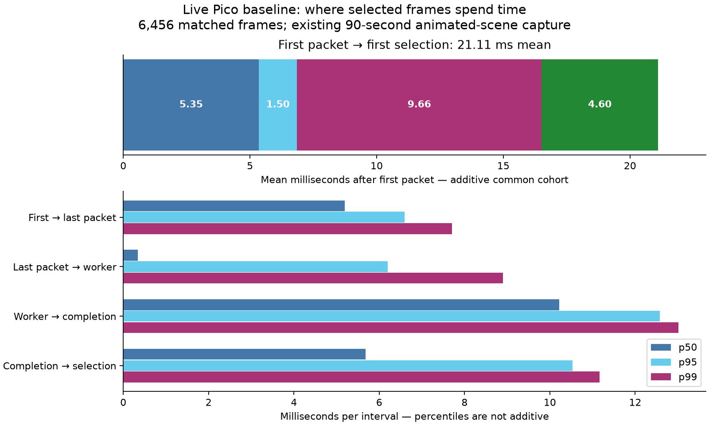

# Where live selected frames spend time

This is a **new analysis of the existing live baseline**, not a new headset run
or latency improvement. It joins consecutive endpoints for the same 6,456
selected stereo frames, instead of subtracting percentiles from different
cohorts. The first ten seconds are excluded.

| Interval | Mean | p50 | p95 | p99 |
|---|---:|---:|---:|---:|
| First packet → last packet | 5.351 | 5.194 | 6.590 | 7.700 |
| Last packet → worker decode entry | 1.502 | 0.345 | 6.201 | 8.901 |
| Worker decode entry → completed output | 9.655 | 10.221 | 12.581 | 13.010 |
| Completed output → first render selection | 4.598 | 5.685 | 10.530 | 11.168 |

All values are milliseconds. Means add to **21.106 ms from first packet to
selection** for this common cohort. Percentiles do not add. Server encoding and
travel before the first packet are outside this table. The original
encode-to-selection result remains **27.646 ms median**, not photon latency.
Received frames that were never selected are excluded from this selected cohort.

## What the endpoints establish

`receive_begin/end` are feedback timestamps for the first/last packet, not CPU
reassembly start/end. Their interval includes packet delivery; it cannot be
called five milliseconds of CPU reassembly work.

`decode_begin` is stamped at worker entry. It includes subsequent host setup,
submission and completion waiting. It is not a GPU dispatch timestamp.
`decode_end` follows completion in this decoupled, borrowed-NV12 profile. `blit`
is first render selection, before presentation work, compositor and scanout.

The parser first validates canonical NX frame mappings using the original
baseline parser, then joins headset event pairs by the same extended frame ID.
It keeps earliest duplicate events and rejects negative adjacent intervals.
These headset-to-headset intervals avoid mixing independent event cohorts, but
still inherit the feedback timing implementation and clock conversion. No
external timing calibration or physical head-motion apparatus is available.

## Queue audit

The recorded client explicitly reports **three queues in family 0**, with
separate decode queues. Its final windows report negligible queue-lock and
previous-frame waits, about 1 ms host submission work, approximately 5 ms codec
GPU work, and around 4 ms of remaining fence-wait time.

That remainder is calculated by subtracting GPU timestamp intervals from host
fence waiting. It is **not a directly measured GPU queue-residency duration**:
driver overhead, completion wakeup, unmeasured commands and scheduling can
contribute. The interval table and two-second diagnostic windows are different
aggregations and must not be added together.

Code inspection found separate NXVC decode and borrowed-image layout-transition
submissions. On a single-queue fallback, rendering could be submitted between
them. **This capture uses separate decode queues**, so extending a CPU mutex
across both submissions is not an evidenced fix for this Pico result.
Likewise, deleting the completion wait would violate the current decoupled
presentation contract: published frames must already be complete.

## Next bounded experiment

Instrument the decode submission and its following layout-transition submission
with per-frame host and GPU endpoints. Attribute their gap before considering
moving the final borrowed-output transition into the decode command buffer.
That could remove one submission and its handoff, but it requires a clear output
layout/synchronization contract across NX Warp and WiVRn NX. It is an untested
proposal, not an expected four-millisecond saving.

Separately, the packet-arrival span and completion-to-selection delay warrant
controlled experiments. Preserve native centres, synchronized eyes and the
actual LITE/borrowed-output profile. Compare canonical encode-to-selection p95,
fresh selections and deadline misses under motion before promoting any change.

## Reproduce

Run `python3 analyze.py` here, followed by `python3 plot.py`. The default input is
[the original compressed CSV](../live-latency/timings.csv.gz); `--csv` selects
another complete capture with the same schema. [results.json](results.json)
contains exact interval statistics and the original mapping-validation result.
The original [client log](../live-latency/client.log),
[measurement details](../live-latency/README.md), and
[latency parser](../live-latency/summarize_pipeline_latency.py) remain the sources.
No streamer restart or APK change was required for this analysis.
