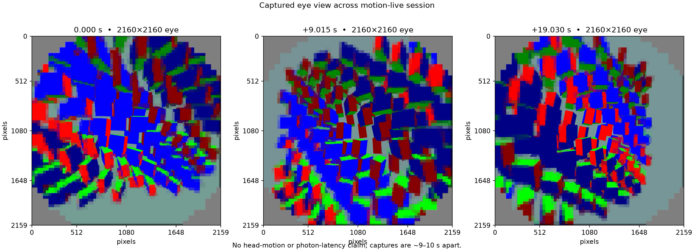
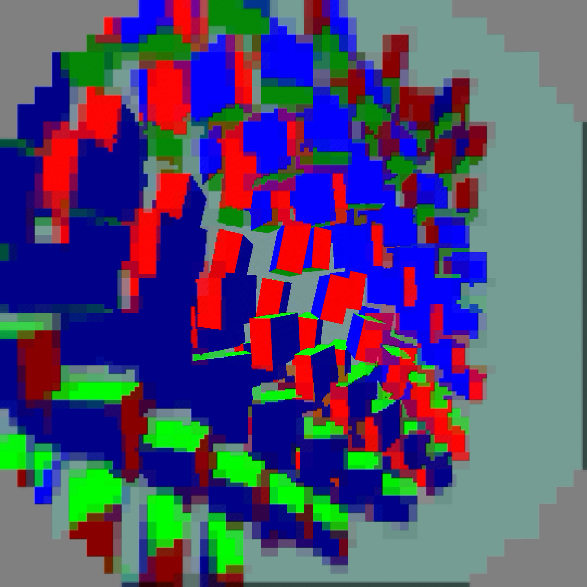

# Motion-live capture evidence

This folder archives a stationary Pico 4 / Adreno 650 motion-live smoke test
using the deterministic full-view scene in the modified `hello_xr` program.
The scene is driven by the predicted display clock; the captures therefore do
not demonstrate physical head movement or motion-to-photon behavior.

The three eye captures are 2160 × 2160 at device times 17:40:04.518,
17:40:13.533, and 17:40:23.548. They are approximately 9–10 seconds apart.
`motion-captures.png` is a visual contact sheet and `changes.json` reports the
percentage of pixels whose RGB difference exceeds 8/255 for whole images and
the centered 512 × 512 region. These are capture-to-capture comparisons, not
per-frame motion measurements.

The paired timing runs are 90-second stationary `hello_xr` windows with
capture disabled. The baseline (`baseline`) used FDM off and had 68.23 fresh
updates/s, 77.08 rendered iterations/s, 7.37 ms presentation GPU, and 72.01
ms source offset. The FDM wait runs (`fast`, `repeat`) used a 4000 µs wait and
measured 77.22 / 77.02 fresh updates/s, 80.74 / 80.85 rendered iterations/s,
7.06 / 7.04 ms presentation GPU, and 70.45 / 70.79 ms source offset. Values
are last-30 complete approximately two-second window means. They do not prove
90 or 240 FPS delivery.

The ready-wait implementation waits up to the configured cap only when the
joined-eye latest-frame set has no newer ID than the last selected frame; it
releases `frames_mutex` and reserves the predicted deadline budget. The
default is disabled. Raw client, scene, server logs, status JSON, and parsing
scripts are archived beside this note. The server parser keeps encoded FPS,
payload rate, controller allowance, and paced target separate.

The bitrate-budget trial and repeat are also archived. Their last-30 window
means measured 77.9 / 77.8 fresh updates/s and 70.32 / 70.13 ms source offset.
Estimated actual payload was 90.586 / 90.283 Mbit/s, versus 98.572 Mbit/s in
the fast run, with QP fixed at 40.0 versus 23.43. The conservative correction
bound preserved admission, while payload remained above the 76.3 Mbit/s
controller allowance. `server-summary.json` records these values and keeps
actual encoded FPS distinct from the paced target.

This eye capture is from a separate 28-second visual run and is excluded from
the timing summaries. Its centre edges remain distinct with a coarse
periphery; the phase differs from the earlier captures, so it is not a
quantitative quality comparison.

The full modified source is [openxr_program.cpp](openxr_program.cpp), with its
complete [HEAD diff](openxr_program.patch). Provenance is SDK repository HEAD
`3636e60d4e1aea848110bb97bfbb23c5e5cf5a77` and upstream OpenXR SDK commit
`2b99fec95e9cdf352c1a98e9cb23bf4def1cf8e6` (1.1.63, 2026-09-01). The source
change is a benchmark-scene modification, not a claim about headset motion.
The runtime, APK, scene hashes and reproducible Vulkan include-path configure
command are recorded in [build-provenance.json](build-provenance.json).
The server-side settings are archived in
[config.planar-gpu-graduated-copybaseline90.json](config.planar-gpu-graduated-copybaseline90.json).

No physical-motion,
photon-latency, or end-to-end 90/240 FPS conclusion is drawn here.

## Interpretation and remaining work

Trials were sequential, not randomized. Within the analyzed windows, Pico
runtime telemetry reported 587 MHz GPU clocks throughout, mean GPU temperatures
74.1–77.8 °C and mean utilization 94–99%; see [runtime-summary.json](runtime-summary.json).
These short runs do not establish thermal equivalence or long-session stability.
All five timed runs kept the client alive and advanced the animated workload.

The server fix budgets using `min(source_fps, 1 / (pace_interval - 0.5 / source_fps))`,
with guards for disabled pacing or nonpositive intervals. The half-source-tick
tolerance is shared with frame admission. This conservative bound can underuse
bandwidth when admission is quantized to a slower cadence. It is not a transport
rate limiter: max-QP frames can still exceed the target, as these trials show.
The focused C++ test reproduces the old 61-target / 90-source budget mismatch
and checks the corrected bound. The test binary and rebuilt server passed.

The corrected runs still spend about 5.2 ms in decode GPU work and 7.1 ms in
presentation, with roughly 6 ms of additional decode queue delay. Reducing that
shared GPU workload is the next experiment; a bitrate-accounting correction
alone did not recover the 11.11 ms refresh budget. Runtime MTP estimates and
source display-time offsets are not independently measured photon latency.

The tested server binary predates a comment-only cleanup in commit `0579f26a`;
the archived SHA-256 identifies the executable used for both corrected trials.
