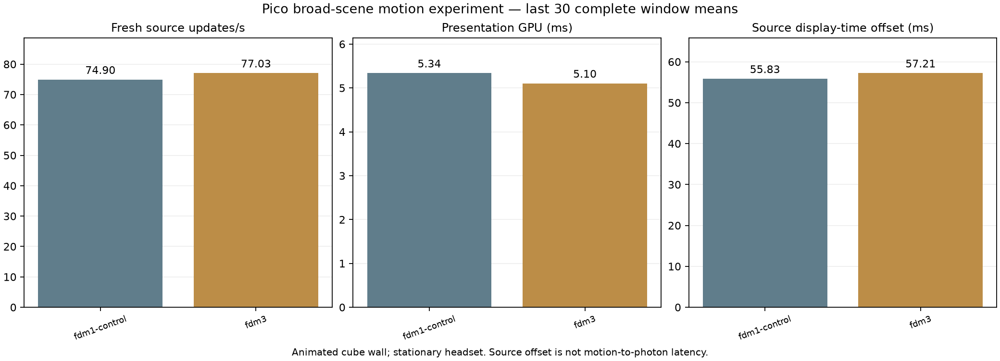

# Coarser peripheral shading: rejected probe

Same full-density centre as mode 1; mode 3 changes the two outer RG8 density
values from 128/64 to 64/32. Same APK, same motion workload and server,
90 seconds each, last 30 complete reporting-window means. Both passed the
scene-progress and fresh-client-telemetry checks. Sequential, not randomized.

| Map | Presentation GPU ms | Fresh updates/s | Source offset ms |
|---|---:|---:|---:|
| Original mode 1 | 5.337 | 74.90 | 55.833 |
| Coarser mode 3 | 5.103 | 77.03 | 57.213 |

The 0.23 ms GPU saving did not produce a latency benefit. Mode 3 is **reverted**;
the original map remains active. This is not a 50% latency improvement.
Source offset is not physical motion-to-photon latency. No quality claim is
made; the coarser map has not been accepted for live use.

APK SHA-256: `e6df1013b4aef20da39a52c48b040a9e54ce84ac2ebb543db7d898a53ac0a99a`.
The archived patch applies to WiVRn NX `64afe113`. See the neighboring
[motion methodology](../motion-live/README.md) and
[benchmark validity checks](../pacer-audit/README.md).
