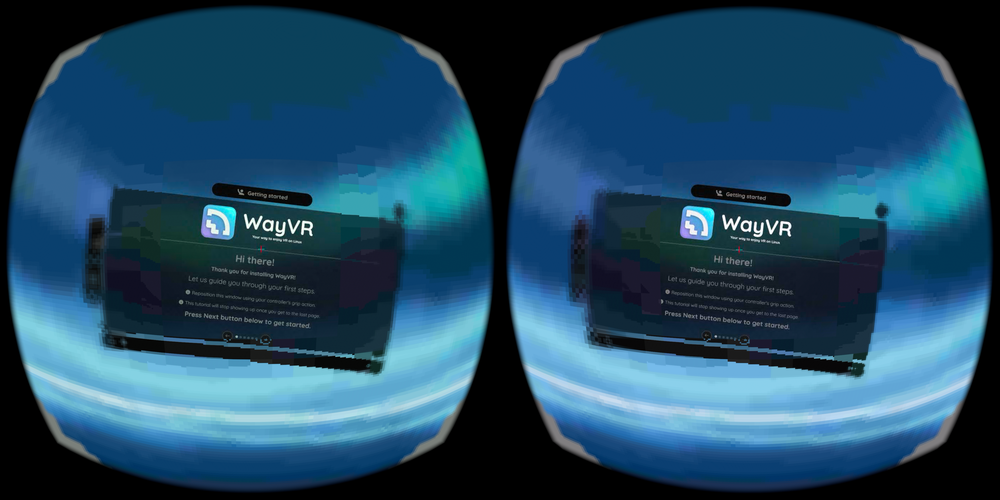
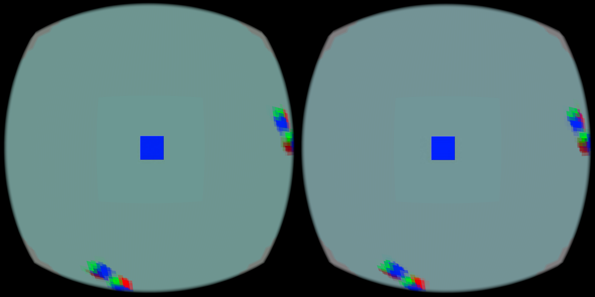
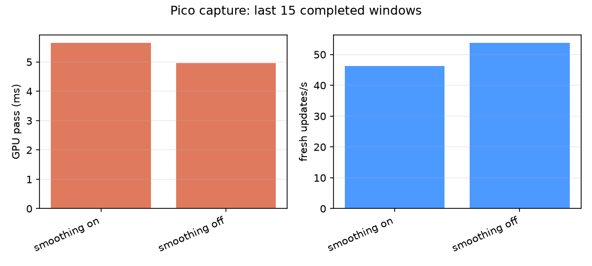

# Peripheral smoothing capture

These are real Pico captures from September 9, 2026. `before.png`,
`four-tap.png`, and `two-tap.png` are headset screenshots. The smoothing A/B
uses the same headless hello workload; the older four-tap capture used a
different workload and is retained as a rejected heavier filter comparison.

 

The raw logs preserve the full sessions. The filtered `*-last15-windows.log`
files contain the last 15 completed two-second render windows. `analyze.py`
recomputes `metrics.csv` and `matched-cost-fresh.png` from those filtered logs.

| Capture | Window | GPU pass | Fresh updates/s | Source offset | Submit lead |
|---|---:|---:|---:|---:|---:|
| Matched smoothing on | 11:24:50–11:25:18 | 5.65 ms | 46.2 | 73.84 ms | 38.49 ms |
| Matched smoothing off | 11:25:40–11:26:08 | 4.96 ms | 53.7 | 75.24 ms | 38.41 ms |
| Pacing `.4` baseline, smoothing on | 11:18:08–11:18:36 | — | — | 75.15 ms | 38.75 ms |
| Pacing `.1` client, smoothing on | 11:24:46–11:25:14 | — | — | 73.81 ms | 38.56 ms |

The matched runs use the same hello workload and smoothing toggle. The pacing
comparison also uses the same headless hello workload with smoothing on, but
the sessions are separate. These are
two-second window means, not frame percentiles, and neither comparison
establishes a latency win or penalty. Source offset and submit lead are render
timing proxies, not photon-to-photon latency.

The client smoothing property was `debug.wivrn.nx.peripheral_smooth=1` for the
ON run and `0` for OFF. The server pacing comparison used `.4` and `.1`.
The installed smooth3 APK SHA-256 was
`94399cffb5a6a66f1c6276747a3d4e94c572270f56d28141aefed486ff590072`; native
was `33f6ca77cea32d8c4080b5170f399d57dfb4a4896e32d4f123e2b82f47c98e33`.
Recheck an APK with `sha256sum`; no APK is stored in this archive.

`four-tap.png` is retained as a rejected heavier filter capture; `two-tap.png`
is the selected lightweight filter capture. Re-run `./analyze.py` to regenerate
the CSV and chart. No synthetic illustration is part of this evidence set.
