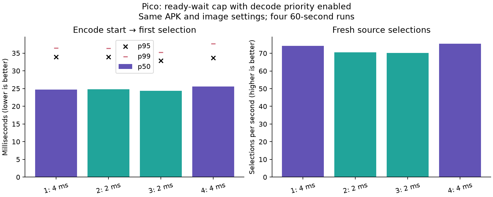

# Ready-wait cap with decode priority: keep 4 ms

The previous queue-priority experiment reduced selected-frame latency but lost
fresh updates. This follow-up tested whether shortening the ready-frame wait
would recover them. **It did not:** both 2 ms runs delivered fewer fresh updates
than either 4 ms control. Retain 4 ms for the user's low-latency test profile.

| Run | Requested cap | Encode → selection p50 / p95 / p99, ms | Fresh selections/s | Actual mean wait per attempt |
|---|---|---:|---:|---:|
| 1 | 4 ms | 24.708 / 33.880 / 36.471 | 74.22 | 2.423 ms |
| 2 | 2 ms | 24.795 / 33.919 / 36.334 | 70.61 | 1.452 ms |
| 3 | 2 ms | 24.338 / 32.907 / 35.237 | 70.11 | 1.458 ms |
| 4 | 4 ms | 25.598 / 33.660 / 37.694 | 75.49 | 2.420 ms |

Mean fresh delivery across the two runs is **74.86/s at 4 ms**, versus
**70.36/s at 2 ms**. Latency differences are smaller and mixed: the mean of the
per-run medians is 25.153 versus 24.567 ms. This is not a pooled percentile or
proof of a repeatable 0.586 ms improvement. The freshness loss does not justify
changing the chosen wait cap.

## Method

Four 60-second headless animated-scene runs in **4 → 2 → 2 → 4 ms** order.
Decode queue priority remains 1 in every run. Each app process starts after the
property is set, because the wait cap is cached at startup. Each server session
records a fresh canonical timing CSV; shutdown closes it before parsing. Ten
seconds of warmup are excluded from latency statistics. All four scene-progress,
process-survival and recent-telemetry checks passed.

The APK, native centres, wider PLANAR ring, LITE entropy, borrowed NV12, FDM 1,
4K-class stereo source and 90 Hz presentation target remain the same. No codec
code or queue-priority setting changes between conditions. Handoff tracing is
disabled. The existing 12 ms deadline reserve may shorten or eliminate a wait;
the table includes the measured wait duration rather than treating the cap as
actual delay. A wait success only means a newer frame became available; the
selection algorithm still chooses its own frame.

Fresh-selection figures are means of telemetry windows, not physical display
FPS. Latency describes selected frames only, and stops at first render selection,
not scanout or photons. Clock-estimator uncertainty, run-order variability and
logging overhead remain. Synthetic animation does not prove physical head-motion
quality; the next check is the user's own applications and head movement.

## User test profile

After the tests, the user explicitly chose the lower-latency option. The streamer
and Pico app were launched with **decode priority 1 and ready wait 4000 µs**,
keeping native-resolution centres, wider graded periphery, LITE and borrowed
output. Per-frame tracing and benchmark captures are off. The headless test scene
was stopped so the user can launch their own VR application.

The code's default remains equal priority; this is an explicit user test override.
The previously measured roughly 3 ms median gain from priority mode still carries
a roughly 5% freshness cost relative to equal priority. No 240 FPS or half-latency
claim is made.

## Evidence and reproduction

[metadata.json](metadata.json) identifies the unchanged APK and test order.
[results.json](results.json) contains every run's latency and telemetry summary.
Each `priority-wait-*.csv.gz` is a closed canonical capture, with matching client,
server, scene and status logs. Recompute latency using
`../live-latency/summarize_pipeline_latency.py FILE.csv.gz --codec nx`.
`plot.py` regenerates the figure.

`run.py` preserves the original workspace paths and uses the existing owned-server
restart and headless capture helpers. Its finalizer restores the baseline test
settings; the requested user profile was applied separately after completion.
Future isolated tests should restore the user's active profile rather than
silently replacing it with the old equal-priority setting.
