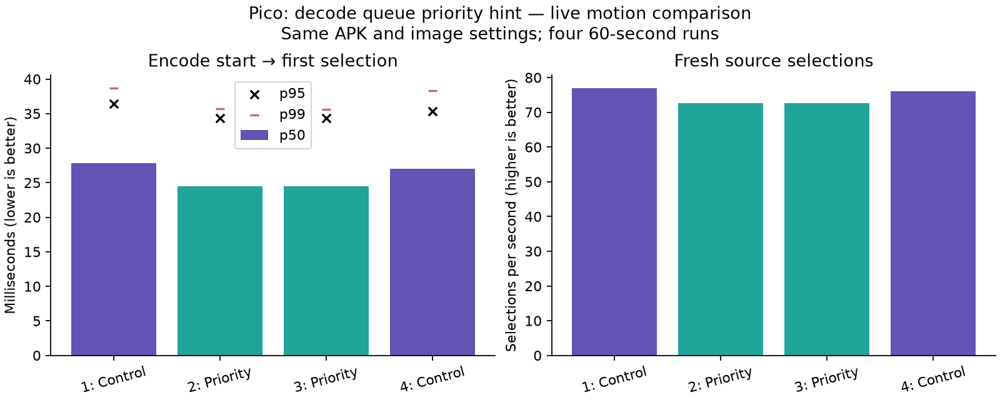

# Decode queue priority: lower selected-frame latency, fewer fresh updates

Four controlled 60-second Pico motion runs show a repeatable **latency/freshness
tradeoff**, not an unconditional speedup. Increasing decode queue priority from
0 to 1 while keeping render priority at 0 reduced selected-frame median latency
by about **3 ms**, but reduced fresh source selections by approximately **5%**.
The equal-priority setting remains active; the new setting is opt-in.

| Run | Configuration | Encode → selection p50 / p95 / p99, ms | Fresh selections/s | Selected / received IDs |
|---|---|---:|---:|---:|
| 1 | Equal control | 27.840 / 36.439 / 38.672 | 76.92 | 3981 / 4098 |
| 2 | Decode priority | 24.501 / 34.374 / 35.667 | 72.66 | 3768 / 4001 |
| 3 | Decode priority | 24.461 / 34.320 / 35.601 | 72.69 | 3743 / 3950 |
| 4 | Equal control | 27.042 / 35.303 / 38.283 | 76.12 | 3961 / 4082 |

The mean of the two per-run medians is **27.441 → 24.481 ms**; this is a
comparison of run summaries, not a pooled percentile. Fresh-selection window
means average **76.52 → 72.67/s**. Both priority runs closely agree, while the
last control improves somewhat over the first. More sessions would be needed
to characterize environmental variability and sustained thermal behavior.

## What was changed

All queues previously used normalized priority 0. The prototype leaves render
queue 0 at 0 and requests priority 1 for decode queues 1 and 2. The same APK
runs both conditions, selected at device creation by
`debug.wivrn.nx.decode_priority=0|1`. Startup logs confirm all three requested
priorities for every run. No stream syntax, centre resolution, bitrate setting,
shader, frame-selection algorithm or synchronization requirement changes.

These are device-local priority hints. Vulkan translates normalized priorities
to implementation-defined levels; this is not global priority or a guarantee
of preemption. See the [Vulkan queue-priority specification](https://docs.vulkan.org/spec/latest/chapters/devsandqueues.html#devsandqueues-priority).
The measurements establish a configuration-level tradeoff, not that a particular
GPU scheduler mechanism caused it.

## Method and limits

Order: **control → priority → priority → control**. Each run uses the same
headless animated full-field scene, wider PLANAR ring, native centres, LITE,
borrowed NV12, FDM 1, 4 ms ready wait and 90 Hz presentation target. The actual
custom WiVRn NX server is restarted with a fresh canonical timing CSV per run.
Each CSV is closed before analysis. The parser validates wire/outer frame maps,
uses earliest duplicate feedback endpoints, excludes ten seconds of warmup and
rejects negative or unmapped selected-frame durations.

All four runs passed scene advancement, client survival and recent-telemetry
checks. Per-frame handoff tracing was disabled. Fresh-selection figures are
means of client telemetry windows; their cohort differs from the latency
parser's post-warmup cohort. They are not physical display FPS.

Selection latency includes only selected frames. The table retains received-ID
counts because priority mode selects a smaller fraction: losing or repeating
updates must not be hidden behind a better selected-frame percentile. The
recorded endpoint is render selection, before presentation completion and
scanout. It is **not motion-to-photon latency**. WiVRn clock-estimator uncertainty
and logging overhead remain; no new claim of halving latency or sustaining
240 FPS is made.

## Clock-capability finding

The attempted direct scheduling-delay measurement is limited by this driver:
`VK_EXT_calibrated_timestamps` / its KHR equivalent are not advertised on the
Adreno 650. [clock-caps.log](clock-caps.log) and [clock_caps.cpp](clock_caps.cpp)
record the probe. Device timestamp durations remain available (52.0833321 ns per
tick), but subtracting them directly from host clocks would be invalid. The
priority experiment therefore measures full live outcomes instead of presenting
an unsupported pre-decode queue-delay number.

## Reproduction and retained state

[metadata.json](metadata.json) identifies the shared APK, codec revision and
[prototype.patch](prototype.patch). Build the patched Android client against
that NX Warp revision. Set the property before restarting the app. `1` requests
decode priority; `0` restores the equal-priority control.

The archived `run.py` preserves the original workspace-relative paths and
invokes the existing `nx-scratch/motion-live` harness and restart helper. It
requires the configured Pico, owned server, headless gamescope and test scene.
Its `finally` block restores priority 0, removes timing logging from the server
and launches the client again. Those settings were verified after this run.

Each `priority-*.csv.gz` is a complete timing capture, with matching client,
server, scene and status logs. Recompute latency using
`../live-latency/summarize_pipeline_latency.py FILE.csv.gz --codec nx`.
[results.json](results.json) includes per-run latency and telemetry summaries;
`plot.py` regenerates the figure.

Keep the hint available for low-latency experiments, with its freshness cost
visible. The next candidate should preserve this latency reduction while
recovering fresh delivery; do not promote priority 1 as a blanket default.
