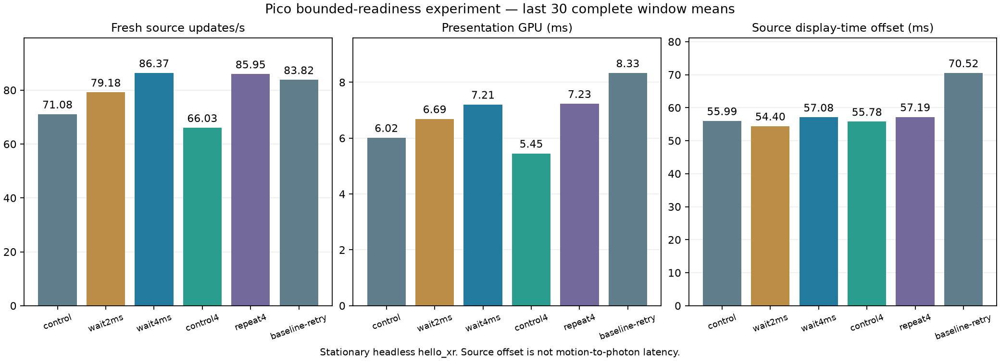
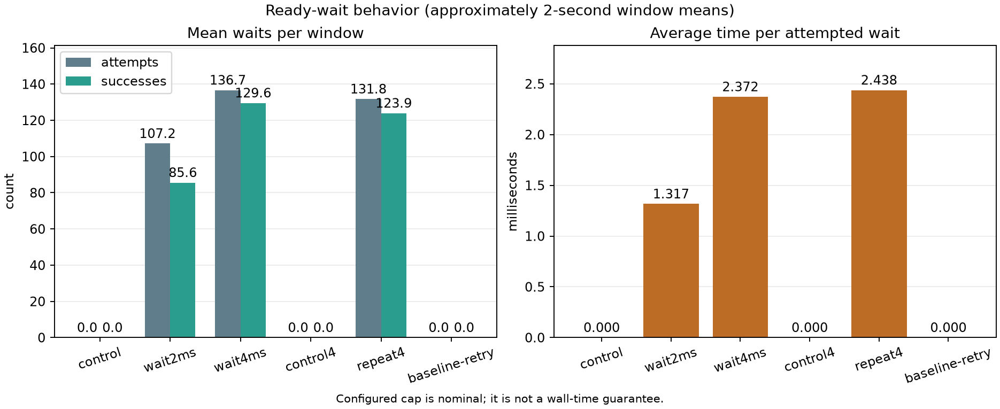
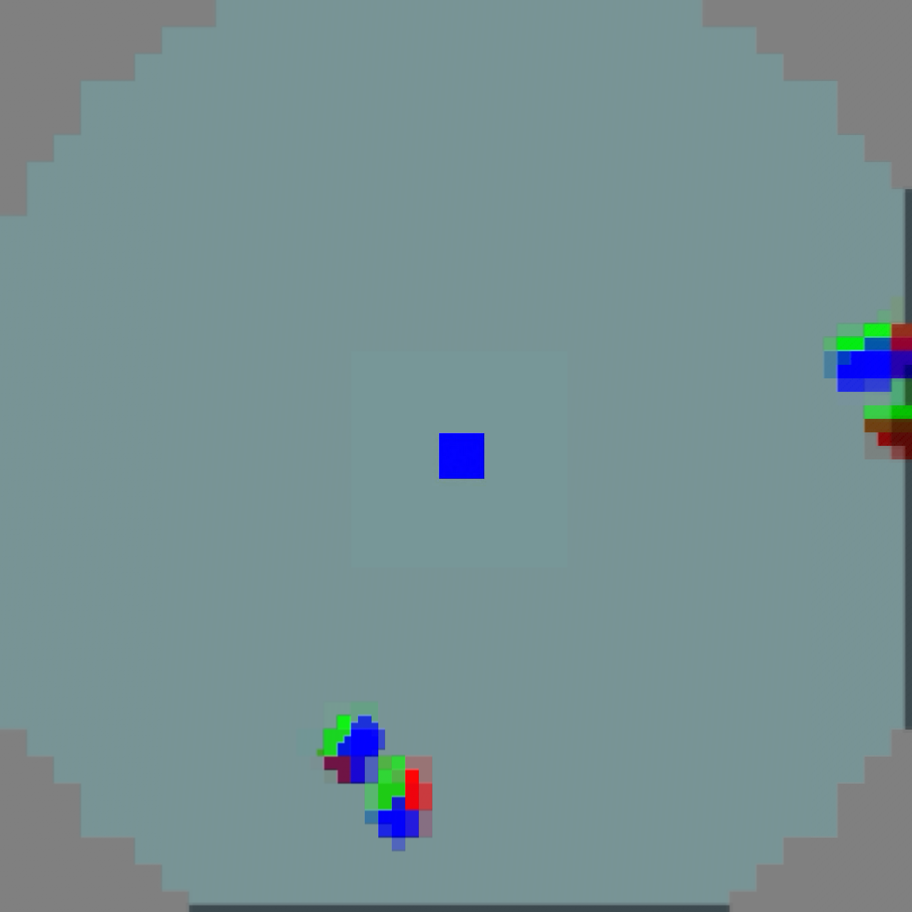

# Bounded ready wait evidence

This experiment measures an opt-in bounded condition-variable wait in the
WiVRn NX render path. A render thread waits for up to the configured cap only
when the joined-eye latest-frame set has no newer ID than the last selected
frame. The wait releases `frames_mutex` and allows waiting only within a 12 ms reserve before the predicted
display deadline. The software timer can overshoot the requested cap. The
`older_available=0` counter records that no older frame was selected when a
newer one was available; it does not establish the complete cause of any
freshness change.

The tested [WiVRn source is commit a411fd48](https://github.com/nerdrx/wivrn-nx/commit/a411fd48) on `atlas-live`. The
control and 2 ms runs use `ready.apk`; the 4 ms and control-4 ms runs use
`ready4.apk`, differing only in the maximum accepted cap (2 ms versus 4 ms). Restart is required. The default is 0. The
property is `debug.wivrn.nx.ready_wait_us=...` on Android and
`WIVRN_NX_READY_WAIT_US=...` on desktop. Capture was disabled. The run
manifest and APK hashes are in [manifest.json](manifest.json).

| Run | FDM | Cap µs | Fresh/s | Render/s | Presentation GPU ms | Source offset ms |
|---|---:|---:|---:|---:|---:|---:|
| control | 1 | 0 | 71.08 | 89.67 | 6.02 | 55.99 |
| wait2ms | 1 | 2000 | 79.18 | 89.62 | 6.69 | 54.40 |
| wait4ms | 1 | 4000 | 86.37 | 89.63 | 7.21 | 57.08 |
| control4 | 1 | 0 | 66.03 | 89.62 | 5.45 | 55.78 |
| repeat4 | 1 | 4000 | 85.95 | 89.58 | 7.23 | 57.19 |
| baseline-retry | 0 | 0 | 83.82 | 83.85 | 8.33 | 70.52 |

The values above are means of each run's last 30 complete approximately
two-second windows. They are window means, not per-frame percentiles, and the
configured cap is nominal rather than a wall-time guarantee. The wait
behavior and live timing plots are [wait-behavior.png](wait-behavior.png) and
[live-comparison.png](live-comparison.png); raw logs and parsed metrics remain
beside this note.

All runs used compact reconstruction, joined-eye source, JIT on and optional
peripheral smoothing off. FDM was on except for the original-profile baseline.
Every completed performance run lasted 90 seconds; the stationary test application
was headless `hello_xr` through WiVRn NX. These measurements provide no 90 FPS freshness proof, 240 FPS proof,
motion result, or photon/motion-to-photon latency measurement. A baseline
startup attempt failed with SIGSEGV inside the vendor `vkBindImageMemory`
path through `xrCreateSwapchain`; waiting was disabled for that attempt. The
cause is unresolved, so it is excluded from performance comparisons. The
90-second baseline retry completed: 83.82 fresh updates/s and 70.52 ms source
offset. Two 4 ms runs reached 86.37 / 85.95 fresh updates/s and 57.08 / 57.19 ms
offset. Thus the combined FDM/wait profile reduced source age by about 13 ms
with a small throughput gain over the original profile. Source offset is a
difference of display timestamps, not photon latency. The feature defaults off;
the tested Pico profile is left at FDM=1 and ready_wait_us=4000.

## Actual eye readback

The 2160 × 2160 captures came from a separate 25-second diagnostic run, excluded
from the timing table. The central cube remains visibly sharp; this simple scene
does not establish general visual quality or performance under head movement.

[Right eye](eye1.png). Capture was then disabled and a separate 35-second reconnect check passed;
that short check is not included in the performance table.
