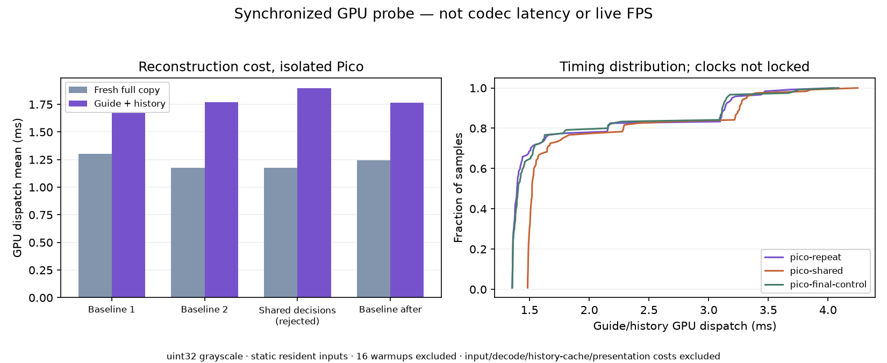

# Synchronized guide/history: first Pico GPU probe

**Standalone Vulkan implementation tested on Pico; not integrated into WiVRn NX.**
Both native centres remain fresh. Both eyes share one full/guide phase, avoiding
alternating left/right detail ages. The current wider-ring streamer was restored
after these isolated tests; its production encoder/decoder were not modified.

## What is implemented

The reconstruction kernel consumes current guide, previous detail and fresh
centre/full-detail buffers. Full dispatches copy fresh detail. Cheap dispatches
retain the fresh 512×512 centre per eye, warp peripheral history using a known
integer horizontal translation, and compare the same warped 2×2 footprint with
the current guide. Differences above 28 code values, invalid coordinates,
reset, or history age other than one source frame select the guide fallback.

Geometry matches the live **packed** output dimensions: 1856×928 stereo, 928×928
per eye, guide 464×464 per eye. The probe is uint32 grayscale, not production
NV12. Translation passes through native 2176-wide sample coordinates; a shift
of packed pixels would be wrong around the 512-pixel native centre. The inverse
selects the nearest retained sample, with ties toward the higher index. It
never samples the other eye. This is synthetic translation, not a head-pose,
depth or object-motion implementation.

## Independent validation

All **14 cases** match a separate NumPy oracle exactly on both host GPU and
Pico. The oracle uses `searchsorted` on the retained sample axis, independently
of the shader's piecewise inverse. Cases cover signed native shifts −900, −64,
−3, −1, 0, +1, +3, +64, +900, reset, missing/stale history, full copy and a
high threshold that exercises retained history. Both centres are checked.

The rejected shared variant also matches all 14 cases. Raw output hashes and
case definitions are committed; large uint32 dumps are regenerated by the
harness. [Pico checks](pico-verified.json), [host checks](host-verified.json),
[shared-variant checks](pico-shared-verified.json), [coordinate checks](mapping-checks.json).

## Pico timings

The app was stopped during testing. Each run excludes 16 warmups and measures
240 dispatches, alternating synchronized full/cheap phases (120 of each).
Vulkan timestamps bracket the compute dispatch; the query's 48 valid bits and
52.0833 ns period are respected. Host upload visibility and compute-to-host
readback barriers surround the work. CPU construction, input upload and file
readback are outside the measured interval.

| Run | Full copy mean, ms | Guide/history mean, ms | Guide/history p95, ms |
|---|---:|---:|---:|
| Baseline 1 | 1.302 | 1.671 | 3.114 |
| Baseline 2 | 1.175 | 1.769 | 3.197 |
| Shared 2×2 decisions | 1.176 | 1.894 | 3.318 |
| Baseline after shared | 1.243 | 1.764 | 3.150 |



The shared version computes each guide decision once per four output pixels,
then uses a workgroup barrier. It remained exact but did not justify its extra
complexity: its guide/history mean was slower than the surrounding baselines.
It is archived as **rejected**, not selected for integration. Its early returns
are safe only for this fixed geometry with workgroup-aligned eye/centre edges.

The simpler shader itself costs **1.67–1.77 ms** for guide/history reconstruction
in these runs. It is more expensive than the full copy, not a measured decoder
speedup. Replacing expensive decoding could still pay for that work, but this
probe does not measure or implement that replacement. Adding this pass to the
existing pipeline would introduce work. Integration should instead investigate
sampling retained history inside the existing presentation pass, alongside an
encoder/decoder representation that actually omits unneeded detail work.

## Interpretation limits

- Timed inputs are static resident arrays. Signed shifts exercise coordinate
  handling, but the benchmark does not advance a persistent image history or
  measure real scene motion, packet loss or headset movement.
- The [earlier CPU quality study](../alternating-eye/README.md) separately tests
  moving imagery, synchronized cadence, lost detail and history reset. Its
  quality figures are not GPU outputs or results from this harness.
- The shader takes a uniform known translation and age. It has no motion
  estimator, depth, per-pixel history validity, transport or lifetime integration.
- uint32 buffers and host-visible allocations do not reproduce NV12 image-cache,
  chroma-conversion or mobile bandwidth behavior. Clocks were not locked; these
  short tests do not establish thermal stability. Host timings are archived
  separately and must not be substituted for Pico timings.
- No 90/240 FPS streaming claim, physical latency reduction or binocular comfort
  conclusion follows from these dispatch measurements.

## Reproduce

With a Vulkan loader, headers, C++ compiler and `glslangValidator`, from this
folder (replace paths as appropriate):

```sh
python3 build.py --repo /path/to/nx-warp --out /tmp/nx-sync-build
mkdir -p /tmp/nx-sync-results
/tmp/nx-sync-build/probe /tmp/nx-sync-build/sync_probe.spv /tmp/nx-sync-results/probe 240
python3 verify_gpu.py /tmp/nx-sync-results/probe
```

Use `--headers /path/to/Vulkan-Headers/include` if headers are not installed.
For Android, supply `--android --cxx /path/to/NDK/bin/aarch64-linux-android29-clang++`,
push the binary and SPIR-V into a device scratch directory, run there, then pull
the prefix's dumps/CSVs and apply the same NumPy verification on the host.
`sync_probe_shared.spv` reproduces the rejected variant. The dump directory must
already exist. Build dependencies include the repository's unmodified
`vk/encoder/tools/vk_min.{h,cpp}`.

[Raw timings and summaries](results.json) · [Binary/source identity](metadata.json).
`plot.py` regenerates the figure from committed CSVs. Input/output dumps are
uncompressed deterministic validation data and intentionally not committed.
