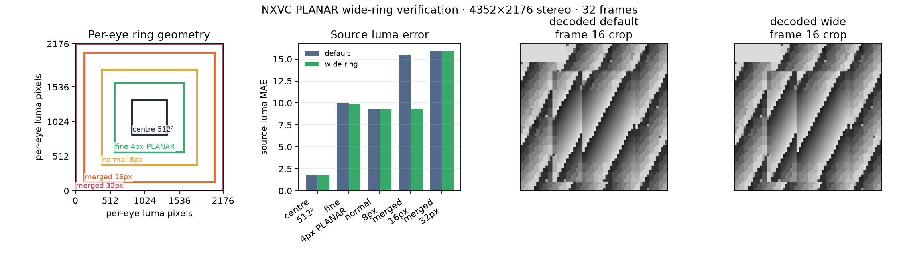
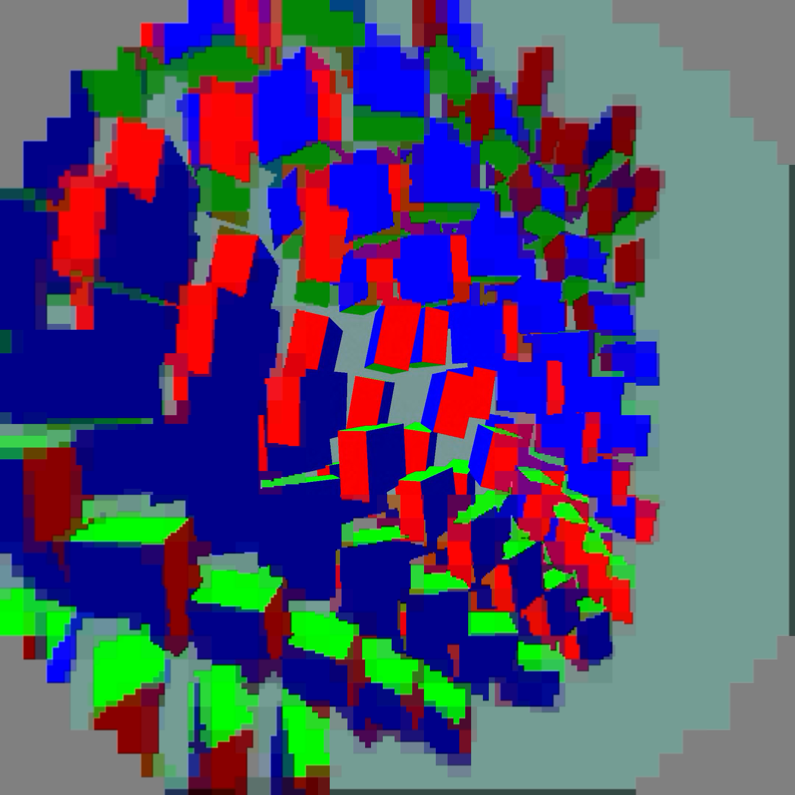

# Wide PLANAR ring verification

This result compares the existing default stream with the opt-in wide-ring
stream for the recorded `nx-scratch/adaptive-tiles/large.yuv` fixture
(4352×2176 stereo,
`yuv420p`, 32 frames). `verify.py` memory maps the source and decoded files;
it does not copy raw YUV. Run it from this directory:

```sh
python3 reproduce.py --bin /absolute/path/to/nx-warp/build-vk/bin \
  --work /absolute/path/to/nx-scratch/wide-ring-repro
```

This generates the same large fixture algorithm documented in
[adaptive-planar/README.md](../adaptive-planar/README.md), encodes default and
`NXVC_PLANAR_WIDE_RING=1`, CPU-decodes both streams, and invokes `verify.py`
with explicit paths. The large raw input remains intentionally untracked.

The native 512×512 centre of each eye is exact between decoded default and
wide output for every frame and all three planes (maximum absolute difference
0, zero mismatches). The complete decoded frames differ outside that protected
centre, as expected from the wider classification. The ring MAE is measured
against the source luma plane, with tile distance in 64-luma-pixel tiles:

| ring | default MAE | wide MAE |
|---|---:|---:|
| native centre 512×512 | 1.764742 | 1.764742 |
| fine 4px PLANAR cells (dist 1–4) | 9.971776 | 9.904663 |
| normal 8px cells (dist 5–7) | 9.278303 | 9.278303 |
| merged 16px cells (dist 8–11) | 15.496892 | 9.346586 |
| merged 32px cells (dist ≥12) | 15.947021 | 15.947021 |

The default bitstream is 3,246,520 bytes; wide is 3,418,552 bytes, a
172,032-byte increase (5.30%). See [wide-ring.png](wide-ring.png) for the
geometry and error comparison. Full machine-readable values are in
[metrics.json](metrics.json).


## Live Pico check

`NXVC_PLANAR_WIDE_RING=1` is enabled on the running custom WiVRn NX server.
The existing compact decoder and client are unchanged. This expands the
fine 4px PLANAR boundary from 768×768 to 1024×1024 per eye; the normal 8px
band extends to 1408×1408 and the merged 16px band to 1920×1920.
The native 512×512 centre remains unchanged. This is not a true half-resolution
ring, continuous spatial blend, or a larger native-resolution centre.

Three 90-second headless `hello_xr` animated full-field cube trials completed
with advancing scene frames, a surviving client, and fresh telemetry through
the end. This is scene motion on an actual Pico, not tracked human head motion
or a binocular comfort test. Values below are means of the last 30 reported
two-second windows, not per-frame tail latency.

| Measurement | Default | Wide | Wide repeat |
|---|---:|---:|---:|
| Fresh presented source updates/s | 78.50 | 81.58 | 77.38 |
| Pico decode GPU, ms | 4.947 | 4.947 | 4.940 |
| Server encode, ms | 2.050 | 2.047 | 2.043 |
| Presentation GPU, ms | 5.643 | 5.857 | 5.537 |
| Reported source offset, ms | 56.57 | 57.52 | 56.46 |
| Decoder queue, ms | 4.18 | 3.76 | 4.40 |
| Mean payload bytes/frame | 130,975 | 136,165 | 136,168 |
| Actual payload, Mbit/s | 86.48 | 92.47 | 87.99 |

Decode and encode cost remained similar; fresh-update throughput varied across
runs, so these trials do not establish a speedup. The wider profile is retained
for its detail distribution, with about 4% larger live frames in this scene.
Controller targets and QP varied; use the fixed-QP offline comparison for the
5.3% byte-cost estimate. Actual payload exceeds the reported 76.3 Mbit/s
controller allowance here; that allowance is not an enforced wire-rate cap.
The source offset is a scheduling diagnostic, not measured motion-to-photon
latency. Neither 90 fresh frames/s nor 240 FPS is proven by these results.

Raw logs, trial status and summaries are in [live/](live/); build/profile
provenance is in [build.json](build.json). Capture token 9272 recorded the
left/right eye output during the first wide trial. These are client image
captures, not through-lens photographs; blockiness outside the centre is
still visible. Captures were disabled for the repeat and restored to zero.





[Right-eye capture](pico-wide-right.png).
