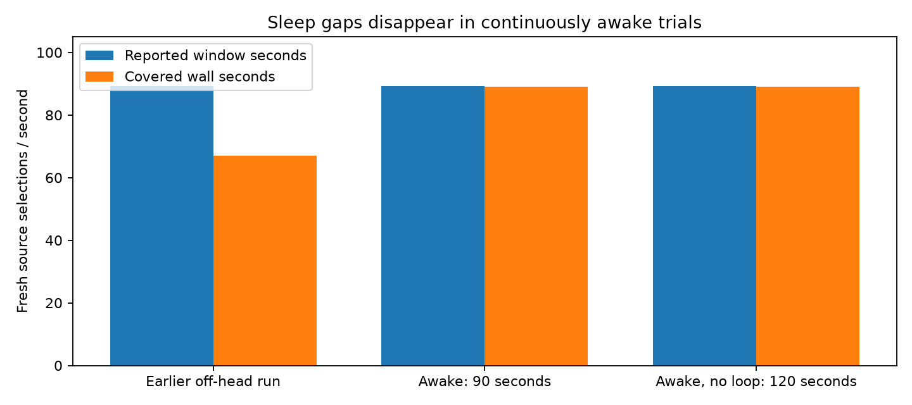

# Awake stability archive

The headset proximity policy slept it after 10 seconds off-head. The old workaround woke it every 4 seconds but failed to prevent sleep, leaving roughly 12-second stop/restart cycles. Setting
`pvr.factorytest.never.sleep=1` removed those cycles: the completed 90-second
`awake-stability-1` run had zero STOPPING events and approximately 89.09 fresh
sources per covered wall-second. The baseline compact-clamp run had 5
STOPPING events and 66.95 fresh sources per covered wall-second, despite a
similar 89.31/window-second reported rate.

The comparison is about logged coverage, not panel behavior or photon timing.
Earlier window means are not continuous FPS. `awake-stability-2` requested 120
seconds but is archived as a harness failure because the old analyzer capped
at 30 windows; it is not marked passed. The corrected 120-second rerun (`awake-stability-3`) passed with all 60 render and 60 decoder windows retained, zero STOPPING events, and 89.07 fresh sources per covered wall-second after warmup (108.335 seconds covered). The periodic wake loop was absent for this run.

To reproduce the reversible property change on the target device:

```sh
adb shell setprop pvr.factorytest.never.sleep 1
# restore the prior state after the isolated run:
adb shell setprop pvr.factorytest.never.sleep 0
```

The property change is nonpersistent. Runtime user presence and application
code were unchanged. `coverage.png` compares reported-window rate with
covered-wall-second rate. `archives.tgz` contains the baseline, awake-1, and
incomplete awake-2 captures plus scene/server logs; power-event archives and
the fixed capture/analyzer scripts are included separately.



## Harness correction

The harness now enables and verifies the awake property before testing. It streams filtered logcat continuously to disk, avoiding the device ring buffer losing early trial data. Liveness validation checks full-log window counts separately from the summary's last-30-window limit. The failed second run remains archived with its original status; the third run used the corrected harness. These changes improve test validity rather than codec speed.

The retained baseline comes from the preceding shader experiment, so this is a diagnosis and coverage comparison, not an isolated shader A/B. Active-window GPU improvements remain distinct from uninterrupted delivery. No physically moving-headset or 240 FPS result is established here.

A subsequent optional screenshot run exited normally after `xrCreateSwapchain` returned `XR_ERROR_RUNTIME_FAILURE`, before useful frames were captured. Its failure status and current-process logs are archived separately. This is not a passing screenshot test and is not fixed by the awake property. The non-capture continuous run above remains the validated result.

A 30-second non-capture recovery run then completed with the client alive. The test scene was stopped, capture remains zero, and the awake override remains enabled for unattended Pico testing. Set the property back to zero to restore normal off-head sleep.
