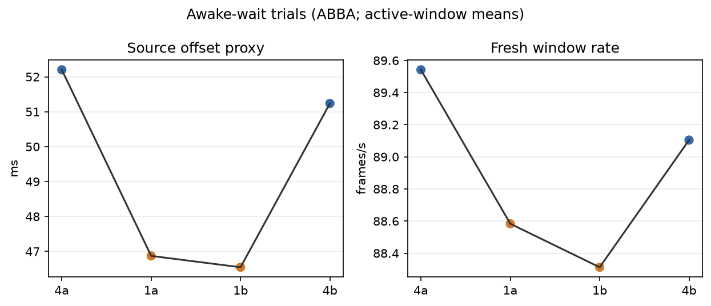

# Awake-wait result

Four completed 60-second synthetic moving-content trials ran ABBA (`4a`,
`1a`, `1b`, `4b`) with static-post 2, FDM 3, smoothing 3, priority 1, and
continuous awake mode. The first 10 valid telemetry seconds were excluded;
all runs had zero STOPPING events.

| ready wait | own GPU pass | fresh window rate | source offset proxy |
|---|---:|---:|---:|
| 4 ms | 4.1708 ms | 89.3229/window-s | 51.7188 ms |
| 1 ms | 3.8083 ms | 88.4479/window-s | 46.7083 ms |

The 1 ms setting lowers own GPU by `0.3625 ms` (`8.69%`) and lowers the
source-offset proxy by `5.01 ms`, while fresh rate falls about `0.98%`.
Vendor MTP mean changes `30.003 → 27.589 ms`; it is not photon timing. This
supports selecting 1 ms for the current low-latency preference.

The earlier FDM-wait rejection remains valid for its older profile with sleep
cycles; this result also changes the shader/profile, so the difference cannot
be attributed to sleep alone. Covered-wall-time source-selection rates were
89.08/s at 4 ms and 88.17/s at 1 ms (see `coverage.jsonl`). These are not
physical panel FPS. There are no head-motion or 240-fps claims. `per-run.png` shows source offset and fresh rate in ABBA order;
`logs.tgz` contains all raw client, scene, server, and status logs.

Client revision: `060474e4` in WiVRn NX. The selected runtime profile uses
`debug.wivrn.nx.ready_wait_us=1000`; the other settings above stay fixed.
