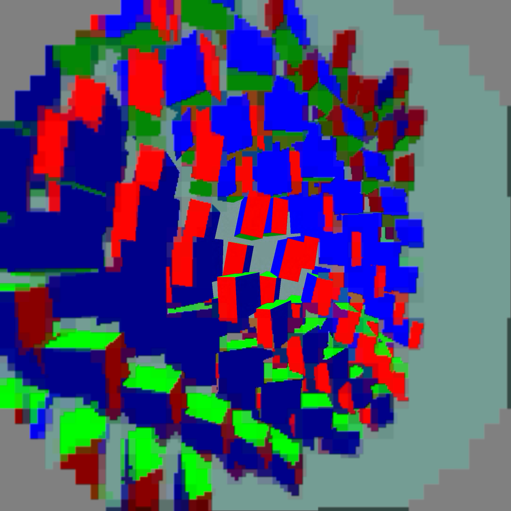

# Capture fallback fault-injection test

This is a failure-recovery test, not a performance benchmark. The forced
build injected `XR_ERROR_FEATURE_UNSUPPORTED` into every transfer-source
swapchain creation call. A 60-second capture run completed with the client
alive and 30 render plus 30 decode windows. Requests `91111`, `911111`, and
`911112` each emitted exactly one `NX capture ... unavailable` warning; zero
captures were saved, as expected.

The optional capture swapchain now retries without `TRANSFER_SRC` after the
optional mutable fallbacks, updates transfer capability state, and records a
failed request so frames do not recreate it repeatedly. The prior real-device
failure was `XR_ERROR_RUNTIME_FAILURE`; see the
[awake-stability archive](../awake-stability/README.md) for that context.

`forced-logs.tgz` contains the forced client, scene, server, and status logs.
`final.patch` and `fault-injection.patch` preserve the implementation and
test changes. `capture_live.py` and `analyze_live.py` are included for
reproduction. The final APK has the fault injection removed. A separate 25-second normal run completed with the client alive and saved all three requested captures. Neither run establishes a latency or performance improvement.

The final screenshot was visually checked. The existing detailed centre and blocky periphery remain. `normal-capture.tgz`, `normal-status.json`, and `final-manifest.json` retain final-build evidence. Capture was reset to zero and the test scene stopped afterward.

If normal presentation swapchain creation also fails, that remains a real runtime error; this change only degrades gracefully when optional readback can be dropped. Native driver crashes cannot be recovered by retrying a returned OpenXR error.
