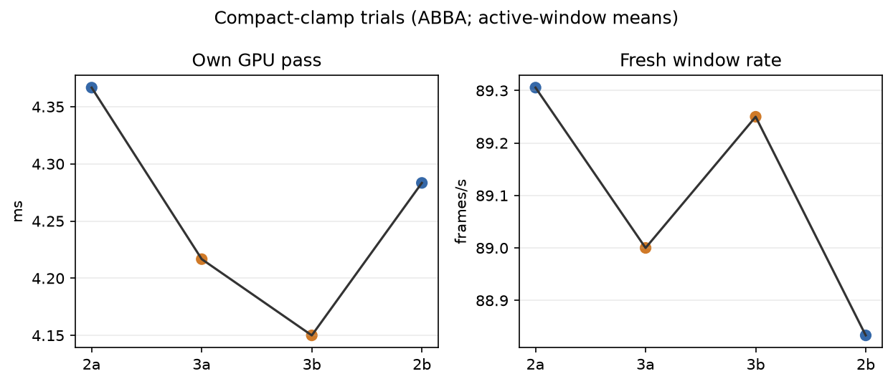
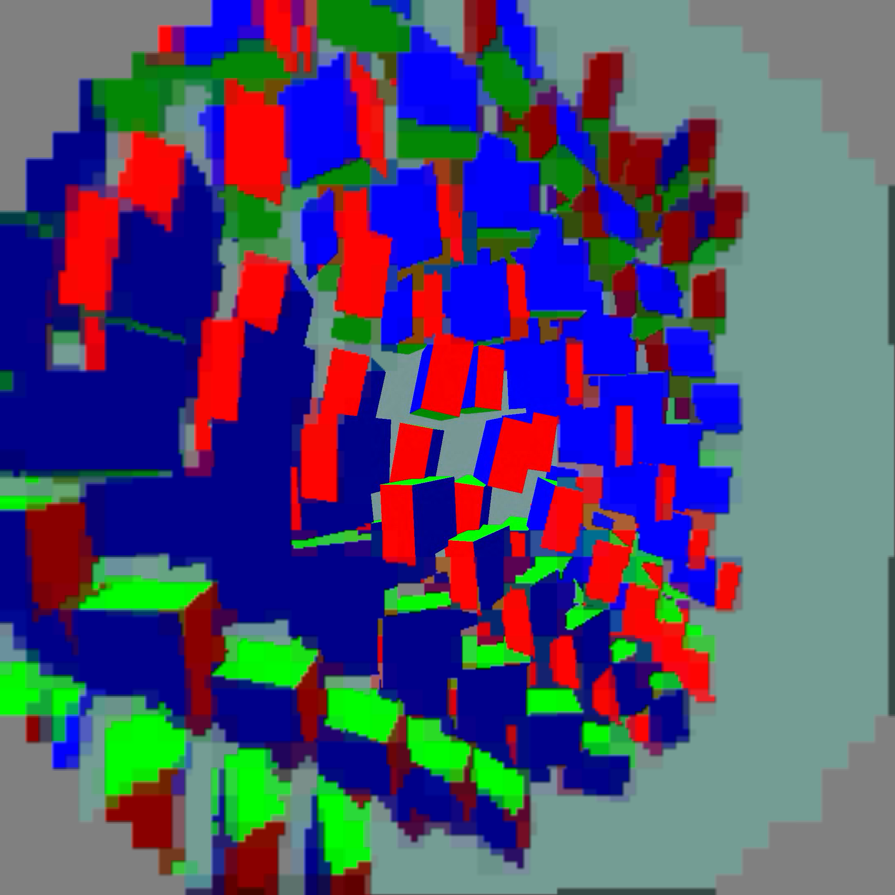

# Compact-clamp positive result

Four completed 60-second synthetic moving-content trials ran ABBA (`2a`,
`3a`, `3b`, `2b`) with FDM 3, smoothing 3, priority 1, and 4000 us wait.
The first 10 valid telemetry seconds were excluded.

| path | own GPU pass | fresh source rate | source offset proxy |
|---|---:|---:|---:|
| mode 2 baseline | 4.3250 ms | 89.069/window-s | 52.767 ms |
| mode 3 compact-clamp | 4.1833 ms | 89.125/window-s | 52.024 ms |

The compact-clamp change reduced mean own-GPU pass by `0.1417 ms` (`3.28%`).
Source offset is a harness proxy, not photon timing; there are no wall-clock
FPS or 240-fps claims.

Coordinate verification covered 200,648 float32 points across both eyes,
including 648 boundary points: mapped coordinates were exactly equivalent with
zero differences. This is not GPU bit-exact colour verification. Within `.5..2175.5`, the removed clamp was an identity. Below that interval, the mapping is already below the final lower bound `.5`; above it, the mapping exceeds the final upper bound `927.5`. The remaining clamp therefore supplies the same saturation.

`per-run.png` shows the ABBA measurements. `logs.tgz` contains raw client,
scene, server, and status logs. No APKs are included.

## Final implementation and capture

The temporary mode-3 comparison switch was removed after the trials. The final change simply removes the first clamp from compact mapping; the existing mode-2 speed profile remains selected. No other image operation changes.

The separate 25-second final capture is a visual sanity check and is excluded from timing results. It does not establish pixel-exact GPU equivalence or physically moving-headset performance. Peripheral codec blocks remain visible. The benchmark scene is stopped and capture reset to zero afterward.

One late capture in the first final run was [black](pico-transition-black.png), immediately after a logged OpenXR stop/idle/ready sequence. An earlier capture showed the scene, and a second 25-second run produced the scene image above. The black capture and both sets of logs are retained; the transition cause is not resolved by this shader change.
