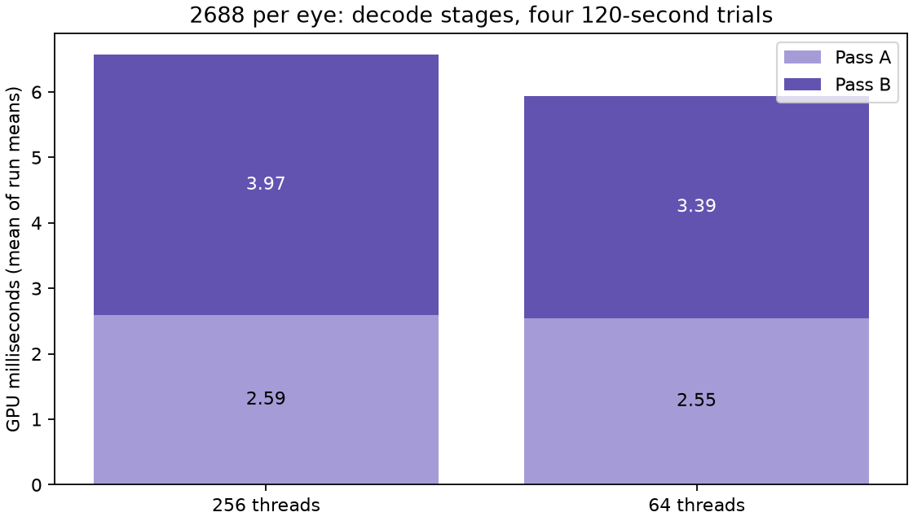
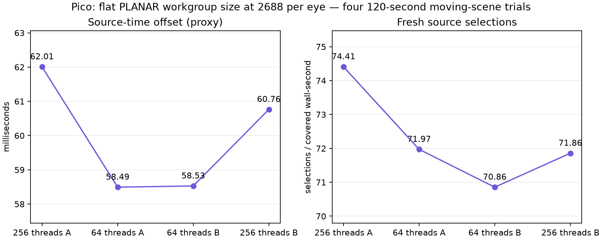

# 64-thread validation under sustained load

Four completed 120-second Pico trials, ABBA, at 2688² per eye. Client `2d6ead1b`, codec `2239f1d`. Fixed ready wait 1 ms, JIT maximum 5 ms, decode priority 1, FDM 3, static-post 2, smoothing 3, continuously awake. Each run retained 60 render/decode windows; analysis uses all valid windows after ten telemetry seconds. No session stops.

| Threads | Pass A GPU | Pass B GPU | Total decode GPU | Fresh selections / covered wall-second | Source-offset proxy |
|---|---:|---:|---:|---:|---:|
| 256 | 2.5939 ms | 3.9722 ms | 6.5624 ms | 73.13 | 61.3861 ms |
| 64 | 2.5464 ms | 3.3873 ms | 5.9309 ms | 71.41 | 58.5102 ms |

Means of per-run means. **Pass B improves 14.7%, total decode GPU improves 9.6%, and source offset improves 2.88 ms.** Both pairs favor 64 for decode time and source offset. However, fresh delivery falls about 2.4%, unlike the essentially unchanged rate in the shorter trials. Keep 64 for the user's latency preference; do not describe it as a fresh-frame-rate improvement. Presentation GPU rose slightly 3.8972→3.9639ms.

Valid vendor GPU-temperature samples reached 84.5°C across these runs. Initial zero readings were excluded from the temperature summary. Temperature and load change during the comparison; this does not prove thermal throttling or a power-efficiency improvement. The wider decoding gain under this load is not a universal guarantee.

The earlier [byte-identical fixture check and high-resolution capture](../compact-flat64/README.md) validate output for the same implementation. These longer runs add sustained timing evidence, not exhaustive pixel equivalence. Source offset and fresh selections are software metrics, not photon latency or physical panel FPS. Synthetic motion is not physical head motion. No 90/240 fresh-FPS claim.

Extract `logs.tgz` before `python3 summarize.py <log-directory>`. Live harness scripts retain original machine paths. Selected property remains `debug.wivrn.nx.compact_flat64=1`.
